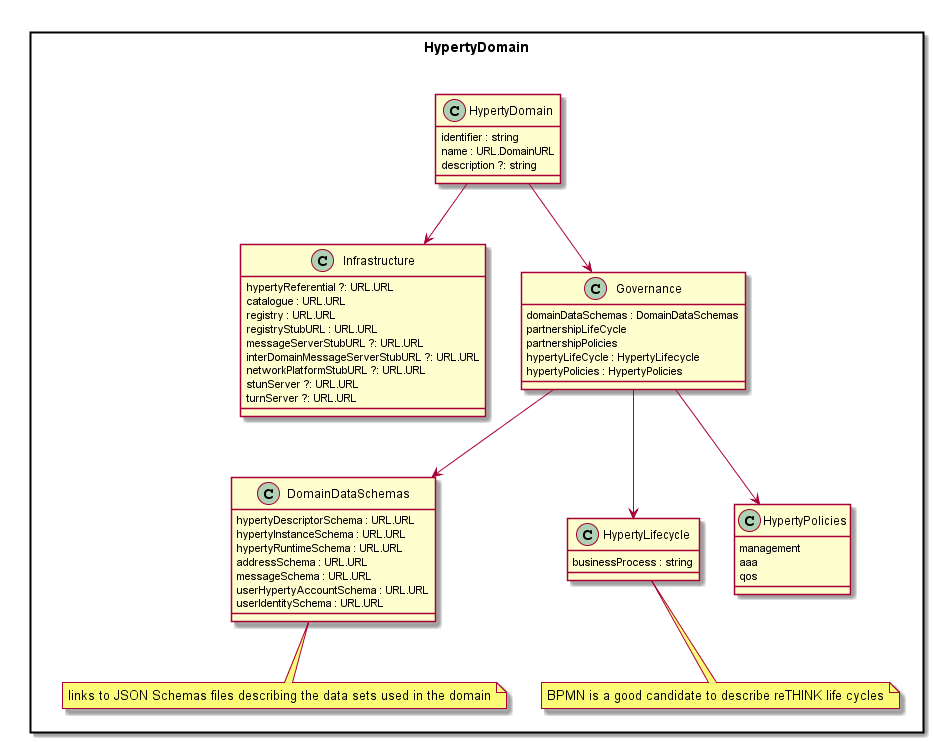

The Hyperty domain brings together and organizes the data of the service provider about the induced administrative domain. Beyond the associated identifiers, it is structured around two main building blocks concerning respectively the governance carried out in this domain and the associated infrastructure subject of this governance.  

The infrastructure block includes the main servers supporting the various services required in such a domain :
-	Hyperty referential : global data basis containing the data about the defined hyperties
-	Hyperty catalogue : data basis of the published hyperties
-	Hyperty registry : directory of the instanced hyperties
-	QoS servers
-	STUN/TURN servers
-	…

The governance block concerns the definition of the data underlying two main life-cycles :
-	the one with an external insight concerning the structure of the service provider partnership with other service providers
-	the life-cycle of an hyperty,
-	the policies involved in these two life-cycles

We will focus in this work on the definition of the data involved in an hyperty life-cycle together with the associated policies concerning management, QoS, AAA.

During the HypertyProvisioning stage of Figure 2, completely defined hyperties are stored in a repository acting as an internal referential of the service provider. The provisioning ends with the publication of the hyperty in a catalogue accessible from end users. An authorized request of a consumer for some hyperty leads to the deployment of its instance on the consumer device together with the registration of the instance in a dedicated register managed by the service provider.  

Figure : Working part of an Hyperty life cycle

The hyperty management involves the following services :
-	publishing, updating and removing a provisioned hyperty
-	registering, monitoring, charging and unregistering a deployed hyperty instance

Figure : Hyperty governance

The Hyperty Domain data model is mainly described by its name (DomainURL), the addresses of provided management services (Infrastructure) and its Governance. According to the Protocol On-the-fly concept, Network Platforms, Registry and Message Servers are defined through URLs from where protocol stubs used to reach them, are downloadable. It is also possible to have a different protocol stubs for inter domain communications. The usage of [well-known URIs](https://tools.ietf.org/html/rfc5785) to discover Infrastructure data, should be considered for implementation purposes.

The domain governance is described by the data schemas used (DomainDataSchemas) as well as by the Business Processes and the Business Policies used to rule the Hyperty Life-cycle and Partnership life-cycle as defined in T1.3.

Figure : Hyperty Domain UML diagram
