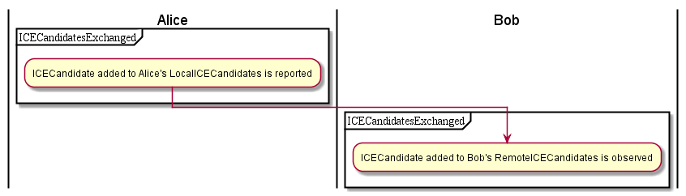

## Communication Setup using Reporter-Observer pattern

<!--
@startuml "comm-setup-activity-1.png"

|Alice|
start

partition ConnectionCreation {
    :create Connection Object to connect to Bob;
    :Bob Connection Object]
    :create LocalConnectionDescription;
    :LocalConnectionDescription]
    :create LocalICECandidates;
    :LocalICECandidates]
    :report Connection, LocalICECandidates\n and LocalConnectionDescription objects to Bob;
}

|#AntiqueWhite|Bob|

partition ConnectionRequestReceivedByBob {
    :create Connection Object requested by Alice and Observe;
    :Connection Object requested by Alice]
    :create RemoteConnectionDescription from Alice and Observe;
    :RemoteConnectionDescription]
    :create RemoteICECandidates from Alice and Observe;
    :RemoteICECandidates]
}

partition BobAcceptsRequest {
	}

partition BobReportsRequestIsAccepted {
    :Connection Object requested by Alice]
	:create LocalConnectionDescription for connection requested by Alice;
    :LocalConnectionDescription]
    :create LocalICECandidates for connection requested by Alice;
    :LocalICECandidates]
    :report to Bob communication is accepted;
    :report Bob's LocalConnectionDescription and\n LocalICECandidates to Alice;
	}

	|Alice|

partition AliceReceivesBobHasAccepted {
    :Bob Connection Object]
    :create RemoteConnectionDescription from Bob and Observe;
    :RemoteConnectionDescription]
    :create RemoteICECandidates from Bob and Observe;
    :RemoteICECandidates]
	}

@enduml
-->

An analysis on how to apply the Reporter-Observer pattern on communication setup is performed below.

### Connection setup start

Alice creates Connection object as well as its LocalConnectionDescription and LocalICECandidates Objects and reports to Bob.

Bob receives Alice request, creating Connection object and its RemoteConnectionDescriptions and RemoteICECandidates objects sent by Alice. Bob is set as observer of these objects.

As soon as Bob accepts the request its LocalConnectionDescription object and its LocalICECandidates are created and added to Connection object, which is reported back to Alice.

Alice receives update from Bob, adding the new objects sent by Bob as its RemoteConnectionDescription and RemoteICECandidates. Alice is set as observer of these new objects.

### ICE Candidates exchanged

<!--
@startuml "comm-setup-activity-2.png"

    |Alice|
partition ICECandidatesExchanged {

    :ICECandidate added to Alice's LocalICECandidates is reported;
    }

    |Bob|

partition ICECandidatesExchanged {
    :ICECandidate added to Bob's RemoteICECandidates is observed;

    }

@enduml
-->

Alice adds a ICE Candidate to its LocalICECandidates Object and reports to Bob.

Bob observes there is a new ICE Candidate in its RemoteICECandidates object.

<!--
@startuml "comm-setup-activity-3.png"

    |Bob|

partition ICECandidatesExchanged {

    :ICECandidate added to Bob's LocalICECandidates is reported;
    }

    |Alice|

partition ICECandidatesExchanged {
    :ICECandidate added to Alice's RemoteICECandidates is observed;
    }

@enduml
-->

Bob adds a ICE Candidate to its LocalICECandidates Object and reports to Alice.

Alice observes there is a new ICE Candidate in its RemoteICECandidates object.

### Connection is established

<!--
@startuml "comm-setup-activity-4.png"
    |Alice|
partition StreamAddedAtAliceConnection {
    :Stream added to Alice's LocalIceCandidates\nand status set to connected is reported;
    }

    |Bob|

partition StreamAddedAtAliceReceiver {
    :Stream added to Bob's RemoteIceCandidates\nand status set to connected is observed;

    }

@enduml
-->

Alice reports a remote stream is added in its LocalIceCandidates object and its status is set to connected

Bob observes that its source stream was added in its RemoteIceCandidates object and its status was set to connected

<!--
@startuml "comm-setup-activity-5.png"

    |Bob|

partition StreamAddedAtBobConnection {

    :Stream added to Bob's LocalIceCandidates\n and status set to connected is reported;
    }

    |Alice|
    
    partition StreamAddedAtBobReceiver {

    :Stream added to Alice's RemoteIceCandidates\n and status set to connected is observed;

    }

 
@enduml
-->

Bob reports a remote stream is added in its LocalIceCandidates object and its status is set to connected

Alice observes that its source stream was added in its RemoteIceCandidates object and its status was set to connected

<!--
@startuml "comm-setup-activity-6.png"

    |Alice|
    
    partition ConnectionIsEstablished {

    :Connection status set to connected is reported;
    }

    |Bob|

    partition ConnectionIsEstablished {
    :Connection status set to connected is observed;

}

@enduml
-->

Alice reports Connection status is set to Connected

Bob observes Connection status was set to Connected

