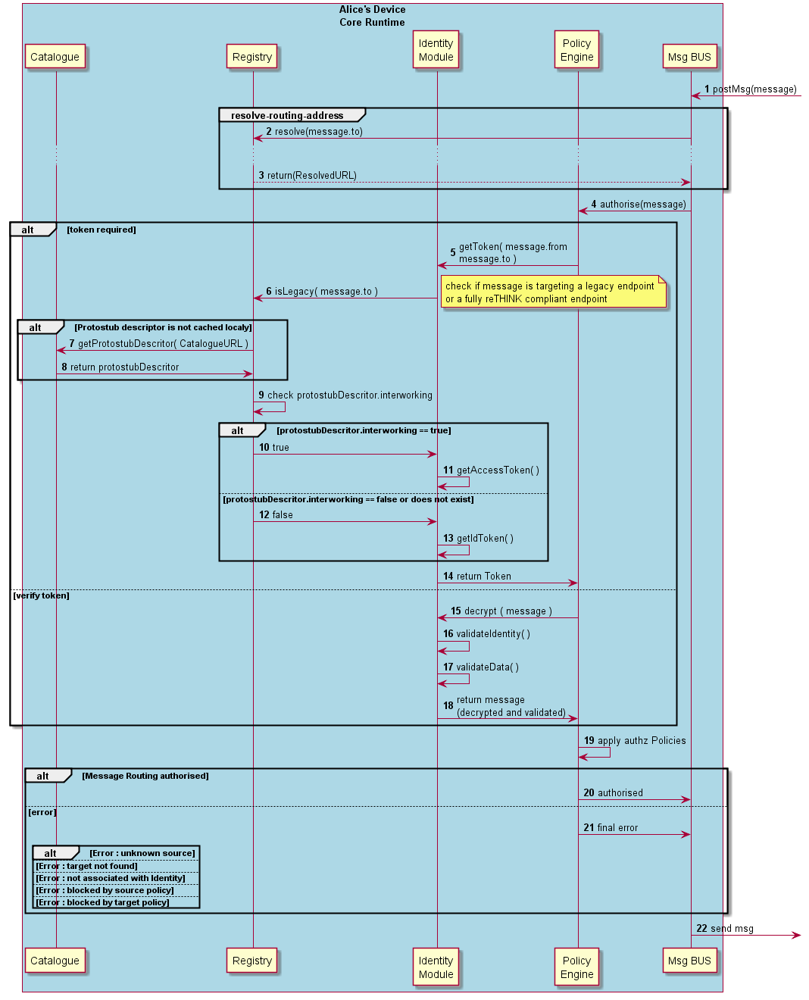

#### Message Routing in Message BUS

The Runtime procedures to route a message by the Runtime BUS are described in this section.

Steps 1 - 3: on receiving a message, the Runtime BUS requests the Registry to verify if the originator is valid (3) (i.e. its Runtime URL has been previously registered) and the Message Bus asks the Runtime Registry to [resolve the Message](resolve-routing-address.md).

Steps 4 : the message routing is subject to authorisation by the Policy Engine. Before enforcing the policies, the Policy Engine asks the Identity Module to secure the message delivery:

  **For outgoing messages ie messages are coming from the originator Hyperty (`message.from`)**

  Steps 5-14: **Phase 2 New!!** the Identity Module asks the Runtime Registry to check if the target endpoint is a legacy endpoint. If it is a legacy endpoint, the Identity Module should return an AccessToken to the Policy Engine that is added to the message body. Otherwise, an IdentityToken is returned to the Identity Module which is used to to assert the identity source and to encrypt the communication between the two endpoints.

  **for incoming messages ie messages are requested to be delivered to the target Hyperty (`message.to`)**

  Steps 15 - 18: , the Identity Module decrypts the message and validates the identity assertion as well as the message content.

Steps 19 - 20: The Policy Engine enforces authorisation policies and if successful, the message is returned to be routed.

Step 21: if not successful different types of errors may occur and corresponding error message should be replied to the originator:

-	target does not exist
-	Hyperty instance that is sending the message is not associated with an appropriate Identity
-	the message is blocked by a source or target policy
