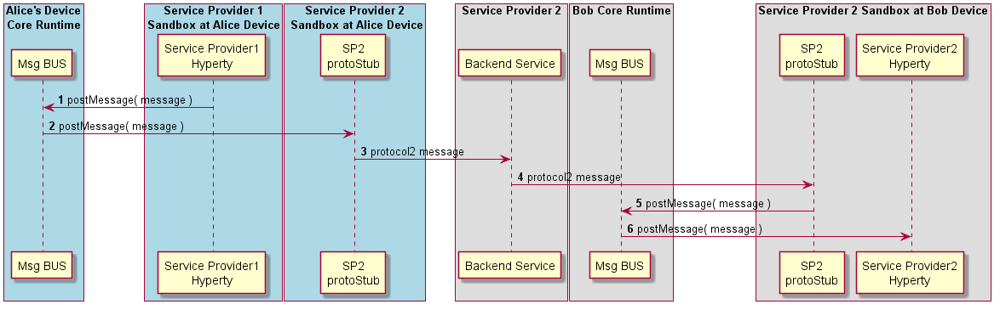

#### Inter-domain Remote Communication

The routing of messages between two Hyperties running in different Runtime instance and from different domains, is described below.

<!--
@startuml "interdomain-remote-communication.png"

autonumber

!define SHOW_RuntimeA

!define SHOW_SP1SandboxAtRuntimeA
!define SHOW_ServiceProvider1HypertyAtRuntimeA

!define SHOW_CoreRuntimeA
!define SHOW_MsgBUSAtRuntimeA

!define SHOW_SP2SandboxAtRuntimeA
!define SHOW_Protostub2AtRuntimeA

!define SHOW_RuntimeB
!define SHOW_SP2SandboxAtRuntimeB
!define SHOW_Protostub2AtRuntimeB
!define SHOW_ServiceProvider2HypertyAtRuntimeB

!define SHOW_SP2

!define SHOW_CoreRuntimeB
!define SHOW_MsgBUSAtRuntimeB

!include ../runtime_objects.plantuml
!include ../runtime_objects_domain2.plantuml

SP1H@A -> BUS@A : postMessage( message )

BUS@A -> Proto2@A : postMessage( message )

Proto2@A -> SP2 : protocol2 message

Proto2@B <- SP2 : protocol2 message

BUS@B <- Proto2@B : postMessage( message )

SP2H@B <- BUS@B : postMessage( message )

@enduml
-->

