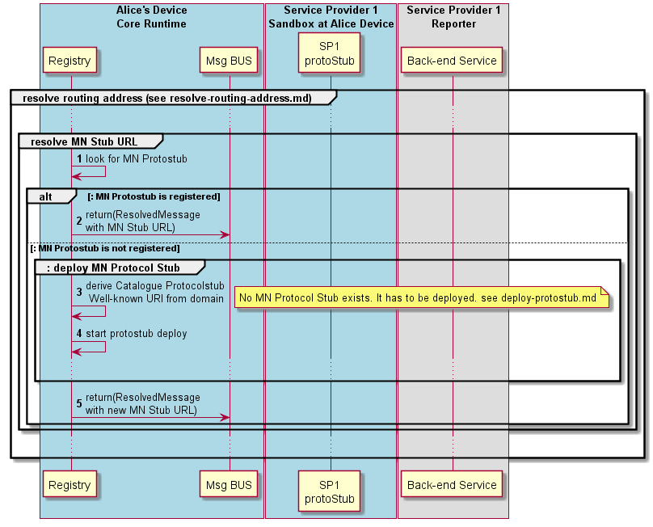

#### Resolve Messsage Node Stub URL

**phase 1 resolve process**

This section describes the Runtime Registry procedures to resolve the Message Node Stub URL during the [Resolve Routing Address](resolve-routing-address.md) process.

In case P2P Connections are not used during routing address resolution, the runtime registry looks for the Message Node protostub Runtime URL to be used that is associated to the Hyperty domain. The process to [deploy the Message Node Requester Protocol Stub the runtime](deploy-protostub.md) is triggered, in case it is not available yet.
