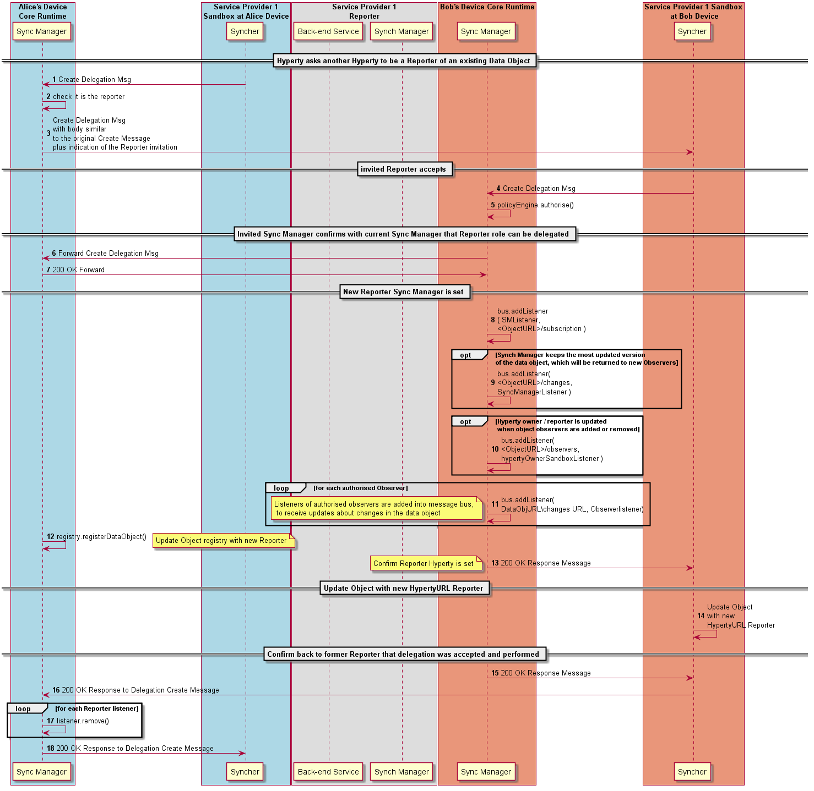

#### Data Object Reporter Delegation



The Data Object reporter role can be delegated to another Hyperty with the following procedures.

**[Subscription Message sent by invited Observer to Reporter domain SM](https://github.com/reTHINK-project/architecture/tree/master/docs/datamodel/message#subscriptionmessagebody)**

```
"id" : "1"
"type" : "SUBSCRIBE",
"from" : "hyperty://sp2/bobhy123",
"to" : "comm://<sp1>/<alice>/<123456>/subscription"
```

The Sync Manager checks if subscription requester has been previously authorised when the data object was created.

Steps : in case subscription requester has not been previously authorised, and according to applicable policies, the subscription request message can be forwarded to the Reporter Hyperty that will take the final decision.

Step : according to applicable policies, the Registry can be queried to check if the data object was previously registered.

Step : in case the subscription request is authorised, a listener of the new observer, is added into the Message BUS to receive messages on the Data Object resource URL.

Step : optionally, the new Observer listener is added in the Message BUS to be notified about new Observers.

Steps : optionally, it is posted an UPDATE message into the DataObjectObserversURL with information about the new added Observer.

Steps : the subscription requester is informed about the subscription authorisation with a RESPONSE message.

**[Subscription Response Message ](https://github.com/reTHINK-project/architecture/tree/master/docs/datamodel/message#responsemessagebody)**

```
"id" : "1"
"type" : "RESPONSE",
"from" : "comm://<sp1>/<alice>/<123456>/subscription",
"to" : "hyperty://sp2/bobhy123",
"body" : { "code" : "2XX", "value" : "<data object>"  }
```

**note**: Subscription response message body may contain the most update data object, which implies the reporter sync-manager is also an observer of the data object.

**[Subscription Message sent to observer sync-manager to add listeners to observer runtime and domain ](https://github.com/reTHINK-project/architecture/tree/master/docs/datamodel/message#subscribemessagebody)**

```
"id" : "1"
"type" : "SUBSCRIBE",
"from" : "hyperty://sp2/bobhy123",
"to" : "hyperty-runtime://<sp1>/<bob-device>/sm",
"body" : { "resource" : "comm://<sp1>/<alice>/<123456>" , "schema" : "hyperty-catalogue://<sp1>/dataObjectSchema/<schema123>" }
```

**[Subscription Message sent to observer domain sync-manager to add listeners to observer runtime and domain ](https://github.com/reTHINK-project/architecture/tree/master/docs/datamodel/message#subscribemessagebody)**

```
"id" : "1"
"type" : "SUBSCRIBE",
"from" : "hyperty-runtime://<sp1>/<bob-device>/sm",
"to" : "domain://msg-node.<sp1>/sm",
"body" : { "resource" : "comm://<sp1>/<alice>/<123456>" , "schema" : "hyperty-catalogue://<sp1>/dataObjectSchema/<schema123>"}
```

### Data Object Update

Step 22: as soon as the Reporter receives the information that the data object synchronisation was authorised, it can request the Syncher to start reporting data object changes by posting UPDATE messages to the Data Object URL resource. It should be noted that, according to Hyperty Service logic, this step can be performed later, e.g. after the Reporter is notified an Observer has been added.


**[Data Synchronisation UPDATE Message sent by Reporter Syncher](https://github.com/reTHINK-project/architecture/tree/master/docs/datamodel/message#updatenmessagebody)**

```
"id" : "2"
"type" : "UPDATE",
"from" : "comm://<sp1>/<alice>/<123456>",
"to" : "comm://<sp1>/<alice>/<123456>/changes",
"body" : { "value" : "changed value"  }
```
