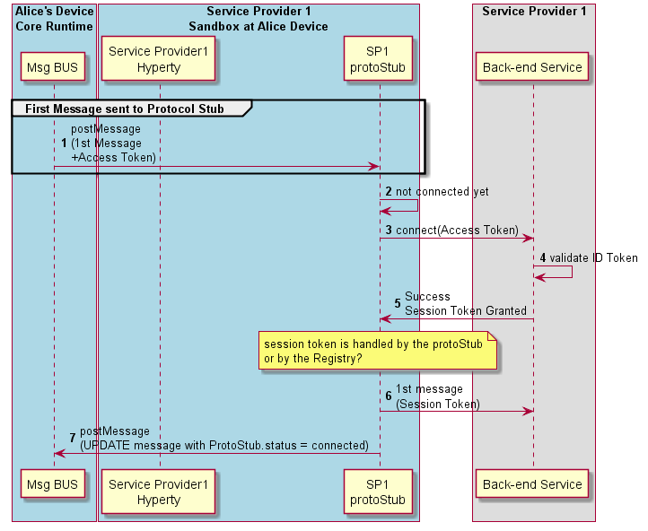

#### Domain Login

This section describes the main procedures to support domain login.

A first option is the Hyperty to explicitly ask to connect (see Figure above):

Steps 1-3: Hyperty requests to connect to domain with a GET message sent to DomainURL which is subject for Authorisation by the Core Policy Engine.

Steps 4-5: according to applicable policies the Policy Engine request the Identity Module for an Access Token to be used in the login message, providing the Identity identifier associated to the hyperty and the scope (login to domain).

Steps 6-7: Identity Module returns a valid Access Token to be used in the domain login. To be noted that this may imply the generation of a new token in case there is no valid token stored in the Identity Module. In this case, the Identity Module may have to interact with an IdP back-end server through an IdP (proxy) Protocol Stub. The Access Token generation is described in D4.1.

Steps 8-10: the returned token is added to the login message by the Policy Engine, which is forwarded to the Protocol Stub by the Message BUS.

Steps 11-13: the Protocol Stub uses the Access Token to request to connect to the domain back-end server. If successful a Session Token is granted and returned back to the Protocol Stub. (it is assumed the session token is handled by the Protocol Stub and not by Core Runtime)

Steps 14-16: as soon as the Protocol Stub is connected, its status is updated (UPDATE message posted to its status URL resource) and Response message is sent back to the Hyperty.

In a second option (see Figure above), the ProtoStub only connects when requested to send the first message. The Access Token used in the connection request is provided like it is in the first option.
