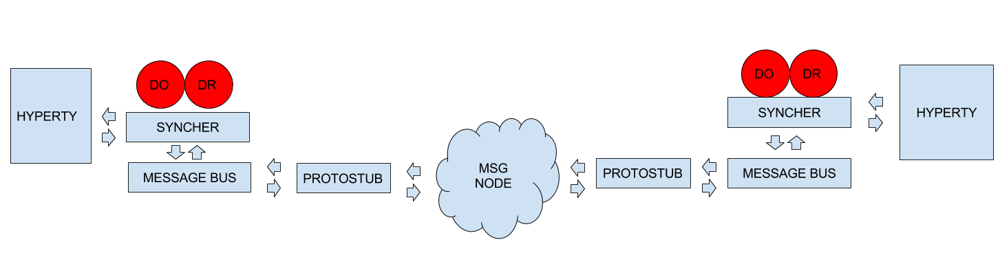

## Interworking stub development

In a general way, there are not many differences between developing a stub or an interworking stub. The same [specs](https://github.com/reTHINK-project/specs/blob/master/messaging-framework/stub-specification.md) still apply. The big difference could be a conceptual one.

### Stub conceptual view:



### Interworking stub conceptual view:


As you can see on the diagrams an interworking stub is a stub that communicates with the hyperty using the [Data Synchronisation Reporter - Observer communication mechanism](https://github.com/reTHINK-project/specs/blob/master/messaging-framework/p2p-data-sync.md). It still has to listen to the message bus in order to catch the message from the hyperty but then it subscribes to the syncher and gets the dataobjectreporter with the data. In this way, we can keep the hyperty interoperable with other protostubs without changing it.

### Communication flows

**Communication from the hyperty to the protostub:**


```
        miniBus.addListener('*', (msg) => {
			switch (msg.type) {
			  case 'create':
				if(this._filter(msg) && msg.body.schema) {
					let dataObjectUrl = msg.from.substring(0, msg.from.lastIndexOf('/'))
					this._syncher.subscribe(this.schema, dataObjectUrl)
						.then(dataObjectObserver => {
```

**Communication from the protostub to the hyperty:**

```
        miniBus.addListener('*', (msg) => {
			switch (msg.type) {
			  case 'register':
				this._connection.connect(msg.body.identity.access_token)
				this.source = msg.body.source
				this.schema = msg.body.schema
				break
```

TODO: Implement a way to register the hyperty in the legacy protostub without changing it.

**Communication from the protostub to a legacy domain**

A protostub is an adapter so it implements and isolates the communication with third parties. The implementation will be different from one to another.

For the sake of cleanness and organization, in the examples, you can find a new object, ConnectionController, responsible for this communication.

### Interworking identity proxy development

No special consideration are required. [Identity proxy development](https://github.com/reTHINK-project/specs/blob/master/trust-management/idp-proxy-development.md)
