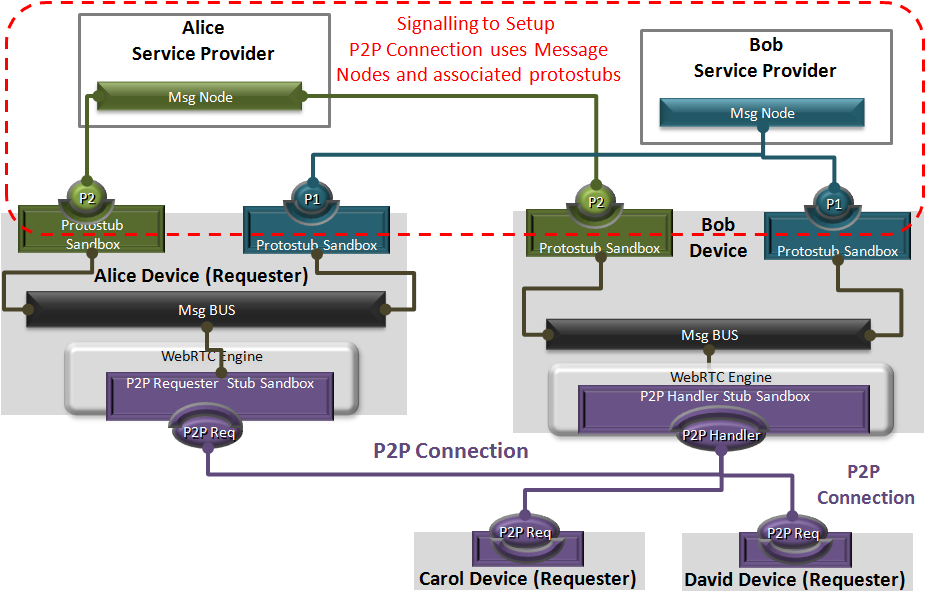
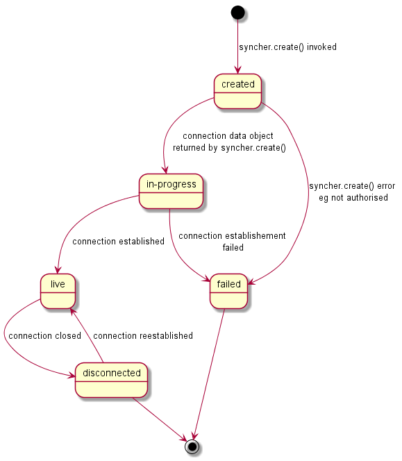

## P2P Message Delivery

Communication between different Hyperty Runtimes can be supported with peer to peer connections or via a Message Node. In both options a Protostub implementing the most appropriate network protocol stack is used. For example,  JSON over Websockets and  Restfull API Client are good options for Protostubs used to interface with a Message Node, while WebRTC Datachannel is a good option for a Protostub used to directly interface with another Hyperty Runtime. The usage of P2P Protostubs are favored since fewer resources are spent and Network latency should be better.

Protostubs are registered in the Runtime Registry with its own Hyperty Runtime URL e.g. `hyperty-runtime://example.com/runtime-123/protostub-3` and have listeners in the MessageBUS to receive messages targeting its URL.

When the MessageBUS is processing a new message and looking up routing paths for an address, which is not local (eg `hyperty://example.com/alice-hyperty`), it won't find any registered listeners. In this case, the Message BUS will ask the Runtime Registry to [resolve the "Message.to" header field](../dynamic-view/basics/resolve-routing-address.md) and it should return a registered Protostubs that is able to deliver messages to such non-local address. In this process, in case the required Protostub is not yet available, [its deployment is performed](../dynamic-view/basics/deploy-protostub.md).

There are two types of P2P Protostubs:

- P2P Handler Stub: it is deployed as soon as the Runtime is instantiated in order to be ready to receive requests for P2P Connections setup. This Stub plays the [observer](p2p-data-sync.md) role of [Connection Data objects](../datamodel/data-objects/connection) that are created by remote P2P Requesters Stub. The P2P Handler Stub can observe more than one connection data objects ie it can handle several p2p connections to remote runtimes. Each p2p connection would be managed by a connection controller (see Connector hyperty design). As soon as the Runtime is instantiated, the P2P Handler Stub is deployed and the path to receive P2P Data Connection creation requests from P2P Requester Stubs is set.
- P2P Requester Stub : it is deployed to setup a p2p connection with a remote runtime  P2P Handler Stub. It plays the [reporter](p2p-data-sync.md) role for a single [Connection Data object](../datamodel/data-objects/connection) object instance.

These P2P Protostubs are provisioned in the catalogue.

Hyperties that are deployed in a P2P enabled runtime, are registered in the Domain Registration with its Hyperty Runtime URL and its P2P Handler Stub instance URL. P2P Requester Protostubs in other Runtimes can setup a P2P connection exchanging messages with the P2P Handler Protostub through the Message Node ie using Message Nodes Protosubs (see picture below).

The P2P Connections status follows the state machine specified below. The changes of P2P Connections status are notified to `<P2PStubURL>/status` address which should be processed by the Runtime Registry to keep the P2P Connections List updated.

Detailed description of P2P Message Delivery procedures can be found for:

* [Routing Address Resolution](../dynamic-view/basics/resolve-routing-address.md)
* [P2P Connection setup for Message Delivery](../dynamic-view/basics/p2p-setup.md)
