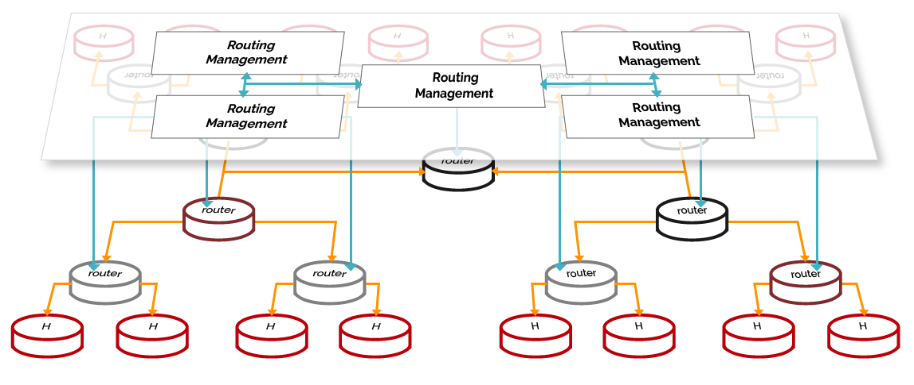

## Decentralized Messaging

Decentralised Communications are built on top of a Resource Oriented Messaging model that supports  publish/subscribe as well as request/response messaging patterns.
Messages are used to perform CRUD (Create, Read, Update, Delete) operations on resources handled by communication endpoints, for example to create or update a WebRTC connection.

The Message delivery is based on a network of routers where each router only knows adjacent registered routers or end-points.
The routers forward messages to all registered listeners, which can be other routers or the final recipient end-point. Listeners are programmatically registered and unregistered by Routing Management functionalities, which take their decisions according to a higher level view of the Routing Network.

There are different layers of routers in the Decentralized Communication architecture.
The lower layers are responsible for the communication between components on a single end-point.
The upper layers - the Message Nodes - route messages between end-points in the same service provider domain or even between different domains.
The Decentralized Messaging Framework is protocol agnostic, i.e. domains with different internal messaging protocols (e.g. SIP, Matrix) can exchange message with each other.
This is achieved by Message Nodes supporting the Protocol on-the-fly concept.

