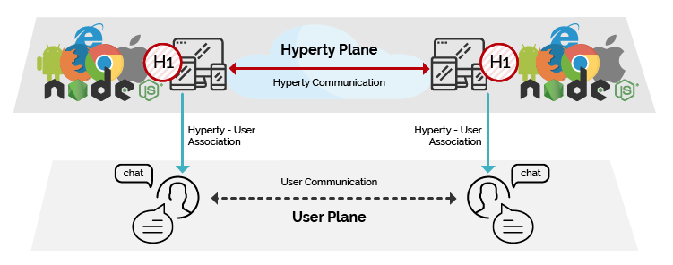

<h1></h1>

The Hyperty Concept is a secure user associated microservice, which can be deployed either on a web runtime environment, on an end-user device or on a networked server.

Hyperties follow [Microservices](http://martinfowler.com/articles/microservices.html)  architectural patterns  meaning they are independently deployable components each one providing a small set of business capabilities, using the smart endpoints and dumb pipes philosophy i.e. Hyperties don't depend on complex and sophisticated communication middleware like Enterprise Service BUS (ESB).
Instead, Hyperties rely on a very light but powerful Decentralized Messaging Framework concept.
On the other side, Hyperties follow emerging [Edge](https://en.wikipedia.org/wiki/Edge_computing) and [Fog](https://en.wikipedia.org/wiki/Fog_computing) computing paradigms as opposed to more popular Cloud Computing.
Hyperties can also be executed in Network Servers for specific Business Capabilities (e.g. Media Servers) or when End-user devices don't have enough capabilities in terms of computing resources and/or power.

Currently, Hyperties are programmed in Javascript but in future it is expected the launch of Hyperty Runtimes supporting more programming languages like Go and Java.

Hyperties follow Decentralized Communications principles providing a few unique advantages:

**Adhoc Interoperability with nearly Zero Standards**

Hyperties are network protocol agnostic and communicate each other through a decentralized messaging framework.
By using the Protocol on-the-fly concept and the Reporter - Observer communication pattern, cross-domain interoperability is supported without requiring the standardization of network protocols or service APIs.

For example, as soon as there is new measurement collected from a sensor, the data is set in a associated JSON Object, which is immediately propagated to any authorised Observer Hyperty.
In this way, the JSON Object handled by Observer Hyperty is always synchronised with the JSON Object owned by the Reporter Hyperty.

**Hyperties are Trustful**

Hyperties use an identity framework enabling independent identity management from the communication provider and the front-end application.
The identity is managed by the user and is verified by an independent trusted entity selected by the user.
This identity provider delivers authentication tokens, which are sent to any involved stakeholder.
This independent ID would be used for any participating service and users will be free to change service providers, where the subscription changes do not affect user reachability.
On enquiry, these IdPs vouch for users’ authenticity and return the URL of the users’ domain, which enables finding destination users.
The users’ identities are based on their personal and confidential data, which is verified by other solicited data, but such private information is only divulged under user-controlled privacy rules.

**Write once, deploy anywhere**

The development of Hyperties and Applications is very easy and flexible, giving the freedom to the developer to select its favorite programming framework.
Currently Hyperties are programmed in Javascript ECMA5/6, i.e. any existing device featuring a Browser or a NodeJS can be used today to execute Hyperties without requiring the installation of any new software.
This means, billions of devices are already Hyperty enabled and ready to participate in the reTHINK ecosystem.

**Hyperties are more Effective and Faster**

Hyperties follow edge computing principles, promoting a more effective usage of computing and network resources, as well as decreasing communication latency.

**Hyperties are Application Domain agnostic**

Hyperties can be used on any Application Domain, but they are specially suitable for Real Time Communication Apps (eg Video Conference and Chat) as well as IoT Apps.
