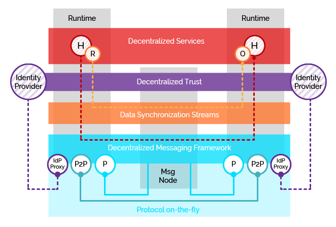

## Conceptual Foundations

**Decentralized Communications** is the main Conceptual Foundation of the reTHINK framework.
It provides trustworthy communication among any peers without central authorities or communication monopolies.
reTHINK Decentralized Communication services are inherently inter-operable without the need to standardize protocols or service APIs.
Decentralized Communications can be applied to any kind of communication, including human-to-human, human-to-things, and things-to-things communication.

reTHINK Decentralized Communications are built on top of a **Decentralized Messaging Framework** providing message delivery in a peer-to-peer mode, the **Protocol on-the-fly** mechanism providing transport interoperability without requiring to standardise messaging protocols, the **Reporter -- Observer data stream synchronisation** communication pattern that enables semantic interoperability through peer-to-peer data synchronisation streams, and the **Decentralised Trust Framework** that enables trustworthy interoperability by using independent Identity Providers. On top of these concepts a new decentralized service paradigm is introduced: the **Hyperlinked Entity aka Hyperty**. Hyperties are securely executed in the Hyperty Runtime binding it with independent Identities selected by the user. Hyperty Runtimes communicate each other as much as possible through p2p connections, otherwise a light Message Node is used.

**Protocol on-the-fly (Protofly)** - provides transport interoperability without requiring the standardization of messaging protocols.
Protocol on-the-fly leverages the code on-demand support by Web runtimes (eg Javascript), to dynamically select, load and instantiate the most appropriate protocol stack during run-time. Such characteristic enables protocols to be selected at run-time and not at design time, enabling protocol interoperability among distributed services, promoting loosely coupled service architectures, optimising resources spent by avoiding the need to have Protocol Gateways in service's middleware as well as minimising standardisation efforts.

**Protostub** - The implementation of the protocol stack, e.g. in a javascript file, that is dynamically loaded from the Service Provider and instantiated at run-time by using the Protocol on-the-fly concept.

**Decentralized Messaging Framework** - is based on a distributed network of routers where each router only knows adjacent registered routers or end-points.
It is designed on top of a Resource Oriented Messaging model that supports publish/subscribe as well as request/response messaging patterns.
Messages are used to perform CRUD operations on resources handled by communication endpoints. In addition, Subscribe operations on resources are also supported in order to be notified on any change performed to such resource.
The Protocol on-the-fly is used by the Decentralized Messaging Framework to be protocol agnostic, i.e. devices and domains using different messaging protocols (e.g. SIP, Matrix) can exchange messages with each other.

**Reporter - Observer peer-to-peer Data Synchronisation** - While the Protocol on-the-fly provides transport interoperability without requiring the standardization of messaging protocols, the Reporter - Observer communication pattern enables semantic interoperability between Services without having to standardize Service APIs.
It extends existing Observable communication patterns by using a P2P data stream synchronization solution for programmatic Objects e.g. JSON Objects, simply called Data Objects.
The Reporter is the only peer with permissions to write to the Data Object while all the other service instances only have permissions to read the Data Object - the Observers.
As soon as the Reporter performs changes to Data Objects, they are immediately propagated to any authorized Observer.

**Hyperties** - Hyperties is a new service paradigm built on top of reTHINK decentralized communication framework that follows microservices architectural patterns. This means Hyperties are independently deployable components each one providing a small set of business capabilities, using the smart endpoints and dumb pipes philosophy.

**References**

* **[Microservices](https://martinfowler.com/articles/microservices.html)** - a particular way of designing software applications as suites of independently deployable services ("Microservice Architecture"). While there is no precise definition of this architectural style, there are certain common characteristics around organization around business capability, automated deployment, intelligence in the endpoints, and decentralized control of languages and data.

* [Distributed Communications Networks](http://www.rand.org/pubs/research_memoranda/RM3420.html)

**Articles**

* [Walled gardens look rosy for Facebook, Apple – and would-be censors](https://www.theguardian.com/technology/2012/apr/17/walled-gardens-facebook-apple-censors)

* [A decentralized web would give power back to the people online](https://techcrunch.com/2016/10/09/a-decentralized-web-would-give-power-back-to-the-people-online/)
