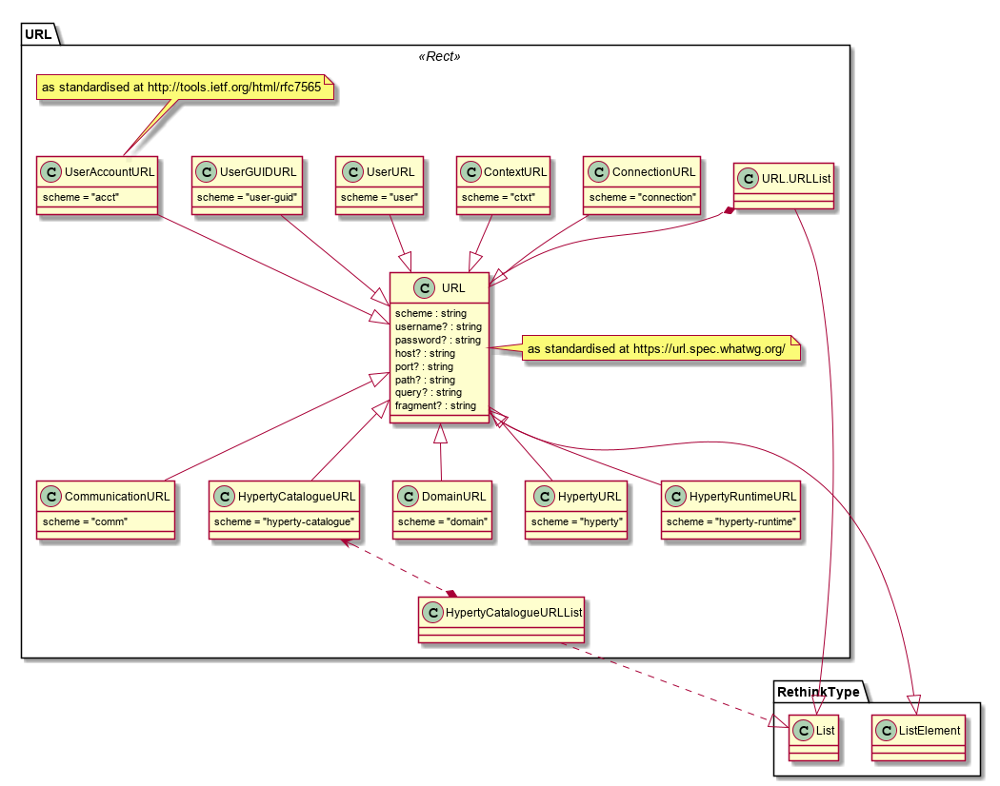

## reTHINK Address Model

It is proposed to use as much as possible Web URLs model for reTHINK addressing model as defined in the [WHATWG standard](https://url.spec.whatwg.org/). According to this standard, there is no distinguish betweeb URL and URI. The intention is not to depend on existing DNS based naming resolution but to keep it open as such decision will take place in WP4.

reTHINK URL is used by the [Message model](../message/readme.md) to identify the message recipient, message sender and resources where operations carried by the message will be performed. It is to be noted, that in some situations, there is no need to resolve URL into IP addresses in order to reach the URL endpoint. For example, it is possible that Hyperty instances served by a messaging service like vertx.io would use a dedicated name space to manage message routing between Hyperty instances.

We should consider the introduction of new URL schemes for the different types of addresses needed but re-use as much as possible existing schemes that are handled by [IANA](https://www.iana.org/assignments/uri-schemes/uri-schemes.xhtml)

The different types of URLs required by reTHINK are defined in the picture below:

### Domain URL Type

The Domain URL is used to identify a reTHINK Service Provider domain and, if required associated functional element.

Usage examples:

* to support messaging communication between Hyperty instances and Service Provider back-end Support Services eg to query Domain Registry for an Hyperty Instance
* to support messaging communication between Core Runtime components and Service Provider back-end Support Services eg to request address allocation for a new Hyperty Instance
* to support messaging communication between Core Runtime components and Service Provider back-end Support Services eg to request address allocation for a new Hyperty Instance

It is proposed to use a new scheme e.g. "domain"

    domain://<rethink-functional-element>.<service-provider-domain>/<functionality-identifier>

where:

**<rethink-functional-element>:** identifies reTHINK Architecture functionality being addressed including:

  **msg-node** for Messaging Node functional element

  **registry** for Domain Registry functional element

**<functionality-identifier>:** identifies a specific functionality of a functional element. At this stage only applicable to [Messaging Nodes functionalities](../../../messaging-framework/msg-node.md).

**examples**

    `domain://registry.hyperty.com`

    `domain://msg-node.hyperty.com/hyperty-address-allocation`

#### Business Role Domain URL Type

    The Business Role Domain URL is an extension of the reTHINK Service Provider domain for specific reTHINK Business Role, and, if required, associated functional element.

    Usage examples:

    * to support messaging communication between Hyperty Core Runtime Functionalities and an IDP

    It is proposed to use:

        domain-<business-role>://<rethink-functional-element>.<service-provider-domain>/<functionality-identifier>

    where  **<business-role>:** identifies a specific business role including:

      **idp** for IDP Business role

      **csp** for CSP Business role

      **broker** for CSP Broker business role

    **examples**

        `domain-idp://google.com`

### Global URL Type

            The Global URL is used to identify reTHINK functionalities that are domain agnostic.

            Usage examples:

            * to support messaging communication between Hyperty Core Runtime Functionalities and the Global Registry

            It is proposed to use:

                global://<rethink-functional-element>

            where  **<rethink-functional-element>:** identifies a global reTHINK functionality:

              **registry** for reTHINK Global Registry functionalities

            **examples**

                `global://registry`

### User URL Type

This URL is needed to identify reTHINK users as defined in D2.1 (including individuals, organisations, physical spaces, physical things) and modelled as [User Identity Objects](../user-identity/readme.md).

Usage examples:
* to query information about the user profile
* to request to communicate with the user

Analysis of existing schemes for users (improve consistency):
* [acct](http://tools.ietf.org/html/rfc7565): is not appropriate since it is associated to a service provider and this address must be portable between service provider domains

Proposal: to use a new scheme eg "user":

    user://<idpdomain>/<user-identifier>

In case, the user identifier is not managed by an IdP but by some other naming management mechanism like a pure [DHT](https://github.com/reTHINK-project/governance-security-implementation/blob/master/docs/directories/directories.md) the URL would not contain the idp domain and just the user identifier that would have to be global unique identifier corresponding to the GraphID concept introduced in D2.1.

    user-guid://<unique-user-identifier>

Anonymous User URL is `user://anonymous`

**examples**

Individuals:

    user://orange.fr/simon

    user://twitter.com/pchainho

Physical Places:

    user://cm-lisboa.pt/campo-grande-28-building

Assuming the city hall is also playing the IdP role.

Organisations:

    user://telecom.pt/meo

    Assuming PT is also playing the IdP role.

Global Uniquer Identifiers (GraphID) without IdP domain:

    user-guid://XXXXMYGUIDXXX

### User Account in a Service Provider

Usage examples:

* account management purposes
* to identify the account where personal policies for a specific service (eg CSP) are applied

For users that have account in Service Providers including CSPs it is proposed to use the existing  [acct](http://tools.ietf.org/html/rfc7565):

    acct://<sp_domain>/<account_identifier>

**Example**

    acct://telecom.pt/paulo-g-chainho

In case the account identifier uses an IdP identifier, according to [RFC3986](https://tools.ietf.org/html/rfc3986), reserved percent encodes for ":" and "/" are used:

    acct://<sp_domain>/user%3A%2F%2F<idpdomain>%2F<user-identifier>

*to be checked. A percent encode before the scheme "user" is needed or can we just skip it?*

**Example**

The former example, now using Identifier from Twitter:

    acct://telecom.pt/user%3A%2F%2Ftwitter.com%2Fpchainho

### Catalogue Address

The Catalogue URL is used to identify [descriptors](../hyperty-catalogue/readme.md) in the Catalogue notably Hyperty and Protocol Stub descriptors.

Usage examples:

* consult Hyperty Metadata from the Catalog
* to download and deploy an Hyperty in a Runtime Device
* consult Protocol Stub descriptor from the Catalog
* to download and deploy an protocol stub in a Runtime Device
* consult a data object schema from the Catalog
* to download a data object schema into a Runtime Device

It is proposed a new ""hyperty-catalogue" scheme:

    hyperty-catalogue://catalogue.<service-provider-domain>/.well-known/<object-type>/<catalogue-object-identifier>

**example**

In case version 1.0 Hyperty "wonder-hype" is provided by "hyperty-provider.com", it URL would be:

    hyperty-catalogue://catalogue.hyperty-provider.com/.well-known/hyperty/HelloWorldReporter

### Device Runtime Address

The Runtime URL is used to identify Runtime Data Objects where Hyperty instances are running.

Usage examples:

* to query information about runtime capabilities
* to update runtime components
* to send messages to a runtime component eg a runtime protocol stub
* to query about hyperty instances running in the runtime

No existing scheme was found appropriate. It is proposed a new "hyperty-runtime" scheme:

    hyperty-runtime://<runtime-provider-domain>/<runtime-identifier>

Where `<runtime-provider-domain>` identifies the stakeholder that provides and manages the Hyperty Runtime execution environment.

**example**

In case the runtime components are provided by google.

    hyperty-runtime://google.com/001/123456

### Hyperty Instance Address

The Hyperty URL is used to identify [Hyperty Instance Data Objects](../hyperty-registry/readme.md) in the Registry.

Usage examples:

* to support messaging communication among Hyperty instances eg to control a Video Conference setup

It is proposed to use a new scheme eg "hyperty"

    hyperty://<hyperty-domain>/<hyperty-instance-identifier>

**open issue:** Should we include in the URL its timeout / expires or in the Registration message?

**example**

In case the Hyperty instance is registered at "meo.pt" domain:

    hyperty://meo.pt/123456

#### Communication / Conversation Address

The URL Communication address is used to identify a [communication data object](../../data-objects/communication/readme.md).

Usage examples:

* to identify the resource communication during communication control
* to query about recorded communications
* to identify communications for billing purposes

It is proposed to use a new scheme eg "comm"

    comm://<csp-domain>/<communication-identifier>

For cross domain communications, it is used the "csp domain" from the communication owner, tipically the communication requesting party. Other involved CSPs are free to generate its own communication URL for its operations purposes or user purposes e.g. to keep records of communication history.

**open issue 1:** do we need a rule to correlate the same communication instance using URLs from different CSPs eg for settlement purposes?

**example**

In case the Communication is provided by "telekom.de":

    comm://telekom.de/sdruesdow-20150802006

#### Context Address

The URL Communication address is used to identify a [Context data object](../../data-objects/context/readme.md).

Usage examples:

* to identify the resource context during production and consumption of context data
* to query about recorded context data
* to identify context data for billing purposes

It is proposed to use a new scheme eg "comm"

    ctxt://<context-producer-domain>/<context-identifier>

**example**

In case the Context data is about energy context of "myhouse" domain:

    ctxt://myhouse/energy
