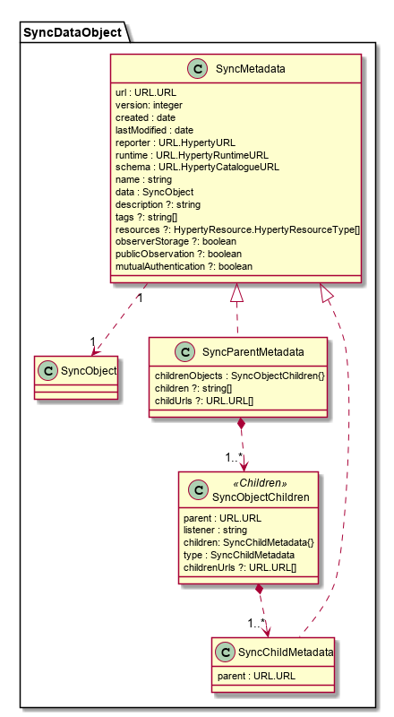

Data Object Synchronisation Model
------------------

The SyncDataObject Model is used to specify the JSON format used in the [Reporter-Observer data synchronisation communication mechanism](../../../messaging-framework/p2p-data-sync.md) used to support Hyperty Interoperability at run time.

## SyncObject

Is the abstract class for any data object to be synchronized.

## SyncMetadata

Is the abstract class for any data object to be synchronized. It contains metadata about the object to be synchronised and the data itself.

**url** is the DataObject URL which scheme is defined in the json-schema descriptor of the DataObject

**Reporter** contains the Reporter Hyperty URL

**schema** contains the CatalogueURL for the JSON Schema describing the Sync Object

**runtime** contains the RuntimeURL where the Sync Object is hosted

**created** data object creation time

**lastModified** last time the data object was changed

**version** is an integer that is incremented every time the object is updated. To be used to order changes in the object when needed. Useful when sync streams are resumed by Observers.

**name** is an identifier of the Data Object that is used for discovery purposes

**description** textual description of the data object (optional)

**tags** strings that can be used to classify the data object (optional)

**resources** the types of [Hyperty Resources](../hyperty-resource/readme.md) supported by the data object.

**observerStorage** is a boolean used by the Sync Manager of the Observer runtime to decide if Observer can store (`true`) or not (`false`) the data object.

**publicObservation** is a boolean used by the Hyperty handling reading requests to decide who can read the Object.

**mutualAuthentication** is a boolean used by the Policy Engine to decide if the Object sync data flows should be encrypted (true) or not (false).

## SyncData

Is the abstract class for the actual data to be synchronized.

## SyncParentMetadata

Is an Abstract class for composite SyncMetadata. It contains one or more containers of Childs called childrenObjects of type SyncObjectChildren.

## SyncObjectChildren

Contains a collection of SyncChildMetadata objects as **children** attribute.

## SyncObjectChild

Is a SyncMetadata that can be created by an observer of the SyncParent.

The **url** attribute inherited from SyncDataObject class contains, `<SyncObjectParentURL>/children/<childreName>/<reporter-instance-indentifier>#<childId>` where,

 `<reporter-instance-indentifier>` is the path from the Hyperty URL of the Reporter, ie the creator, of the SyncObjectChild. Note that HypertyURL is `hyperty://<domain>/<reporter-instance-indentifier`.

 `<childId>` is an integer that is incremented everytime a new SyncObjectChild is create by the same Hyperty.

The **parent** attribute contains the SyncParentMetadata url.
