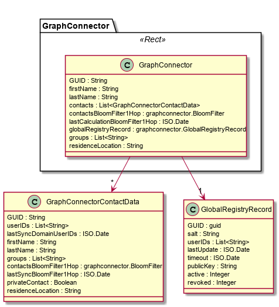

Graph Connector Data Model
--------------------

The Graph Connector handles the user's GUID and serves as a address book/contact list.

## Graph Connector

| **Attribute Name**   | **Attribute Type**        | **Description**     |
|----------------------|:-------------------------:|:--------------------------------------------------------------------------------------------------------|
| **GUID**             |          string           | The user's GUID. |
| **firstName**        |          string           | The user's first name. |
| **lastName**         |          string           | The user's last name. |
| **contacts**         | List<GraphConnectorContactData> | The list of contacts of the user. |
| **contactsBloomFilter1Hop** | graphconnector.BloomFilter | Bloom filter containing the hashed GUIDs of the user's contacts. |
| **lastCalculationBloomFilter1Hop** | ISO.Date    | Date of the last calculation of the Bloom filter containing the hashed GUID of the user's contacts. |
| **globalRegistryRecord** | graphconnector.GlobalRegistryRecord | Object containing all data stored in the Global Registry. |
| **groups**           |    List<string>           | A list of groups the user is member of. |
| **residenceLocation** |    string                | A geohash value indicating the residence location of the contact. |

## Graph Connector Contact Data
For each contact, the following data is stored:

| **Attribute Name**      | **Attribute Type** | **Description**        |
|-------------------------|:------------------:|:------------------------------------------------------------------------------------|
| **GUID**                |       string       | The GUID of the contact. |
| **UserIDs**             |       string       | The UserIDs of the contact. For caching purposes. |
| **lastSyncDomainUserIDs** |     ISO.date     | The date of the last synchronization with the Global Registry. |
| **firstName**           |       string       | The first name of the contact. |
| **lastName**            |       string       | The last name of the contact. |
| **groups**              |    List<string>    | A list of groups the contact is member of. |
| **contactsBloomFilter1Hop** | graphconnector.BloomFilter | The Bloom filter containing the hashed GUIDs of the contact's contact's. |
| **lastSyncBloomFilter1Hop** | ISO.date       | Date of the last synchronization. |
| **privateContact**      |    Boolean         | Indicates if the contact is marked private which leaves her out of the user's contacts Bloom filter. |
| **residenceLocation**   |    string          | A geohash value indicating the residence location of the contact. |

## Global Registry Record
The Global Registry stores information on how to get in touch with users.
Each user sends a JWT (JSON Web Token) representation of this data to the Global Registry.

| **Attribute Name**      | **Attribute Type** | **Description**        |
|-------------------------|:------------------:|:------------------------------------------------------------------------------------|
| **GUID**                |       string       | The GUID of the user. |
| **salt**                |       string       | The salt used in the GUID generation. |
| **userIDs**             |   List<string>     | The list of UserIDs for the user's associated Domain Registries. |
| **lastUpdate**          |      ISO.date      | The date of the last update of the Global Registry Record. |
| **timeout**             |      ISO.date      | A timeout until when the Global Registry Record should be considered valid. |
| **publicKey**           |      string        | The ECDSA public key of the user in PKCS#8 format without line breaks. |
| **active**              |      integer       | Indicating if the record should be considered activated. |
| **revoked**             |      integer       | Indicating if the record should considered revoked by the user. |

### GUID generation

GUIDs are generated with the following algorithm:

* generate a ECDSA key pair over curve secp256k1
* get the public key in format PKCS#8
* remove all line breaks
* get a string to be used as a salt
* perform PKDF2 with SHA256 with 10000 iterations on the public key, using the salt
* encode the result in Base64url. This is the GUID

This operation is performed by calling:
GraphConnector.generateGUID()

This will return a mnemonic consisting of 16 words.
By calling GraphConnector.userGUID(string), the same GUID can then be re-used.

### JWT Global Registry Record

The Global Registry Record is send as a signed JWT to the Global Registry.
The process of proper creation of the JWT is the following:

* Create the dataset as a JSONObject
* serialize the JSONObject
* encode it via Base64URL
* create a JWT
* set a claim "data" with the Base64URL-encoded JSONObject as value
* sign the JWT using the private key matching the enclosed public key
* the result can be sent to the Global Registry via PUT

This can be done with a provided method in the Graph Connector, simply by calling:
GraphConnector.signGlobalRegistryRecord()
