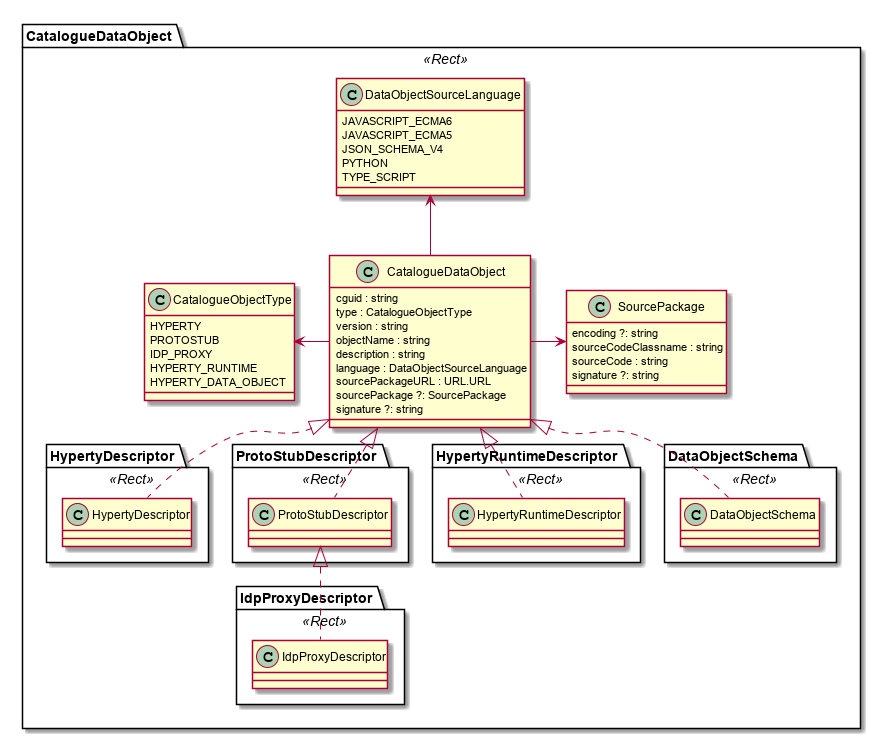
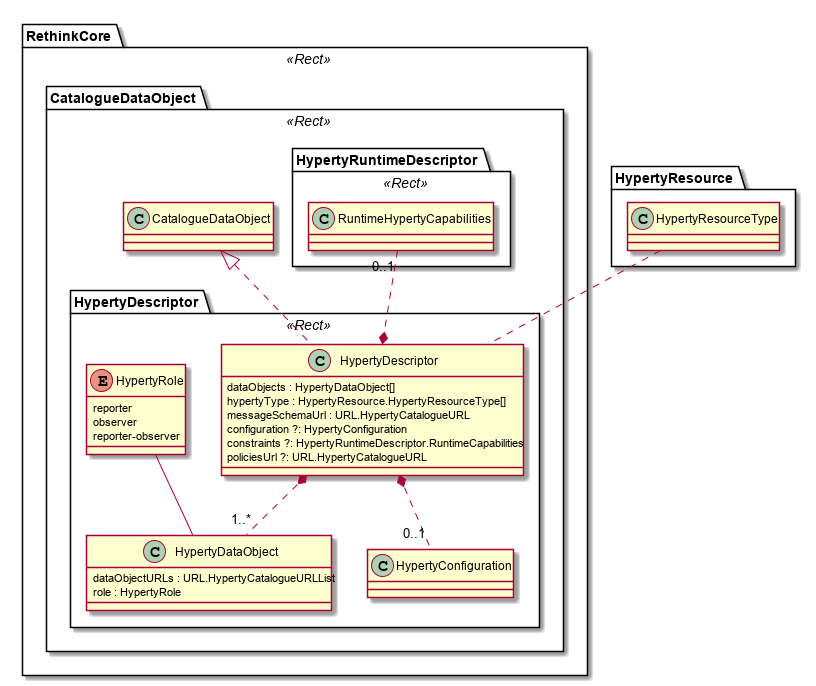
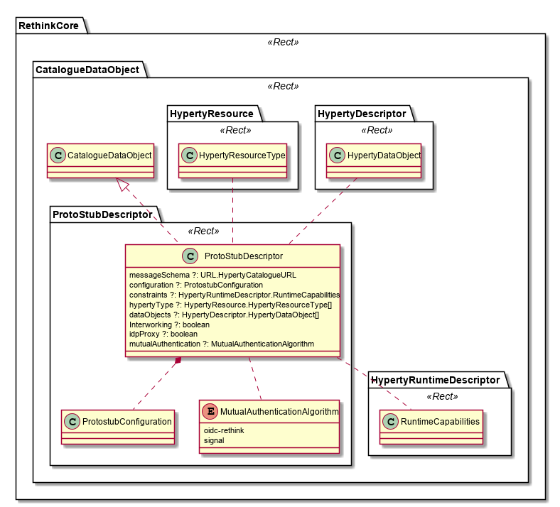
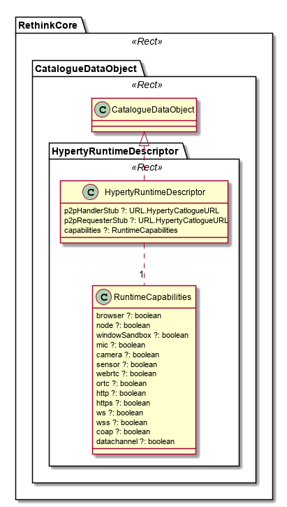

Catalogue Data Model
--------------------

Catalogue Data Model includes all Objects to be handled by the Catalogue functionality including:

-	Hyperty Descriptors
-	Protocol Stub Descriptors
-	Idp Proxy Descriptors
-	Hyperty Interceptors Descriptors
-	Hyperty Runtime Descriptors
-	Data Object Schemas

All Catalogue Data Objects have the following attributes:

| **Attribute Name**   | **Attribute Type**       | **Mandatory** | **Description**                                                                                                                                                                                                                                                                                                                                                                                                                              |
|----------------------|:------------------------:|:-------------:|:---------------------------------------------------------------------------------------------------------------------------------------------------------------------------------------------------------------------------------------------------------------------------------------------------------------------------------------------------------------------------------------------------------------------------------------------|
| **cguid**            |          string          |      yes      | Catalogue Global Unique identifier of the Catalogue Object (e.g. Hyperty descriptor, ProtocolStub descriptor, etc) enabling the same object to be stored and discovered in different Catalogues. That means, *guid* corresponds to `<resource-type-id>` per [BNF of Resource Path](https://github.com/reTHINK-project/architecture/blob/master/docs/interface-design/resource-path.md). *Couldn't we have problems with too long URL paths?* |
| **type**             |   CatalogueObjectType    |      yes      | Indicates the type of Catalogue Data Object e.g. Hyperty, ProtocolStub, etc                                                                                                                                                                                                                                                                                                                                                                  |
| **version**          |          string          |      yes      | Indicates the version of Catalogue Data Object e.g. 0.1, 0.2, etc                                                                                                                                                                                                                                                                                                                                                                            |
|                      |                          |               |                                                                                                                                                                                                                                                                                                                                                                                                                                              |
| **objectName**       |          string          |      yes      | human-understable name of the catalogue object e.g. "My Awesome Hyperty".                                                                                                                                                                                                                                                                                                                                                                    |
| **sourcePackageURL** |          string          |      yes      | A string containing the URL from where the source code package of the corresponding catalogue object, e.g. deployable packages containing executable code for Hyperties or ProtoStubs, can be downloaded. **Question: should this only be the pure URL or should it also include the protocol used to download it, i.e. http://xxxxx or ftp://xxxxx etc)**                                                                                   |
| **sourcePackage**    |          string          |      no       | The deployable packages of the catalogue object (i.e. the executable of the Hyperty or ProtoStubs). Note: The *sourcePackage* attribute must be present if the *sourcePackageURL* points to this attribute.                                                                                                                                                                                                                                  |
| **language**         | DataObjectSourceLanguage |      yes      | The programming language used in the SourcePackage.SourceCode e.g. Javascript ECMA5 for Hyperties or JSON-Schema for Data Object Schemas. The main purpose of this attribute is to make reTHINK agnostic of the programming language used.                                                                                                                                                                                                   |
| **signature**        |          string          |      no       | Enables integrity and authenticity verification of Data Object catalogue.                                                                                                                                                                                                                                                                                                                                                                    |

The detailed description of the SourcePackage is described below.

| **Attribute Name**      | **Attribute Type** | **Mandatory** | **Description**                                                                                                                                   |
|-------------------------|:------------------:|:-------------:|:--------------------------------------------------------------------------------------------------------------------------------------------------|
| **encoding**            |       string       |      yes      | Encoding used in the SourceCode in case we have non-printable characters                                                                          |
| **SourceCodeClassname** |       string       |      yes      | The Classname of the SourceCode e.g. "AwesomeHyperty"                                                                                             |
| **sourceCode**          |       string       |      yes      | The source code of the catalogue object (i.e. the executable Javascript of the Hyperty or ProtoStubs or the JSON-Schema of a Data Object Schema). |
| **signature**           |       string       |      no       | Enables integrity and authenticity verification of the SourcePackage.                                                                             |

### Hyperty Descriptor

The Hyperty Descriptor Data Object is used to model each Hyperty offered by a certain Service Provider.

To support the Hyperty interoperability concept based on [data synchronisation mechanisms](../../data-objects/data-synch/readme.me), the Hyperty Descriptor is characterised by the schemas that describes the data objects handled by the Hyperty: HypertyDataObject. **Changed in Phase 2**  **Each HypertyDataObject contains a HypertyCatalogueURL that links to the data object schema descriptor (see below) and the role the Hyperty plays when handling this object: "reporter", "observer" or both ie "reporter-observer".

In Addition, Hyperty Descriptor contains the policies to rule Hyperty execution (HypertyPolicy), the required runtime Hyperty capabilities (Constraints) and the data needed to configure the Hyperty delivery to users (Configuration).

Besides the attributes inherited from the general CatalogueDataObject described above, additional Hyperty Descriptor attributes are:

| **Attribute Name** | **Attribute Type**                                                                                                                | **Mandatory** | **Description**                                                                                                                                                                                                                                                                      |
|--------------------|:---------------------------------------------------------------------------------------------------------------------------------:|:-------------:|:-------------------------------------------------------------------------------------------------------------------------------------------------------------------------------------------------------------------------------------------------------------------------------------|
| **type**           | Integer (Enumeration which maps the valid tags: "Communicator", "Identity", "Context" to a defined corresponding interger value). |      no      | A tag that identifies what type of hyperty is described in the object.                                                                                                                                                                                                               |
| **hypertyType**           | Array of [HypertyResource.HypertyResourceType](../../data-objects/hyperty-resource) |      yes      | It defines the type of resources handled by the Hyperty.                                                                                                                                                                                                               |
| **dataObjects**    |                                    HypertyDataObject  **Changed in Phase 2**                                  |      yes      | A list of HypertyDataObjects supported by the Hyperty. Each HypertyDataObject is defined by the [Data Schema Catalogue URL](#data-object-schema) from where the schema can be loaded and the role the Hyperty plays when handling it (reporter, observer or both)                                                                                                                          |
| **messageSchema**  |                                      [URL.HypertyCatalogueURL](../address#catalogue-address)                                      |      no       | It defines the [Schema](#data-object-schema) describing the [Message Data Model](../message) used by the Hyperty through the Catalogue URL from where the Message schema can be reached. If not defined, by default it is assumed the *standard* [Message Model](../message) is used |
| **configuration**  |                                                       HypertyConfiguration                                                        |      no       | A Data required to configure the Hyperty                                                                                                                                                                                                                                             |
| **constraints**    |                                                    RuntimeCapabilities                                                     |      no       | [RuntimeCapabilities](#hyperty-runtime-descriptor) describing capabilities required from the Hyperty Runtime in order to be able to execute the Hyperty                                                                                                                       |
| **policies**       |                                                HypertyPolicy (*not yet defined*\)                                                 |      no       | A list of policies to be enforced when executing the Hyperty                                                                                                                                                                                                                         |

### Protocol Stub Descriptor

The Protocol Stub Descriptor is used to model each Protocol Stub that can be used to connect to a certain Service Provider domain. It is characterised by the schemas of the supported messages (messageSchemas) which contains a HypertyCatalogueURL that links to the corresponding Messages schema descriptor (see below).

In Addition, Protocol Stub Descriptor contains the required runtime capabilities (Constraints) and the data needed to configure the Protocol Stub deployment in the runtime (Configuration).

Besides the attributes inherited from the general CatalogueDataObject described above, additional Hyperty Descriptor attributes are:

| **Attribute Name** | **Attribute Type**                                      | **Mandatory** | **Description**                                                                                                                                                                                                                                                                           |
|--------------------|:-------------------------------------------------------:|:-------------:|:------------------------------------------------------------------------------------------------------------------------------------------------------------------------------------------------------------------------------------------------------------------------------------------|
| **messageSchema**  | [URL.HypertyCatalogueURL](../address#catalogue-address) |      no       | It defines the [Schema](#data-object-schema) describing the [Message Data Model](../message) used by the ProtocolStub through the Catalogue URL from where the Message schema can be reached. If not defined, by default it is assumed the *standard* [Message Model](../message) is used |
| **configuration**  |                 ProtostubConfiguration                  |      no       | Data required to configure the ProtocolStub                                                                                                                                                                                                                                               |
| **constraints**    |               RuntimeCapabilities               |      no       | [RuntimeCapabilities](#hyperty-runtime-descriptor) describes capabilities required from the Hyperty Runtime in order to be able to execute the ProtocolStub                                                                                                                       |

### Hyperty Runtime Descriptor

The Hyperty Runtime Descriptor is used to model the Runtime that can be used to execute Hyperties in a certain device or network server. Hyperty Runtimes are described in terms of supported capabilities to execute Hyperties, and Protocol Stubs (RuntimeCapabilities).

**Phase 2 New!!**

The `p2pHandlerStub` defines the Catalogue URL of a [P2P Handler protocolStub](../../messaging-framework/readme.md#peer-to-peer-message-delivery) that can be deployed in the Runtime.

The `p2pRequesterStub` defines the Catalogue URL of a [P2P Requester protocolStub](../../messaging-framework/readme.md#peer-to-peer-message-delivery) that can be used in order to setup a P2P Connection with this runtime.

### Data Object Schema

The Data Object Schema describes data objects used by reTHINK functionalities. Two types are considered:

-	MessageDataObjectSchema describes messages that are used by Hyperties to communicate each other
-	HypertyDataObjectSchema describes the data objects handled by Hyperties and exchanged among them in the Message Body. The access to these Objects are ruled by an AccessControlPolicy (see the Reporter - Observer communication pattern rules as example). At this stage, four types of Hyperty Data Objects are considered:

-	[Communication Data Objects](../../data-objects/communication/readme.md) handled by Communicator HypertyType (see Hyperty Descriptor above)

-	[Connection Data Objects](../../data-objects/communication/readme.md) handled by Communicator HypertyType (see Hyperty Descriptor above)

-	[Identity Data Objects](../../data-objects/user-identity/readme.md) handled by Identity HypertyType (see Hyperty Descriptor above)

-	[Context Data Objects](../../data-objects/context/readme.md) handled by Context (producer or consumer) HypertyType (see Hyperty Descriptor above)
