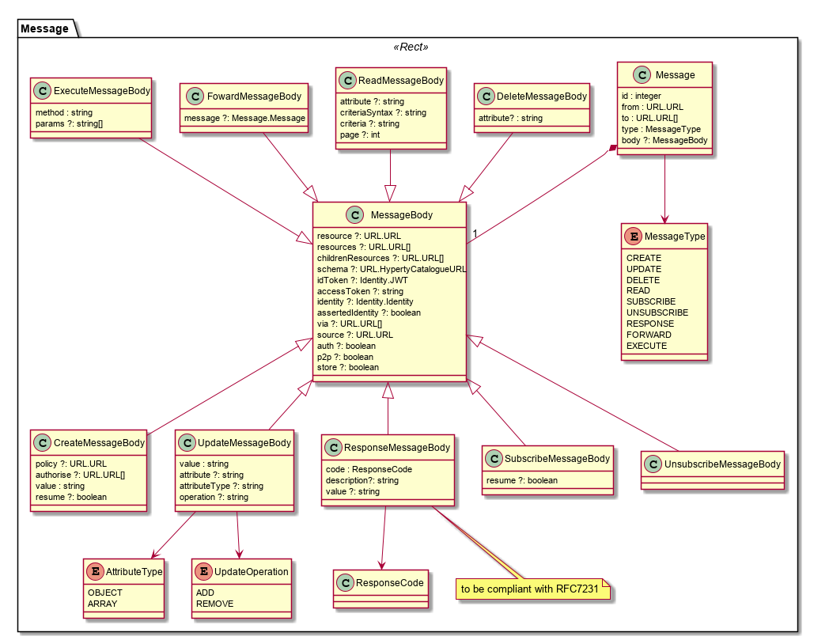

Message Model
-------------

Header
------

Fields needed to route messages.

#### id

To be used to associate Response messages to the initial request message.

#### type

Message type that will be used to define the Message Body format.

#### from

[URL](../address/readme.md) of Hyperty instance or User associated with it

#### to

One or more [URLs](../address/readme.md) of Message recipients. According to the URL scheme it may be handled in different ways

### Message Body

Optionally, message bodies can contain JWT tokens for Access Control or for Identity Assertion purposes. See [here](../../../specs/dynamic-view/identity-management/user-identity-assertion.md) for more details.

The "MessageBody.via" attribute contains a list of all Protostub addresses (Protostub) that the message has been passed through. It is used to prevent infinite cycles in the Hyperty Messaging Framework.

The `MessageBody.source` contains the original creator of the message. Useful e.g. to identify the real source of the response to a one-to-many message delivery ie multiple responses coming from different sources.

The `MessageBody.auth` is used by the policy engine to set the Message was authorised (`true`) or that no policy was found by the Policy Engine to be enforced in this message (`false`).

The `MessageBody.p2p` is used by the Runtime Registry to decide if a P2P Connection Stub should be deployed (`true`) or not (`false`).

#### CreateMessageBody

##### value

Contains the created object in JSON format.

##### policy

URL from where access policy control can be downloaded. Examples:

1.	reporter-observer where only reporter can make changes

2.	similar to previous one but observers can request reporters to make changes

Policy to be enforced by Monitor component colocated with Connector sandbox?

#### ResponseMessageBody

##### Code

A response code compliant with HTTP response codes (RFC7231).

##### Description

Description of response code compliant with HTTP response codes (RFC7231).

##### Value

Contains a data value in JSON format. Applicable to Responses to READ MessageType.

#### ReadMessageBody

##### attribute

Identifies the attribute in the Object to be read (optional)

##### criteriaSyntax

Defines the criteria syntax used in criteria field. To be used for search purposes. Valid criteria Syntaxes are: "key-value", "mongodb", "sql"(?), ...

##### criteria

Defines the criteria to be used for search purposes. Syntax used to define the criteria is set in the criteriaSyntax.

#### UpdateMessageBody

##### attribute (optional)

Identifies the attribute in the Object that is updated

##### value

Contains the updated value object in JSON format.

##### attributeType (optional)

To indicate whether it is an array that is updated.

##### operation (optional)

Operation to be performed in an array: add or remove

#### DeleteMessageBody

##### attribute

Identifies the attribute in the Object that is deleted (optional)

#### FowardMessageBody

##### message

Contains forwarded message.

#### ExecuteMessageBody

Contains the name of method to be invoked and an array and an Array of objects to be passed as parameters to the defined method. This is compliant with [JSON-RPC Spec](http://www.jsonrpc.org/specification).

#### SubscribeMessageBody

Optional attribute `subscribe` is a list of URLs to be subscribed to.

#### UnsubscribeMessageBody

Optional attribute `unsubscribe` is a list of URLs to be unsubscribed from.

### Procedures

#### Request - Response transactions

A Response to a Request message should follow this rule:

-	Response.from = Request.to
-	Response.to = Request.from
-	Response.id = Request.id

It should be note, the Request.id MUST be incremented every time a new Request message is created.
