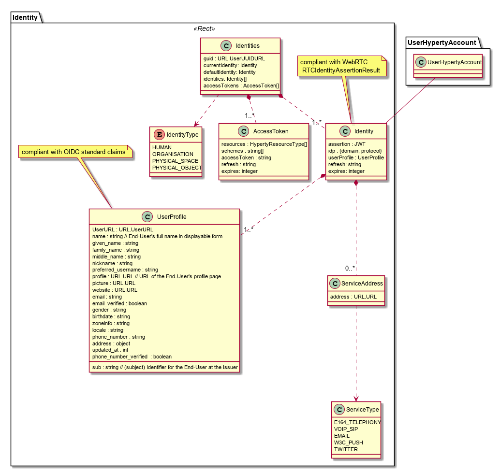

## User Identity Data Model

The Identity Data Model is used to model the reTHINK User entity. The Identity data model is handled by Identity Management functionality.

The Identity has a global unique identifier ([UserUUIDURL](../address/readme.me#user-url-type) which is independent of the IdP corresponding to the GraphID concept introduced in D2.1.

In addition an Identity can have multiple identifiers of type ([UserURL](../address/readme.me#user-url-type).

An identity is characterised by its type which includes Human, HumanGroup, Physical Space and Physical Object.

One Identity may hold one or more credentials (IDToken) used for its authentication.

An Identity is characterised by its profile (UserProfile) which may include username, birthdate, picture, etc. It is proposed to be compliant with OIDC (Open ID Connect) standard claims.

One Identity may hold one or more access tokens (AccessToken) used to manage identity privacy in terms of authorisation policies.

AccessToken and IDToken are JSON Web Token objects.

Identity may also handle Identity Assertions (IdAssertion) to validate some of its identitiers (IdValidation) in certain scopes e.g. in a communication. IdentityAssertion and IdValidation should be compliant with WebRTC RTCIdentityAssertionResult and RTCIdentityValidationResult.

One Identity may be associated with one or more [User Hyperty Accounts](../user-hyperty-account/readme.md) i.e. hyperty subscriptions that uses one of the user Identifiers.
