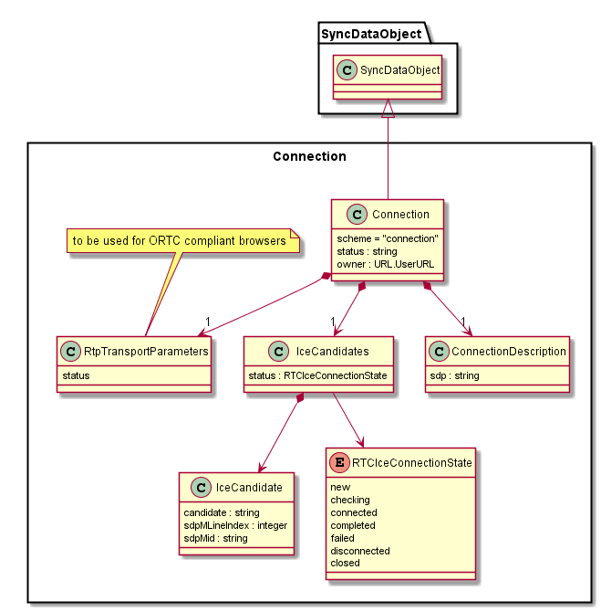

### Connection

The connection object is a SyncData Object that contains WebRTC standardised IceCandidates and Connection Description objects or ORTC standardised RtpTransportParameters objects (for ORTC compliant browsers).

The Hyperty that owns the Connection object is its reporter and the observer of the remote Connection object managed by the remote peer. In this case, the Reporter Connection object contains local PeerConnection data and Observer Connection object contains remote PeerConnection data.
