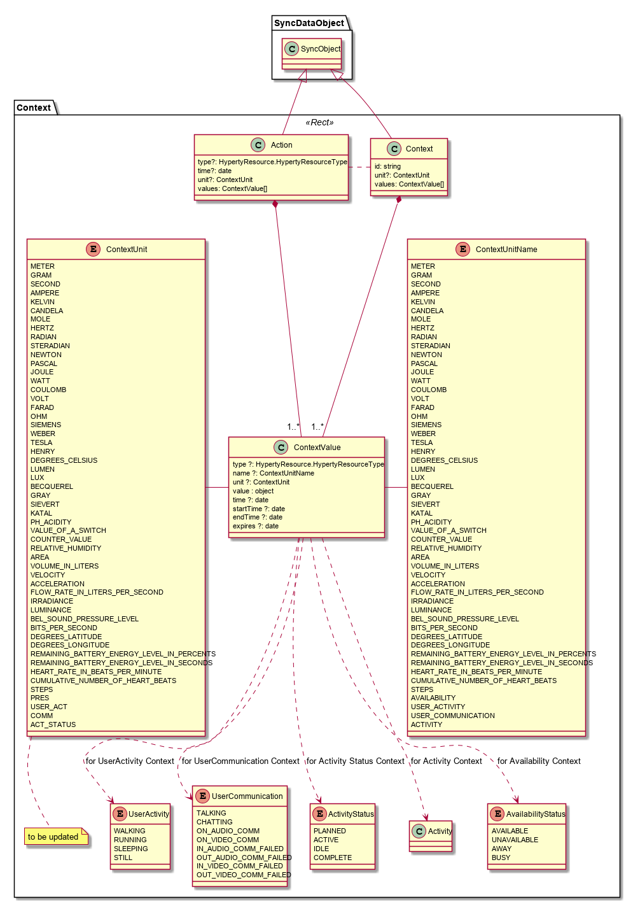

## Context Data Object Model

*To be compliant with [SENML](https://tools.ietf.org/html/draft-jennings-core-senml-01)*

The Context model is comprised by two main types of Objects:

**Context:** contains data that characterises the environment around a certain reTHINK User (ie a human being or physical things) usualy derived from data collected from sensors.

**Action:** contains data used to perform actions on reTHINK physical things users

### Context

A Context is defined by:

- **type**: its the ResourceType
- **children**(optional): list of collections of Child Context Objects. Useful to support actions performance on parent Context Object. **FFS:** to facilitate interoperability a standard syntax should be used for the children name eg `<ContextValueName>-actions`. Example: `lumen-actions` for actions related with light brightness
- **childUris**(optional): list of Child Context Objects eg sensors of a parent room context data object.

### Open Issues
1. JSON encoding directly derived from class design is unlikely to be SENML-compliant (see also https://github.com/reTHINK-project/architecture/issues/60)
