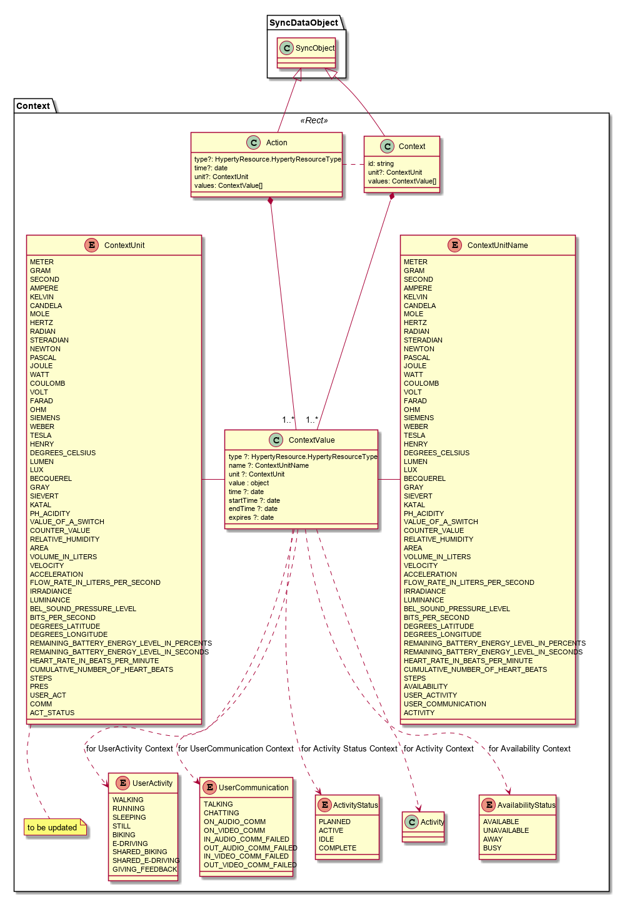

## Context Data Object Model

*To be compliant with [SENML](https://tools.ietf.org/html/draft-jennings-core-senml-01)*

The Context model is comprised by two main types of Objects:

**Context:** contains data that characterises the environment around a certain reTHINK User (ie a human being or physical things) usualy derived from data collected from sensors.

**Action:** contains data used to perform actions on reTHINK physical things users

### Context

A Context is defined by:

- **id**: context identifier
- **unit**: (optional) value of type `ContextUnit` that defines the unit used by `Context.values.value[]`. If a value does not contain a Unit value,
      then this Unit value is used.  Otherwise the value found in the `Context.values[].unit` Unit (if any) is used.
- **values**: an array of type `ContextValue` where the last element contains the most updated value of the context.

### ContextValue

A ContextValue is defined by:

- **type**: its the [ResourceType](../../core/hyperty-resource) of the value
- **name**: (optional) type `ContextUnitName` the display name of the unit used by `value`.
- **unit**: (optional) value of type `ContextUnit` that defines the unit used by `value`.
- **value**: measurement value as defined at `unit`.
- **time**: (optional) time of "instantaneous" measurement.
- **startTime**: (optional) starting time of measurement occurred in a certain period of time.
- **endTime**: (optional) ending time of measurement occurred in a certain period of time.
- **updateTime**: (optional) the last time the measurement was performed.
- **expires**: (optional) when the measurement value expires.
