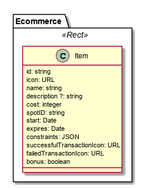

The E-commerce model is used to describe e-commerce items that are availble in shops that can be geo spots.

Items can be a bonus and in that case its cost is deducted from `bonus-credit` wallet field.

**Example**

```
id: "myid",
name: "Croissants",
description: "The best French Croissants in town",
icon: "https://xpto/croissant.gif",
cost: 5,
spotID: "mySpotId",
expires: "27/04/18",
bonus: true
```
