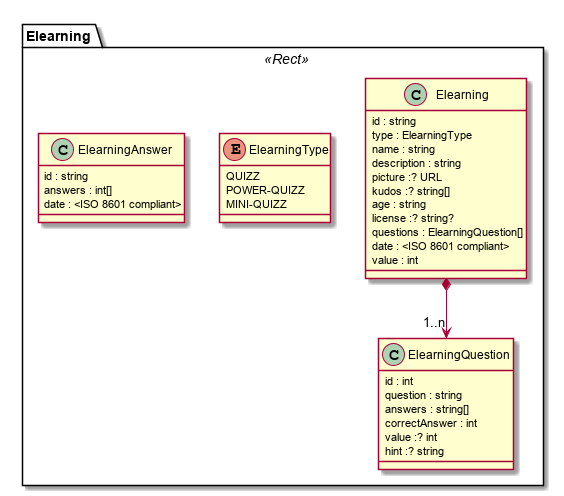

The Elearning model is used to describe Elearning content like quizzes to be used by elearning related Hyperties .

**Quizz Example**

```
id: "myid",
type: "mini-quizz",
name: "Energy",
description: "Energy quizz for children",
picture: "https://xpto/energy.gif",
age: "6-12 years old",
date: "2018-05-22"
value: 10
questions: [
  {
  id: 1,
  question: "Qual destas atividades contribuiu mais para as alterações do nosso planeta?",
  answers: ["Andar de carro", "Cortar as árvores", "Usar combustíveis fósseis para a energia" ],
  correctAnswer: 2,
  tip: "A queima de combustíveis fósseis para produzir energia é a atividade humana que mais contribui para as alterações que prejudicam o nosso planeta."
  },
  id: 2,
  question: "O que entendes por energias renováveis? ",
  answers: ["Energia produzida em Portugal", "Energia que faz mal ao planeta", "Energia limpa e que nunca se acaba (por exemplo, energia do sol e do vento)" ],
  correctAnswer: 2,
  tip: "As energias renováveis são as que existem livremente e em muita quantidade no nosso meio, tal como o sol, o vento ou a água, e não faz mal ao nosso ambiente."
  }
   ]
```

**Quizz Anwer Example**

```
id: "myid",
date: "2018-05-24",
answers: [2,2]
```
