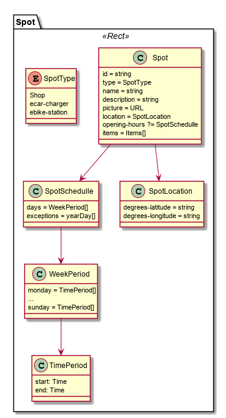

The Spot model is used to describe geo spots like shops or eCar stations to be used in location related Hyperties .

**Example**

```
id: "myid",
type: "shop",
name: "Loja do Manel",
description: "A Loja do Manel é porreira",
picture: "https://xpto/manel.gif",
opening-hours: {
  monday: ['09:00-12:00', '13:00-18:00'],
  ...
  sunday: [],
  exceptions: [
    '2016-11-11': ['09:00-12:00'],
     '2016-12-25': [],
     '01-01': [], // Recurring on each 1st of january
     '12-25': ['09:00-12:00'], // Recurring on each 25th of december  ]
   }
location: { degrees-latitude: "", degrees-longitude: "" }
```
