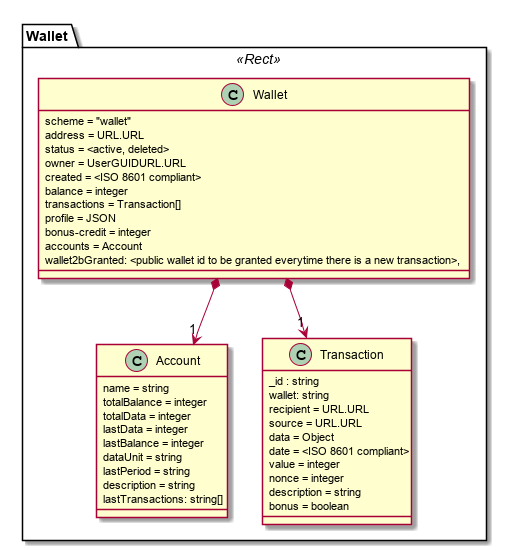

The Wallet model is comprised by its balance in terms of amount of tokens and a set of transactions.

**Wallet**

* `address` wallet address e.g. `wallet://sharing-cities/etuyetrhgfjhf`
* `owner` the wallet owner GUID URL (user public key)
* `created` timestamp creation
* `balance` amount of tokens
* `transactions` all transactions performed with this wallet. See below
* `status` active or deleted
* `profile` a JSON object with any attributes describing the wallet or the wallet owner e.g. age range, workplace, etc

**Transaction**

* `recipient` wallet address of the recipient
*  `data` data that was used to generate this transaction e.g. walking distance
*  `source` data stream address that was used to generate this transaction
*  `date` transaction date.
* `value` amount of tokens in the transaction. If `-1` it is an unsuccessful transaction
*  `nonce` the count of the number of performed mining transactions, starting with 0
* `description` optional text to describe or identify the transaction. For unsuccessful transactions it may be used to describe the reason.
