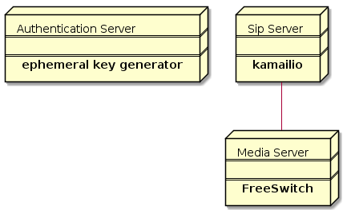

# Rethink IMS integration

## Introduction

## Components

The required components are:

* The Ephemeral Authentication Provider Server: [Sail](http://sailsjs.com/) application that exposes an endpoint to obtain valid ephemeral tokens to log into *The Sip Server*. It is necessary to provided a valid authorization token in the request. Currently any valid Google token is allowed.

Request Example

    curl -i https://ims.rethink-project.eu/credential -H "Authorization: Bearer Ym9zY236Ym9zY28="

* The Sip Server: It is used to build a platform for VoIP and realtime communications – presence, WebRTC, Instant messaging and other applications.  Moreover, it can be easily used for scaling up SIP-to-PSTN gateways, PBX systems or media servers.

* The Media Server:  the computing component that processes the audio or video streams associated with telephone calls or connections. 

### Deployment diagram

## Previous considerations before the installation

### The secret key

*The Ephemeral authentication provider server* and *The Sip server* must share a secret key in order to make possible the generation and validation of the ephemeral tokens. In the installation process you should provide this secret key in the configuration sections.

### The ims URI

*The Ephemeral authentication provider server* will return *The Sip server* URI along with temporary IMS credentials which will be used to register the IMSstub in the Kamailio instance. This registration can be relayed to another server, e.g. an IMS core. In the installation process you should provide this URI in the configuration section.

## Installation

### The Ephemeral Authentication Provider Server

#### Source code

Copy [source code](https://github.com/reTHINK-project/dev-protostubs/tree/master/src/protostub/ims_iw/src/ephemeral-auth) to a local path in your server.

#### Configuring your App for production

Configure it properly setting the right values in [the configuration file](https://github.com/reTHINK-project/dev-protostubs/blob/master/src/protostub/ims_iw/src/ephemeral-auth/config/ephemeral.js). 

#### Deploying it

You should follow [the most recent guide](http://sailsjs.com/documentation/concepts/deployment#?deploying-on-a-single-server) released by the sailsjs team.

### The Sip Server

The selected *Sip Server* for this deployment was [Kamailio](https://www.kamailio.org/w/).
In order to install it is recommended to use the official packages in Debian. Alternatively the installation can be performed by following the [official installation guide](https://www.kamailio.org/wiki/install/4.4.x/git)

**Debian packages to be installed:** kamailio, kamailio-tls-modules, kamailio-utils-modules and kamailio-autheph-modules

#### Ephemeral module

In order to enable ephemeral auth on Kamailio it is necessary to add *[The ephmeral module](http://kamailio.org/docs/modules/4.1.x/modules/auth_ephemeral.html)* and configure it.

After adding *The ephemeral module* following the instruction for your platform you sould configure it:

- Setting secret shared key

Code:

    modparam("auth_ephemeral", "secret", "shared_secret_key")

- Modifying auth route

Code:

    route[AUTH] {
    #!ifdef WITH_AUTH

    #!ifdef WITH_IPAUTH
            if((!is_method("REGISTER")) && allow_source_address()) {
                    # source IP allowed
                    return;
            }
    #!endif

            if (is_method("REGISTER") || from_uri==myself)
            {
                    # authenticate requests
                    if (!auth_check("$fd", "subscriber", "1") && !autheph_check("$fd")) {
                            auth_challenge("$fd", "0");
                            exit;
                    }
                    # user authenticated - remove auth header
                    if(!is_method("REGISTER|PUBLISH"))
                            consume_credentials();
            }
            # if caller is not local subscriber, then check if it calls
            # a local destination, otherwise deny, not an open relay here
            if (from_uri!=myself && uri!=myself) {
                    sl_send_reply("403","Not relaying");
                    exit;
            }

    #!endif
            return;
    }

### The Media Server
WebRTC-enabled endpoints will use a special WebRTC profile for media which requires the support of DTLS-SRTP and ICE. Those features are typically not supportted by MRF in the IMS core so a media server is required to translate from WebRTC media profile to the standard media profile supported by the MRF. 

The proposed server for the integration is FreeSWITCH. It can also be used for transcoding tasks, for example if the WebRTC leg of the call is established using Opus coded which is not commonly supported by IMS cores. 
