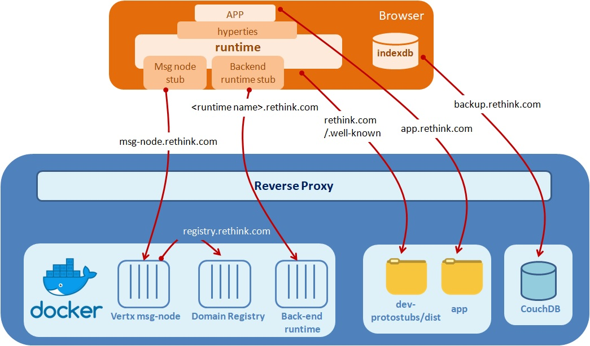

<h1></h1>
<h1></h1>


This page explains how to install your own reTHINK domain to be able to deliver your own Hyperties, Protostubs or Data Schemas.
After following this tutorial, you will be able to run all Hyperties Demos from the catalogue available [here](https://github.com/reTHINK-project/dev-hyperty).  

__Please note that this section is dedicated to an operational platform__. Developers should use the [toolkit](https://github.com/reTHINK-project/dev-protostubs).   

## Requirements

The reThink Framework platform uses two main core back-end services shown in the following picture and described hereafter.




All back-end services are available in Docker images and the preferred host is an Ubuntu 14.04.  

It is recommended that the containers are deployed behind a reverse proxy for several reasons:

-- default DNS is used to access different components of the platform, adding a prefix. The reverse proxy can easily manage different virtual hosts thus simplifying access to these services.

-- All back-end services are using different ports, using a reverse proxy is useful to allow using classical ports

-- It is recommended that the certificates are managed on the front reverse proxy.

Some tools/servers to install:

-- [apache2](https://httpd.apache.org/)

-- or [nginx](https://www.nginx.com/) instead of apache2

-- [reverse proxy for Apache](https://www.digitalocean.com/community/tutorials/how-to-use-apache-as-a-reverse-proxy-with-mod_proxy-on-ubuntu-16-04) in case of on apache2

-- or [ReverseProxy for nginx](https://docs.nginx.com/nginx/admin-guide/web-server/reverse-proxy/) config for nginx

-- [docker-compose](https://docs.docker.com/compose/install/)

If you choose a default apache2 server, for each sub-domain you need to use a config file, where you config the reverse proxy, you can check [here](https://github.com/reTHINK-project/specs/tree/master/deployment/registry-ssl.conf) a config for registry component.

-- - [Node.js and Npm](https://linuxize.com/post/how-to-install-node-js-on-centos-7/)

-- certbot: https free trusted certificates can be obtained on [let's encrypt](https://www.digitalocean.com/community/tutorials/how-to-secure-apache-with-let-s-encrypt-on-centos-7)

-- You need to have DNS configured for your host domain and for four sub-domains: `registry`, `msg-node`, `backup` and `<backend runtime name>`.

### Runtime backend (Vertx)

It is used to support the executions of Hyperties in a Java runtime Backend by using the Vertx.io framework. It currently uses mongodb data base. Can be used and deployed with a [docker image](https://hub.docker.com/r/rethinkaltice/dev-java-hyperty).

You need to have DNS and the sub-domain configured: `vertx-runtime`

### BackUP Service (CouchDB) 

It is used to backup data stored in the browser.

Can be installed using this [tutorial](https://www.rosehosting.com/blog/how-to-install-apache-couchdb-on-centos-7/).

You need to have DNS and the sub-domain configured: `backup`

## Installation process

We will first install the three back-end reTHINK Services, then the application from scratch. To illustrate our text, we will consider that the DNS of the domain is `rethink.com`

Here is a view of the interfaces:


1- Deploy reTHINK back-end services with Docker Compose. Get the [docker-compose](https://github.com/reTHINK-project/specs/tree/master/deployment/docker-compose.yml) file and execute:

`docker-compose up -d`

2- reverse-proxy configuration. Let's assume we are using Apache.

2.1- configure your domain by editing `/etc/apache2/sites-available/000-default.conf` with your domain:

<pre class="line-numbers">
  <code class="language-yml">
    <VirtualHost *:443>
          ServerName csp.rethink.com
           DocumentRoot /var/www/html/
    </VirtualHost>
</code>
</pre>

Activate your domain:

<pre>
  <code class="language-shell">
sudo a2ensite 000-default`
  </code>
</pre>

and restart it:

<pre class="line-numbers">
 <code class="language-shell">
sudo /etc/init.d/apache2 restart
 </code>
</pre>

2.1- configure the reverse-proxy for the Domain Registry. Take note of your Domain Registry Docker Container IP address, move to `sites-available` dir and create `registry.conf` file with it:

<pre class="line-numbers">
  <code class="language-yml">
<VirtualHost *:443>
     ServerName 'registry.csp.rethink.com'
     ProxyPass / http://172.20.0.4:4567/
     ProxyPassReverse / http://172.20.0.4:4567/
</VirtualHost>
 </code>
</pre>

Activate the sub-domain and restart it:

```
sudo a2ensite registry
sudo /etc/init.d/apache2 restart
```

To test if installation is OK, open https://registry.csp.rethink.com/live. It should provide you the current status of the registry.

The urls of the domain users  are encoded to be able to be sent to the domain registry. For apache reverse proxy users the directives _AllowEncodedSlashes On_ AND _ProxyPass_ with _nocanon_.


2.3- configure the reverse-proxy for the Message Node. Take note of your Message Node Docker Container IP address and create `registry.conf` file at `sites-available` dir with:

<pre class="line-numbers">
  <code class="language-yml">
<VirtualHost *:443>
     ServerName 'msg-node.csp.rethink.com'
     ProxyPass / http://172.20.0.2:9090/
     ProxyPassReverse / http://172.20.0.2:9090/
</VirtualHost>
 </code>
</pre>

Activate the sub-domain and restart it:

<pre class="line-numbers">
  <code class="language-shell">
sudo a2ensite msg-node
sudo /etc/init.d/apache2 restart
 </code>
</pre>

To test if installation is OK, open https://msg-node.csp.rethink.com/live to give a view of the current status of the Message Node.  

2.4- configure the reverse-proxy for the Catalogue. Take note of your Catalogue Docker Container IP address and create `catalogue.conf` file at `sites-available` dir with:

<pre class="line-numbers">
  <code class="language-yml">
<VirtualHost *:443>
     ServerName 'catalogue.csp.rethink.com'
     ProxyPass / http://172.20.0.8:5683/
     ProxyPassReverse / http://172.20.0.8:5683/
</VirtualHost>
 </code>
</pre>

Activate the sub-domain and restart it:

<pre class="line-numbers">
  <code class="language-shell">
sudo a2ensite catalogue
sudo /etc/init.d/apache2 restart
 </code>
</pre>

To test if installation is OK, open https://catalogue.csp.rethink.com/ gives a view of the current status of the catalogue node. It also allow to see connected databases and components.

2.5- configure the reverse-proxy for the App Server Demos. Take note of your App Server Docker Container IP address and create `demos.conf` file at `sites-available` dir with:

<pre class="line-numbers">
  <code class="language-yml">
<VirtualHost *:443>
     ServerName 'demos.csp.rethink.com'
     ProxyPass / http://172.20.0.10/
     ProxyPassReverse / http://172.20.0.10/
</VirtualHost>
 </code>
</pre>

Activate the sub-domain and restart it:

<pre class="line-numbers">
  <code class="language-yml">
sudo a2ensite demos
sudo /etc/init.d/apache2 restart
 </code>
</pre>

To test if installation is OK, open https://demos.csp.rethink.com/ and it should open the demos home page.

3. The Browser Runtime has to be uploaded from .well-known/runtime/ must contain the last version of the runtime. It has to be filled with [these files](https://github.com/reTHINK-project/dev-runtime-browser/tree/master/bin)  (rethink.js, index.html, core.js, context-service.js, identities-gui.js, policies-gui.js)

4- If required, configure the different IdPs to give your domain access to it.

4.1- The google idpproxy provided is working with an account that authorizes authentication process on a test platform, which probably does not include the one under installation. This means that by default, it is not possible to use google. To be able to do this, you have to:

-- edit the sourceCode.js of the google idpproxy, change the account and secret of the google account

-- authorize on this account the use of google auth API (https://console.developers.google.com/apis/), with the authorized redirect URI https://csp.rethink.com.  

## Hello World Application Deployment

The Hello World is published in the repository [dev-app](https://github.com/reTHINK-project/dev-app), and its installation manual is provided there. It can be deployed simply behind an HTTP server.  

When all of this is done you can try to connect on the index.html of the hello-app. First step, you should be able to load the runtime, then to load an hyperty, then to contact hyperties.

## Integration with IMS

You should follow this [guide](https://github.com/reTHINK-project/specs/blob/master/deployment/ims-deployment.md) to integrate your application with IMS.

## Docker compose details

### Domain Registry

Domain registry is installable with a [docker image](https://hub.docker.com/r/rethink/registry-domain-server/). As the Domain Registry is necessary to run the messaging node, it has to be running first. The default port of the domain registry is 4567.
The default DNS for our domain registry will be: __registry.csp.rethink.com__.  

```
service for docker-compose file

'domain-registry':
    image: 'rethink/registry-domain-server:latest'
    container_name: 'domain-registry'
    networks:
      rethink:
        ipv4_address: 172.18.0.4
    environment:
      - STORAGE_TYPE=RAM
      - EXPIRES=3600
    expose:
      - '4568'
      - '4567'
```

### Messaging node

This is the core plateform. ReTHINK has provided four implementations but only one is necessary to be installed:
* [VertX](https://github.com/reTHINK-project/dev-msg-node-vertx)
* [Matrix](https://github.com/reTHINK-project/dev-msg-node-matrix)
* [NodeJS](https://github.com/reTHINK-project/dev-msg-node-nodejs)
* [no Matrix](https://github.com/reTHINK-project/dev-msg-node-nomatrix)  

___WARNING___
*  _vertx installation_: the node.config.json contains a parameter that will be used during the docker run through an environment variable. The domain parameter must contain the DNS of the full platform (here csp.rethink.com), and it will be used then to build the DNS of the componants (msg-node.csp.rethink.com, registry.csp.rethink.com, etc...). The registry url must be filled here, but it is not sure if it can be tuned. To install you can use [docker image](https://hub.docker.com/r/rethink/msg-node-vertx/)
*  _nodejs installation_: the docker-compose must be configured. If you use the script "start.sh", it will also build the domain registry. The url to provide in the "environment" section is the _domain_ of the plateform (here csp.rethink.com).
*  _no Matrix installation_: after building the docker image, the simplest is to use the dockerStart.sh script. Be carefull to enter the good folder for the volume mapping, suppress the parameters _--net=rethink -p 8001:8001_ when used with a proxy. Note also that the default is exposed on HTTP on 8001. The MatrixProtoStub example is showing an URL of WebSocket with wss on 443, which is what the reverse proxy will provide.
*  multiple installations of msg-node-vertx on the same machine to serve different servers they can't be installed on the same network (use for example 172.18.0.2 and 172.19.0.2)

```
service for docker-compose file

'msg-node-vertx':
    image: 'rethink/msg-node-vertx:master'
    container_name: 'msg-node-vertx'
    environment:
      - MSG_NODE_CONFIG=env
      - NODE_DOMAIN=csp.rethink.com
      - NODE_PORT=9090
      - NODE_REGISTRY_URL=http://172.18.0.4:4567
      - NODE_GLOBAL_REGISTRY_URL=http://130.149.22.133:5002
      - NODE_REGISTRY_RETRIES=2
      - NODE_REGISTRY_SSL=false
      - NODE_REGISTRY_OWN_CERTIFICATES=false
    networks:
      rethink:
        ipv4_address: 172.18.0.2
    expose:
      - '443'
```


### Catalogue

The catalogue is made out of two main components. A broker, that is needed to access the different services, and one or more databases. You can use this [database](https://github.com/reTHINK-project/testbeds/tree/master/nodes/PT-node/production), that should be possible to use on a production mode. Documentation can be accessed [here](https://github.com/reTHINK-project/dev-catalogue/tree/master/doc).  
First of all, the broker has to be installed. A dockerhub [image](https://hub.docker.com/r/rethink/catalogue-broker/) is available.

```
broker component for docker-compose file

'catalogue-broker':
    image: rethink/catalogue-broker
    container_name: 'catalogue-broker'
    networks:
      rethink:
        ipv4_address: 172.18.0.8
    hostname: 'catalogue.csp.rethink.com'
    command: [-host, 'catalogue.csp.rethink.com', -default, protocolstub/VertxProtoStub, -default, protocolstub/VertxProtoStubNode]

    expose:
      - '443'
      - '5683'
```

```
catalogue database component using local database

'catalogue-database-ptinovacao':
    build: "./catalogue-database"
    container_name: 'catalogue-database-ptinovacao'
    network_mode: "service:catalogue-broker"
    command: [-host, catalogue.csp.rethink.com]
    depends_on:
      - 'catalogue-broker'
```
