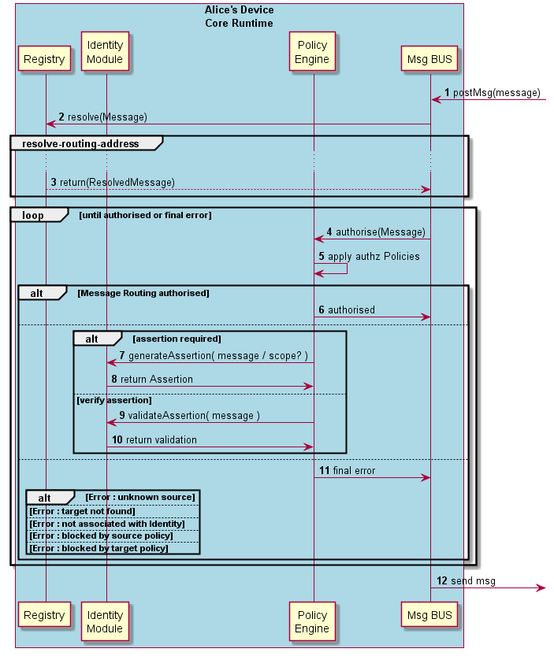

#### Message Routing in Message BUS

The Runtime procedures to route a message by the Runtime BUS are described in this section.

Steps 1 - 5: on receiving a message, the Runtime BUS requests the Registry to verify if the originator is valid (3) (i.e. its Runtime URL has been previously registered) and checks if the target address is external to the Runtime. If yes, it looks for the protostub Runtime URL to be used. The process to [deploy the Protocol Stub in the runtime](deploy-protostub.md) (section 4.3.1.2) is triggered, in case it is not available yet.

Steps 6 - 7: in case the message requires authorisation, the Core PDP applies applicable policies to authorise its routing.

Steps 8 - 12: The Core Policy Enforcer enforces authorisation policies (including generation of Assertions or verification of assertions) in case the Runtime PDP requests it. In case policy enforcement is performed successfully, routing authorisation is requested again (step 6).

Step 13: the application of authorisation policies by the PDP can result in different types of final errors including:

-	target does not exist
-	Hyperty instance that is sending the message is not associated with an appropriate Identity
-	the message is blocked by a source or target policy
