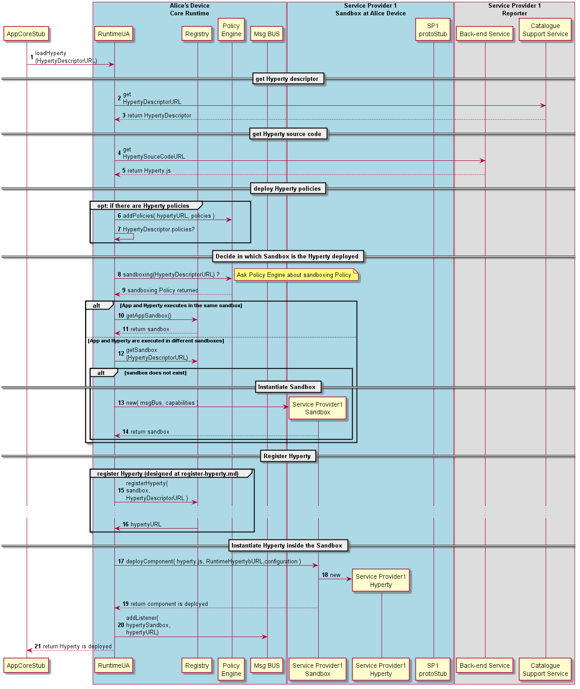

#### Deploy Hyperty

The Runtime procedures to deploy a new Hyperty are described in this section.

Steps 1 - 5: the Runtime UA is invoked by the App to load a new Hyperty from a specific URL passing its sandbox. The Runtime UA downloads the protostub source code, extracting the HypertyDownloadURL from the Hyperty descriptor.

Steps 6 - 7: the new Hyperty is [registered in the Runtime Registry](register-hyperty.md), which returns the Hyperty Instance address (HypertyURL).

Steps 8: policies contained in the Hyperty Descriptor, are deployed in the Core Policy Engine.

Steps 9: the runtime UA checks in the Hyperty Descriptor if a Policy Enforcer is required. If Yes a Policy Enforcer is deployed.

Steps 10-11: the Runtime UA asks the Policy Engine about Hyperty sandboxing policy. As discussed in the Runtime Architecture, and according to security policies, Hyperties and the Application can be deployed in the same sandbox or in separated domains.

---

**Hyperty and App deployed in the same sandbox**

In this situation, the App and the Hyperty are running in the same isolated sandbox which is different from the Hyperty Core Runtime Sandbox.

Steps 12 - 18: The Runtime UA retrieves the App sandbox from the Registry and requests the App sandbox to deploy the Hyperty source code, extracting the configuration data from the Hyperty descriptor. Then the App Sandbox is registered in the Msg Bus to receive messages targeting the new Hyperty.

**Hyperty and App deployed in different sandboxes**

In this situation, the App and the Hyperty must run in different isolated sandboxes.

Steps 19: The runtime UA should avoid the creation of new sandboxes in case there is already a sandbox for the same domain

**Sandbox does not exist**

Steps 20-23: In case no sandbox exists, the Runtime UA instantiates a new sandbox through the SandboxFactory interface (not shown) which is registered in the Registry

---

Steps 24-27: The Runtime UA requests the Hyperty sandbox to deploy the Hyperty source code, extracting the configuration data from the Hyperty descriptor.

Steps 28: the runtime UA adds Hyperty Sandbox listener to the runtime BUS to receive messages targeting the Hyperty URL. It should be noted in case there is an intercepting PEP, the Hyperty listener will only be called for Messages forwarded by PEP.
