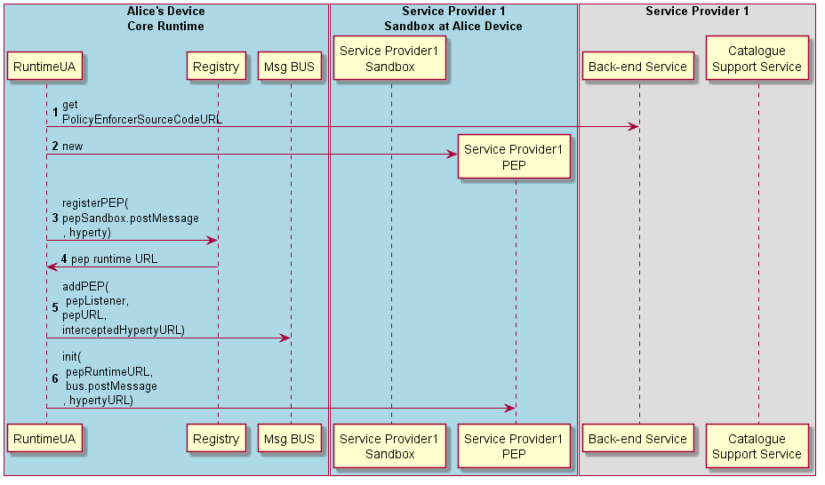

#### Deploy Policy Enforcer

*in progress*

The Runtime procedures to deploy a new Hyperty Policy Enforcer are described in this section.

**Hyperty PEP deployment is required**

Steps 15 - 16: the runtime UA downloads and instantiates the Hyperty PEP in an isolated sandbox.

Steps 17 - 18: the Runtime UA register in the runtime Registry the new PEP for the new deployed Hyperty and the Registry returns PEP Runtime component URL

Steps 19: the runtime UA adds PEP intercepting listener to the runtime BUS to receive messages targeting the Hyperty URL.

Step 20: The Runtime UA activates the Hyperty PEP with its RuntimeURL, the postMessage function to be called to send messages to BUS and the Hyperty instance URL the PEP is intercepting. Depending on the sandbox implementation, the initialisation may have to be remotely executed by an Execution message type routed by the Message BUS.
