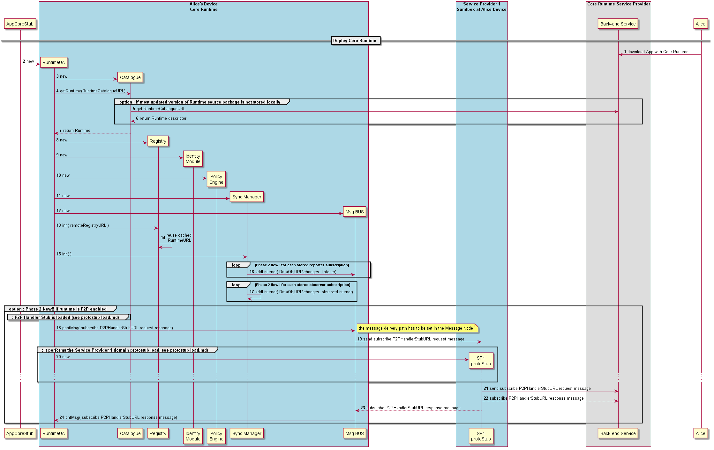

#### Deploy Hyperty Runtime

In case the device does not support the Hyperty Core Runtime components e.g. an existing browser like Chrome or a Network Node.js Server, they have to be deployed in the Device or in the Server.

The main data flow to support the deployment of the Hyperty Core Runtime is depicted in the diagram below.

Steps 1 - 2: the Runtime User Agent, that will handle the deployment of the full runtime, can be explicitly deployed by a specific Application or can be implicitly deployed when an Hyperty or Protocol Stub is required.

Steps 3 - 7: the Runtime User Agent loads all required Runtime components via the Runtime Catalogue. If these components are not locally stored, the Runtime Catalogue will get them from the Catalogue Server.

Steps 8 - 12: the Runtime User Agent handles the deployment and initialisation of required Runtime Core components including the Runtime Registry, Identity Module, Runtime Policy Engine and the Message BUS.

**New!**
Steps 13 - 19: in case the Runtime User Agent detects the capability to support [P2P Connections](https://github.com/reTHINK-project/specs/tree/master/messaging-framework#peer-to-peer-message-delivery) (eg if it supports WebRTC Datachannel) it performs the deployment of the P2P Handler Stub (see the [Protostub deployment procedure](deploy-protostub.md)). As soon as the P2P Handler stub is deployed, the path to receive P2P Data Connection creation requests from P2P Requester Stubs is set in the MN with the P2P Stub URL by sending a [Subscription Request message to Message Node Subscription Management functionality](../../messages/p2p-connection-messages.md#add-p2p-handler-path).
