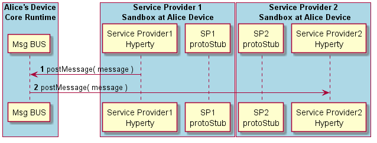

#### Inter-domain Local Communication

The routing of messages between two Hyperties running in the same Runtime instance but in different sandboxes (e.g. they are from different domains) is described below.

<!--
@startuml "interdomain-local-communication.png"

autonumber

!define SHOW_RuntimeA

!define SHOW_SP1SandboxAtRuntimeA
!define SHOW_Protostub1AtRuntimeA
!define SHOW_ServiceProvider1HypertyAtRuntimeA

!define SHOW_CoreRuntimeA
!define SHOW_MsgBUSAtRuntimeA

!define SHOW_SP2SandboxAtRuntimeA
!define SHOW_Protostub2AtRuntimeA
!define SHOW_ServiceProvider2HypertyAtRuntimeA

!include ../runtime_objects.plantuml

SP1H@A -> BUS@A : postMessage( message )

BUS@A -> SP2H@A : postMessage( message )

@enduml
-->

