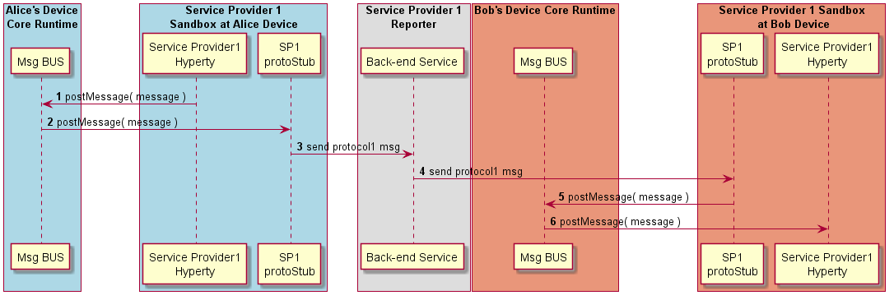

#### Intra-domain Remote Communication

The routing of messages between two Hyperties running in different Runtime instance but from the same domain, is described below.

<!--
@startuml "intradomain-remote-communication.png"

autonumber

!define SHOW_RuntimeA

!define SHOW_SP1SandboxAtRuntimeA
!define SHOW_Protostub1AtRuntimeA
!define SHOW_ServiceProvider1HypertyAtRuntimeA

!define SHOW_CoreRuntimeA
!define SHOW_MsgBUSAtRuntimeA

!define SHOW_Runtime1B
!define SHOW_SP1SandboxAtRuntime1B
!define SHOW_Protostub1AtRuntime1B
!define SHOW_ServiceProvider1HypertyAtRuntime1B

!define SHOW_SP1

!define SHOW_CoreRuntime1B
!define SHOW_MsgBUSAtRuntime1B

!include ../runtime_objects.plantuml

SP1H@A -> BUS@A : postMessage( message )

BUS@A -> Proto1@A : postMessage( message )

Proto1@A -> SP1 : send protocol1 msg

Proto1@1B <- SP1 : send protocol1 msg

BUS@1B <- Proto1@1B : postMessage( message )

SP1H@1B <- BUS@1B : postMessage( message )

@enduml
-->

