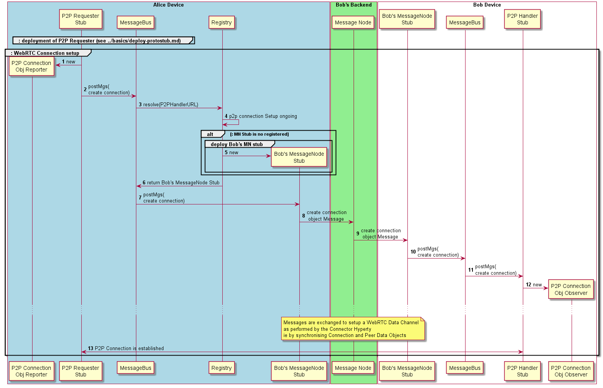
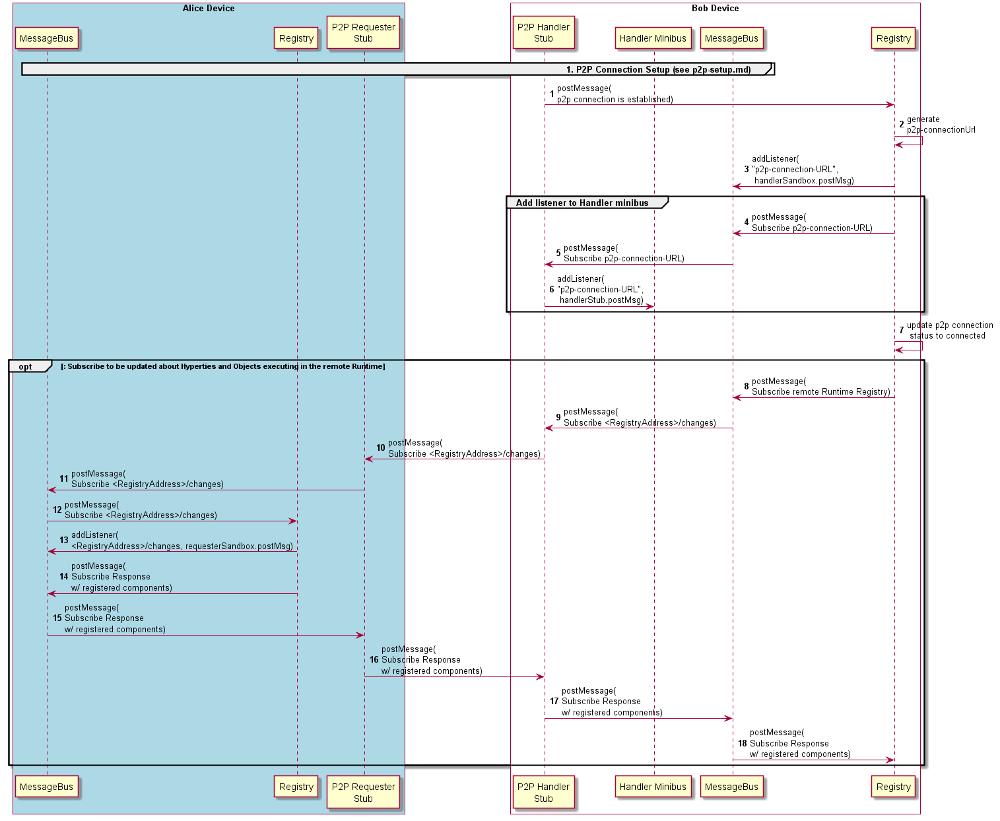

This section describes how P2P Connections are performed as triggered by the [registry.resolve](resolve-routing-address.md) procedure.

Steps 1 - 8. As soon as the P2P Requester is activated, it starts the setup process which will be done through messages sent through "local MN StubURL". The Registry resolve invocation will return Bob's Msg Node Stub URL since the P2P Connection is still not connected (check status=connecting). See [Address Resolve description, for "P2P connection is registered but not connected yet"](resolve-routing-address.md) for the detailed spec.

Steps 9-14: On the remote peer, messages are handled by P2P Handler Sub that was deployed when the Runtime was instantiated. Messages are exchanged among the two Stubs using the Reporter - Observer pattern applied to the Connection data model to establish the WebRTC Data Channel as it is done with the Connector Hyperty. In this case the P2P Requester protostub is the Reporter of the Connection data object while the P2P Handler protostub is the Observer. To be noted that an [event with "status=created" is fired by the handler stub](../../messages/p2p-connection-messages.md#new-p2p-connection-event) as soon as a p2p request is received. This event is received by the runtime registry that will create a new p2pConnection entry to avoid a second p2p connection setup is triggered when signalling messages request sent by the handler are resolved by the registry.

Steps 1 - 7: As soon as the connection is successfuly setup, the Handler Stub fires a new "p2p connection is established" event to the protostub status listener. On receiving this event  the runtime registry generates the p2p connection stub URL - the p2p-connectionUrl (step 2) and add required listeners to the MessageBus (step 3) and to the Minibus (steps 4-6). The former listener is added by sending a [subscribe request message ent to the P2P Handler itself](../../messages/p2p-connection-messages.md#add-handler-listener-to-minibus-for-new-p2p-connection). Then it updates the P2P Connection status to "connected".

Steps 8 - 18: Optionaly, each Runtime Registry can request to subscribe the remote runtime registry (<RuntimeRegistryURL>/changes) to be updated about executing hyperty URLs and reporting data objects by sending a [subscribe request message](../../messages/p2p-connection-messages.md#subscribe-for-registry-changes). If accepted, the subscribe response would return the URLs of all Hyperties and Data Objects currently executing in the remote runtime. These URLs would be added to the P2P Connection table. Every time a new Hyperty or Data Object is instantiated an [Update Message](../../messages/p2p-connection-messages.md#registry-changes-update) would be published to all subscribers in order to keep the P2P Connection table updated. In this way, the Resolve procedure would always return the best routing path ie through the P2P Connection.
