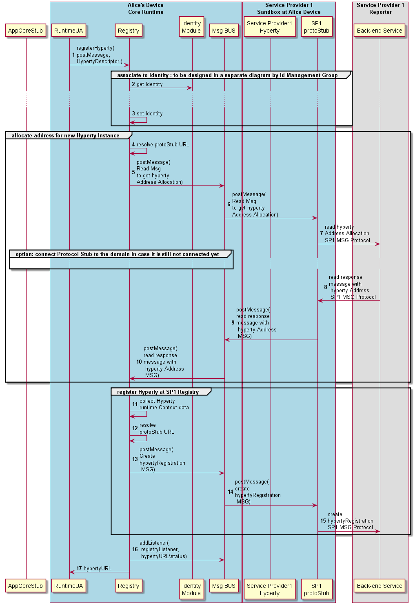

#### Register Hyperty

#### Register Hyperty

The Runtime procedures to register a new Hyperty are described in this section.

Step 1: the Hyperty registration is requested by the Runtime UA triggered by the [Hyperty Deployment process](deploy-hyperty.md) (section ?).

Steps 2 and 3: The Hyperty is associated to a certain [identity](../identity-management/user-to-hyperty-binding.md)(section 4.3.2.3)

Steps 4 - 10: an Hyperty URL address is allocated in cooperation with the Msg Node Address Allocation functionality ([Create Message](../../messages/address-allocation-messages.md#address-allocation-request)).

Steps 11 - 15: the Hyperty instance is registered in the back-end Registry. ([Create Message](../../messages/registration-messages.md#registration-request)\). **Phase 2 New!** Registration contains new fields for Hyperty Runtime URL, its P2P Handler Stub instance URL and the catalogue URL of P2P Requester Stub.

Steps 16 - 17: The runtime Registry adds its listener to be notified about Hyperty instance status and returns the Hyperty URL to the runtime UA
