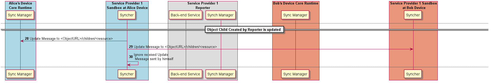

A Data Object Child belongs to a Data Object Parent resource and can be created by any Observer of the Data Object Parent as well as by its Reporter. The Reporter - Observer rules still applies to Data Object Child ie there is only one Reporter that can update the Data Object Child, which can be an Observer of the Data Object Parent, as mentioned earlier. However, the procedures to manage Data Object Child are different from the ones used to manage Data Object Parents. At this point, Data Object Child can't also be a Data Object Parent of another object. Ie Hyperty Data Object composition is limited to one level.

## Creation of Data Object Parent

In the [Data Object creation procedure](data-object-creation.md), the Data Object Schema is parsed to check if there is any resource that can contain Data Object Children. If yes, for each Data Child Resource URL (<ObjectURL>/<resource>/child) the Hyperty Reporter listener is added to the Message Bus and to the Reporter Sandbox Minibus, as well as a Reporter Sync Manager listener.

## Subscription of Data Object Parent

In the [Data Object Parent subscription procedure](data-object-subscription.md), the Data Object Schema is parsed by the Observer Sync-Managers (at Runtime and Msg Node level), to extract resources that can contain Data Object Child. For each Data Child Resource URL (<ObjectURL>/<resource>/child) the Hyperty Observer listener is added to the Bus. The subscription response contains the most updated parent data object including previously created child data objects.

## Creation of Data Object Child

The creation of a Data Object Child is simply a [Create Message that is sent by an Hyperty Syncher to a valid Data Object Resource Children URL](../../messages/data-sync-messages.md#creation-of-data-object-child). All the Data Object Parent Observers, the Data Object Reporter and the Reporter Syncher Manager, will receive the new created Hyperty Data Object Child since they are all listening to this Resource URL as previously described in the Data Object Parent Creation and Subscription procedures. Of course, the sender Hyperty must ignore the received Message. According to the Hyperty Data Object model, a Data Object Child is identified by a ChildId generated by its reporter Syncher in a way that is unique in the Data Object Resource Child scope.

Data Object Child created by Data Object Parent Reporter:

Data Object Child created by Data Object Parent Observer:

## Update of Data Object Child

According to Reporter-Observer rules (to be enforced by the Policy Engine), the update of a Data Object Child is only allowed by its Reporter, and it is accomplished by sending an [Update Message](../../messages/data-sync-messages.md#update-of-data-object-child) to its associated Data Object Resource Children URL. Similar to the creation procedure, all the Data Object Parent Observers, the Data Object Reporter and the Reporter Syncher Manager, will receive the updated Hyperty Data Object Child, and the sender Hyperty must ignore the received Message. The [Update Message Body](../../messages/data-sync-messages.md#update-of-data-object-child) must contain in the value field the ChildId.

Update of Data Object Child created by Data Object Parent Reporter:

Update of Data Object Child created by Data Object Parent Observer:

## Delete of Data Object Child created by Reporter

According to Reporter-Observer rules (to be enforced by the Policy Engine), the delete of a Data Object Child is only allowed by its Reporter, and it is acomplished by sending [Delete Message](../../messages/data-sync-messages.md#delete-of-data-object-child) to its associated Data Object Resource Children URL. Similar to the creation procedure, all the Data Object Parent Observers, the Data Object Reporter and the Reporter Syncher Manager, will receive the Delete message, and the sender Hyperty must ignore the received Message. The [Delete Message Body](../../messages/data-sync-messages.md#delete-of-data-object-child) must contain in the value field the ChildId.

Delete of Data Object Child created by Data Object Parent Reporter:

Delete of Data Object Child created by Data Object Parent Observer:

