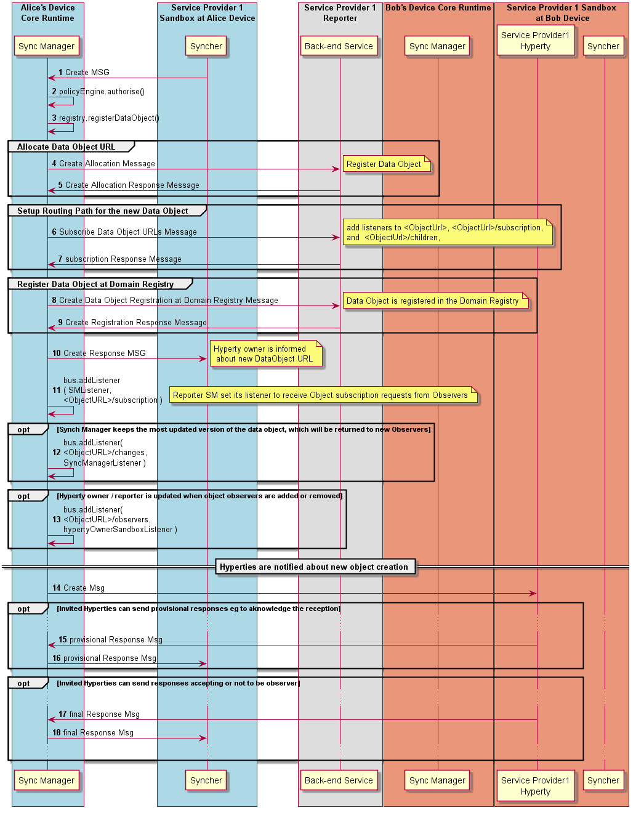

#### Data Object Creation by Reporter

This MSC diagrams shows the most relevant steps to support the setup of data object synchronisation.

Steps 1-4 The Data Object reporter post a [Create Message](../../messages/data-sync-messages.md#hyperty-data-object-creation) to initiate the setup of the Data Object synchronisation. The Core Police Engine applies policies to check whether Alice has permissions to create the data object.

**Phase 2 new:** in case the reporter provides an existing ObjectURL it is assumed this is the resume of a Data Sync Stream and Steps 5 - 10 are not performed.

  Steps 5 - 10 The new data object is registered in the Registry, which includes the allocation of the ObjectURL ([Create Message sent to Message Node Allocation Functionality](../../messages/address-allocation-messages.md#address-allocation-request)) and its registration in the Domain Registry ([Create Message sent to Domain Registry](../../messages/registration-messages.md#registration-request)).  Then, the Routing Path has to be set at Reporter Message Node Subscription Manager functionality ([Subscribe Message sent to Message Node Subscription Manager](../../messages/data-sync-messages.md#reporter-data-sync-routing-path-setup-request-at-reporter-message-node-for-a-new-data-object)).

The Registry may adds a listener in the MessageBUS to be notified about status change events of the new Data Object.

Optionally, and again, according to applicable policies, the Reported Hyperty is added as a listener to be notified when new Observers to its Data Object are added or removed. The DataObjectObserversURL is handled by the Policy Engine.

The new address allocated to the Data Object is returned back to the Reporter with a [response message](../../messages/data-sync-messages.md#response).

**Phase 2 new:** in case this is the resume of a Data Sync Stream, there should no new observer to be invited.

  Steps 11 - 15: In case the data object creation is authorised, the [data object creation message is sent to invited Observers](../../messages/data-sync-messages.md#observer-invitation) and the Core Policy Engine takes the Hyperty Instance URLs set in the `to` header field, to set as the list of addresses that are previously authorised to be Observer for the new data object.

  Steps 16 - 17: Optionally, invited Observers may [respond e.g. to aknowledge the reception of the invitation and to accept or not the invitation to be an Observer](../../messages/data-sync-messages.md#response-3).
