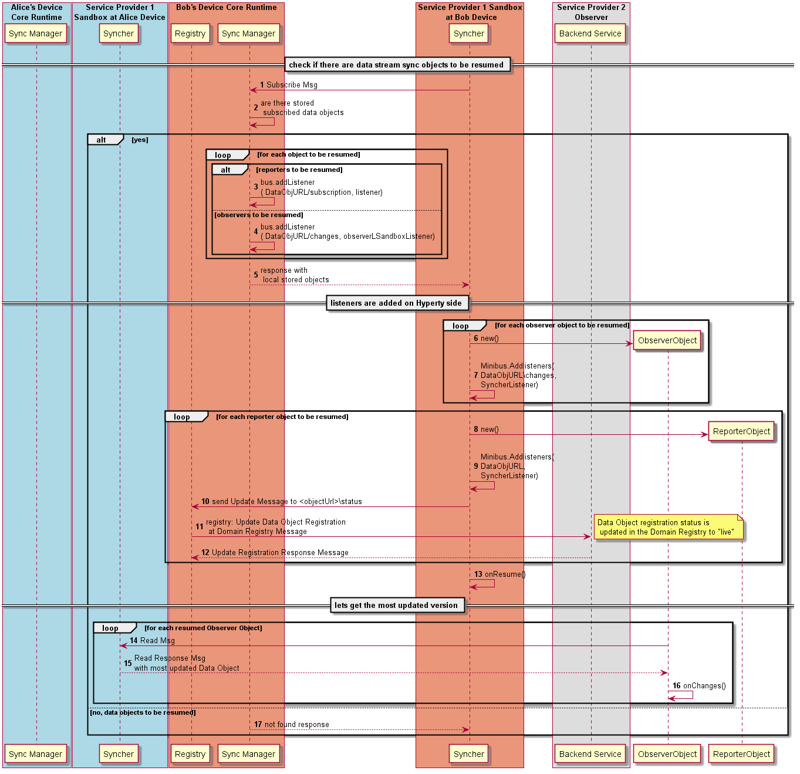

#### Resume Data Object Synchronisation for Reporters and Observers

**Phase 2 New!!**

This Process is performed everytime the Syncher is instantiated in order to resume the sync of data objects created in previous sessions of Hyperties.

Steps 1 - 2: The resume process starts by [asking the local Sync Manager to resume existing subscriptions](https://github.com/reTHINK-project/specs/blob/master/messages/data-sync-messages.md#resume-subscriptions-for-the-same-hyperty-url).

Steps 3 - 7: If there are stored data objects, they are returned in the response body. Each returned Observer Object is instantiated and a listener for the ObjectURL changes address is added. At the end, a ObserversResumeEvent is fired with the Data Objects instantiated objects.

Steps 8 - 10: then the Syncher will check if each returned data object is updated, if not a [Read Message](https://github.com/reTHINK-project/specs/blob/master/messages/data-sync-messages.md#data-object-read) is sent to the sync manager wich fowards it to Object Reader URL to get the most updated version of the data object. For Reporter data objects the sync manager requests the Registry to update its registration to live *or a object status event is also fired from the syncher to the registry*. For each received message, a ChangesEvent is fired by the Syncher with the most updated version of the data object.

Step 11: If there are no Observer stored data objects a NOT FOUND message is returned .

Steps 12 - 13: The resume process starts by [asking the local Sync Manager to resume existing reporters](https://github.com/reTHINK-project/specs/blob/master/messages/data-sync-messages.md#hyperty-reporter-data-object-resume).

Steps 14 - 21: If there are Reporter stored data objects, for each one a Reporter Object is instantiated and a listener for the ObjectURL read address is added. At the end, a ReporterResumeEvent is fired with the Data Objects instantiated objects.

Step 22: If there are no Reporter stored data objects a NOT FOUND message is returned .

*todo:* the option to resume Objects that were subscribed or created in other Runtime instances, by providing the User URL or User GUID. Ssch objects could be discovered from the domain registry or from the storage manager (FFS).
