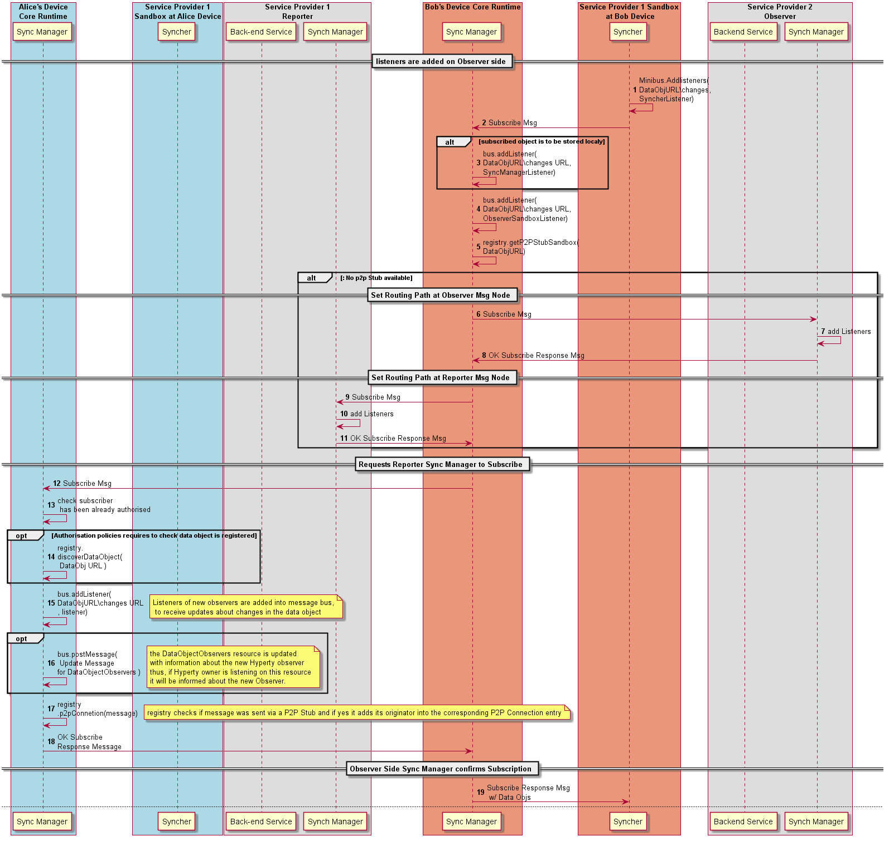
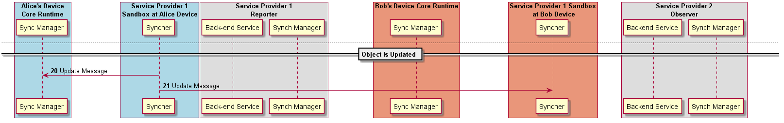

#### Data Object Subscription by Observer

To be an Observer of a Data Object, a [Subscription message](../../messages/data-sync-messages.md#hyperty-request-to-be-an-observer) is sent to the local Sync Manager.

The Local Sync Manager adds Observer side listeners and (**Phase 2 New!!**) asks the Runtime Registry to check if the Data Object is reachable with a P2P Connection. If not, it [asks its Message Node](../../messages/data-sync-messages.md#data-sync-routing-path-setup-request-at-observer-message-node) to also add the required Listeners for the Data Object.

As soon as observer side listeners are added for the Data Object, the [Subscription request is sent to the data object subscription URL (DataObjectURL/subscription)](../../messages/data-sync-messages.md#observer-subscription-request-sent-to-data-object-subscription-handler), which is implemented by the Synch Manager of the Reporter.

The Sync Manager checks if subscription requester has been previously authorised when the data object was created.

In case subscription requester has not been previously authorised, and according to applicable policies, the subscription request message can be forwarded to the Reporter Hyperty that will take the final decision.

According to applicable policies, the Registry can be queried to check if the data object was previously registered.

In case the subscription request is authorised, a listener of the new observer, is added into the Message BUS to receive messages on the Data Object resource URL.

Optionally, the new Observer listener is added in the Message BUS to be notified about new Observers.

Optionally, it is posted an UPDATE message into the DataObjectObserversURL with information about the new added Observer.

**Phase 2 New!!**
The Sync Manager asks the Runtime Registry to check whether the data synchronisation can be done through a P2P Connection and if yes to ensure the new observer address is resolvable for such P2P Connection.

As soon as the Subscription is accepted by the Reporter and all required listeners are added, an [OK RESPONSE message is sent back with the most update data object](../../messages/data-sync-messages.md#response-4).

[Subscription Response Confirmation is forwarded to the Observer, including the most update data object](../../messages/data-sync-messages.md#response-2).

### Data Object Update

As soon as the Reporter receives the information that the data object synchronisation was authorised, it can request the Syncher to start reporting data object changes by posting [UPDATE messages to the Data Object URL changes resource](../../data-sync-messages.md#data-object-update). It should be noted that, according to Hyperty Service logic, this step can be performed later, e.g. after the Reporter is notified an Observer has been added.

