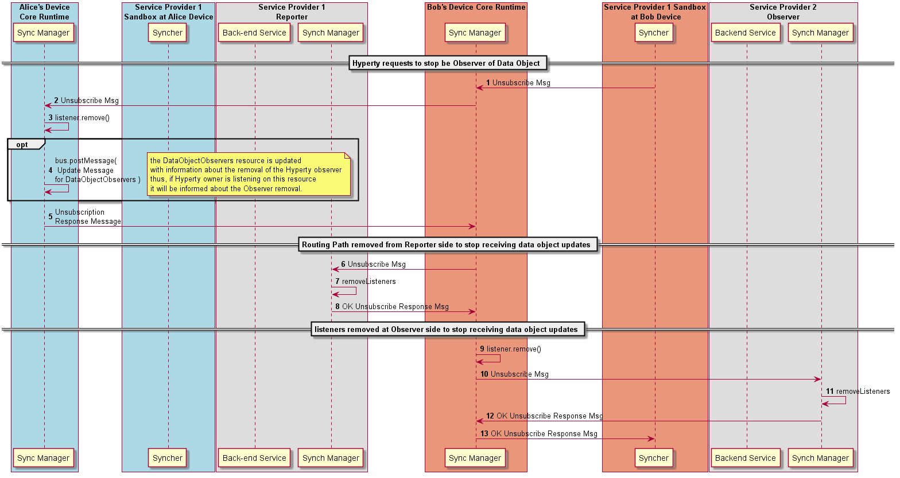

#### Data Object Unsubscription by Observer

To stop the observation of a Data Object, a [Unsubscribe message is sent to the local Sync Manager](../../messages/data-sync-messages.md#data-object-unsubscription-request-by-observer-hyperty) by the Observer.

The [Unubscription request is forwarded to the data object subscription URL](../../messages/data-sync-messages.md#observer-unsubscription-request-sent-to-data-object-subscription-handler), which is implemented by the Synch Manager of the Reporter.

The Sync Manager checks if Observer is valid.

In case the unsubscription request is authorised, the Observer listener is removed from the Message BUS to receive messages on the Data Object resource URL.

The Observer listener is also removed from the Message BUS to be notified about new Observers in case it was added.

Optionally, it is posted an UPDATE message into the DataObjectObserversURL with information about the Observer removal.

The unsubscription confirmation is sent back with a [RESPONSE message](../../messages/data-sync-messages.md#response-5).

As soon as the local Sync Manager receives the unsubscription response it removes the Observer listener from the Message Bus and [sends to its Domain Sync Manager an Unsubscribe message](../../messages/data-sync-messages.md#equest-to-remove-data-sync-routing-path-at-observer-message-node) to also remove listeners from the Message Node.

As soon as the local Sync Manager receives the unsubscription confirmation from the domain, it [sends back to the Observer the unsubscription response](../../messages/data-sync-messages.md#unsubscription-response).
