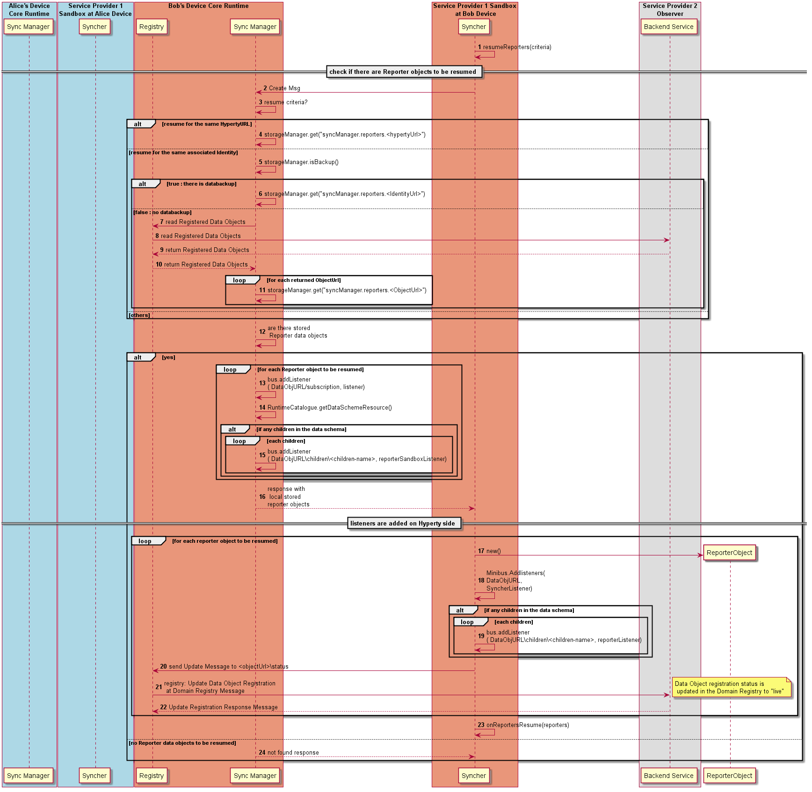

This Process is performed to resume the synchronisation of Reporters data objects. Such resume will be automatically performed everytime the Syncher is instantiated in order to resume the sync of data objects created in previous sessions for the same Hyperty ie the HypertyURL is maintained along the different sessions. In addition, objects can also be resumed and reused from different sessions by explicitely asking the syncher to resume data synchronization that matches a certain criteria e.g. for all objects compliant with a certain data schema that were associated with the UserURL that is currently associated with the Hyperty instance.



Steps 1-2: the resume of data synchronisation streams for reporters is performed by the syncher.resumeReporters() function that has as an optional input parameter  json object `criteria`:

      ```
      {
      "resource" : <dataObject>,
      "identity" : <userIdentity>
      }
      ```
If the `criteria` is not provided it is assumed the resume is to be performed for objects previously handled for the same HypertyURL.
Then the syncher asks the local Sync Manager to resume data synchronisation streams sending a  [create request message](https://github.com/reTHINK-project/specs/blob/master/messages/data-sync-messages.md#hyperty-reporter-data-object-resume). If provided, the criteria info is attached into the message body.

Steps 3 - 4: if there is no criteria provided, the sync manager uses the storage manager to look for data objects previously stored for the same HypertyURL.

Steps 5 - 11: if a data sync criteria is provided for the user identity currently associated to the Hyperty, the sync manager will look for previously associated data objects even if they were handled in a different Runtime device. First it checks if a databackup service is being used by the storage manager. If yes, it will query the storage manager for such data objects. Otherwise, it queries the Registry for such data objects URLs and, in case any objectURL is returned, they are retrieved from the storage manager. To be noted that the Runtime Registry also queries the Domain Registry with a [Read message per UserURL](https://github.com/reTHINK-project/specs/blob/master/messages/registration-messages.md#registry-data-object-search-per-user) or [per UserGUID](https://github.com/reTHINK-project/specs/blob/master/messages/registration-messages.md#registry-data-object-search-per-guid), depending on the criteria used.


Steps 12 - 17: If there are Reporter stored data objects, a listener for the ObjectURL read address is added for each one and, for each subscriber its listener is added for the ObjectURL changes address. In addition the data schema is evaluated to check if any children objects may exist and if yes, the reporter sandbox listener is added for it as well as subscribers listener. *note: currently, according to the implementation, the [object changes URL and the children URL](https://github.com/reTHINK-project/dev-runtime-core/blob/master/src/syncher/Subscription.js#L31) is being added for each subscriber but in principle this is not needed. FFS*

Steps 18 - 25: then the reporter data objects are returned to the syncher. Each returned Reporter Object is instantiated and a listener for the ObjectURL read address is added as well as listeners for children URLs if they exist in the data schema. At the end, a ReportersResumeEvent is fired with the Data Objects instantiated objects and the object status is updated to "live" which is catch the Runtime Registry that localy updates the object status as well as remotely by sending an updated request message to the Domain Registry.

Step 26: If there are no Reporter stored data objects a NOT FOUND message is returned .
