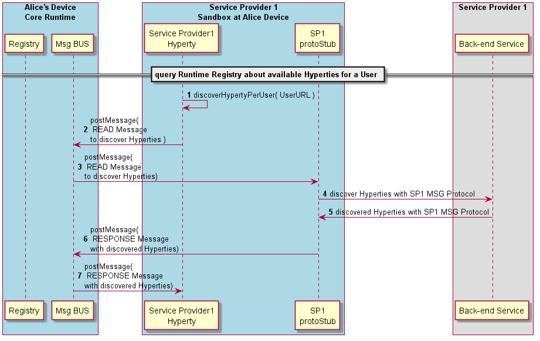

#### Discover Hyperty

The Runtime procedures to Discover available Hyperties. Check Messages Specification [here](../../specs/messages/registration-messages.md#hyperty-instance-query-per-user)

*todo: update messages specs for phase 2 with new fields for the p2p stubs and runtime URLs*
