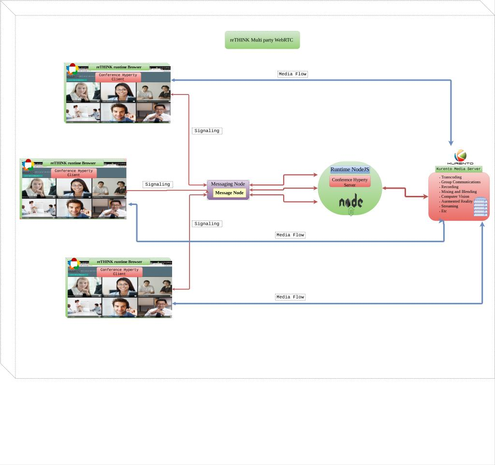

## Group Communication
The goal of this repository is to provide specifications for enabling WebRTC group communication in reTHINK (aka WebRTC Multiparty). Furthermore, an ongoing discussions about these specs can be found here [WebRTC Multiparty #106](https://github.com/reTHINK-project/dev-runtime-core/issues/106#issuecomment-245019063). Besides,in this issue more details and arguments can be found as well.

## 1. Overall Architecture

In summury, star topology having an intermediary media server seems to be a good candidate for scalable group communication.
This start topology, decribes H2H WebRTC group communication between reTHINK users. Therefore, hyperties running on runtime browsers can exchange signaling descriptions between each other and the media server through reTHINK edge server.

Moreover,in order to exchange signaling descriptions with this intermediary media server, reTHINK runtime nodejs [dev-runtime-nodejs](https://github.com/reTHINK-project/dev-runtime-nodejs) is justified choice for exchanging WebRTC signaling. In addition, runtime nodejs is a fully conform with reTHINK specs.

Figure 1 below provides a big picture of this star topology, we have proposed. In this star topology, we have three main components: `Client conference Hyperty` running on `Runtime browser`, `Server Conference Hyperty` running on `Runtime NodeJS`, and the `Media Server`. While, the messaging node is just relay point in reTHINK framework. Thus, it's transparent for the different communication messages.

  Figure 1 : reTHINK Group cummunication overall architecture

In the following sections call flows between the components of this topology will be given.

## 2. Top view call flows

Figure 2 illustrates top level view of how this call flows might look like.
This call flow involves Hyperty conference of Client A (we can call him initiator) running on runtime browser A, hyperty conference of client B, Message Node(just relay no processing), Kurento media server, and Hyperty conference server running on Runtime Node as signaling server relaying messages between them.

  Figure 2 :Top level view call flows

The sequence diagram evolves through the following macro steps:

1. The Hyperty conference server (signaling server) connects to messaging node associated with Runtime Node and registers its instance in it.
2. The messaging node registers the hyperty and provides back hyperty url to the Hyperty conference server.
3. At this point the Hyperty conference server (signaling server) creates a signaling channel, up listening for any incoming message from client.
4. Hyperty client A (initiator) queries the messaging node to register its instance.
5. The Messaging node registers the hyperty and replies back giving it an hyperty url.
6. Hyperty client A connects to the Hyperty conference server and joins the channel.
7. The Hyperty conference server accepts/refuses the join request.
8. If accepted, the Hyperty client A (creates connection data object) sends its sdp offer to kurento media server via the signaling server.
9. Upon receipt of the SDP offer, the kurento media server creates room pipeline and generates an SDP answer to be sent back (via the signaling server) to the remote client A.
10. Hyperty client A sends its local stream directly to kurento media server.
11. If Hyperty Client B wants to join(the joiner) the same room pipeline as client A, it mirrors the same behavior of hyperty A from step 4) to 10).
12. The Hyperty conference server connects the two streams on kurento media server.
13. At this point media streams are exchanged between client A and Client B passing by Kurento media server in star topology.The sequence diagram evolves through the following macro steps:
## 3. Detailed call flows
In this section, we mainly describe the internal logic architecture of the client and server conference Hyperties.

### 3.1 Client Conference Hyperty Logic

The `Client conference hyperty` is supposed to be running on runtime browser of user initiating/joining the conference. This hyperty quite similar to [connector hyperty](https://github.com/reTHINK-project/dev-hyperty/tree/master/docs/connector) but with an advance feature of handling WebRTC conferencing capabilities as well. These call flows involve `Client Conference App`, `Client Conference Hyperty`, `Syncher` , and the `Message Bus`.(see figure 3)

  Figure 3 : Client Conference Hyperty internal architecture

In the following step-by-step description:

1. First, the `Client Conference App` will issue a request message to the `Client conference Hyperty` asking to join a specific room, given that it knows already the `roomId` and the `serverHypertyURL` or it may search for existing Conference servers before it interacts with them. Otherwise, it requests the creation of a new room. Besides, provisioning for options is possible.
2. The `Client Conference hyperty` will get the local description of the peer issuing the request message.
3. Next, the hyperty will ask the `Syncher` to create connection object schema, for which is reporter(owner). Simultaneously, it's an observer of the server room object (description will be provided about this Server side connection object) involved in the Connection object.
4. The `Syncher` sends create connection object request to the `Server Conference Hyperty` through the `Message Bus`.
5. Finally, once an OK piggybacked response message is received. The `Syncher` will adds some incoming details(SDP answer,etc.) from the server hyperty to the data connection object. Afterwards, it returns it to the `Client Hyperty`, That includes it in its local connection controller object in order to control client WebRTC connection parameters.

#### Note:

The server connection object is a special object, created and maintained by the server Hyperty upon incoming request from client hyperty to create new room. Thus, this object is related to a room. Besides, is created by the Hyperty server which means is the reporter (owner) of this connection object. This object will be destroyed when the last participants leaves the room.

### 3.2 Server Conference Hyperty Logic

The `server conference hyperty` will be loaded and executed inside Runtime Node.The figure below represents the internal architecture of the `server conference hyperty`. Essentially, we describe the messages exchanged between the `app`, `conference hyperty`, and the `Syncher`(provided by the core runtime).

We suppose that this server hyperty is up running waiting for connection incoming requests. This hyperty will have an interesting feature of coordinating multiple data objects, each per room. an orchestrator hyperty.

  Figure 4 : Server Conference Hyperty internal architecture

The sequence diagram evolves through the following macro steps:  

1. The Message BUS receives incoming request to create connection object including roomId and some options. This message is mainly coming from the messaging node associated with domain where this server application is hosted.
2. Next, the server hyperty receives a notification message. Then, it forward this request to the server application.
3. The server application, will check if the roomId is new or not. In case of new room, the server application will request kurento media server to create room pipeline, and returns an SDP answer to incoming request.
4. After, the server hyperty will in its turn request the syncher to subscribe to the client hyperty that requests to join the room.
5. Then, the server hyperty will also request Syncher to create data connection object associated to this roomID. This server connection object is owned by the server hyperty. Thus, it's the reporter for this object. Each room has its own connection object. Bijective relationship. Thus, this connection object maintains several observers hyperties. (Similar to group chat hyperty). Everytime a new room pipeline is created in kurento media server, the hyperty will create an associated connection data objects.
6. The client hyperties replies, after that media start following directly to kurento media server.
7. Up to this stage, both client and server hyperty have been subscribed to each other connection objects.
8. Simultaneously, the server hyperty will create connection controller, to maintain and keep track of the WebRTC connection parameters (participants sessions, connected peers Icecandidate,etc).

In case another participant joins the same room, the server mirror the same behavior from step 9. to 13. (see Figure 4). However, it will not create new connection data object, since it has been already created. Instead, it will subscribe this new peer(observer) into room connection data object. Then, as in 4) the server hyperty will subscribe to new peer connection data objects. Afterwards, media will start following to kurento media server. The server hyperty will request previously connection controller related to this room to interconnect  peers media streams at kurento media server.
