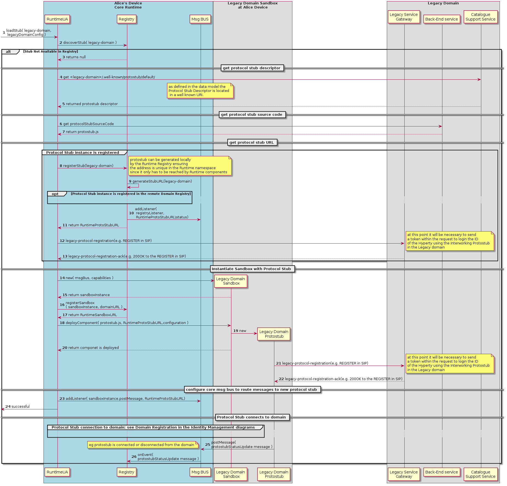

## Interworking with Legacy Services

###Introduction
reTHINK framework provides a mechanism to interact with legacy networks. This allows. for example. to setup calls with an IMS system from a Hyperty running in a browser, or exchanging Slack messages from a Hyperty. These scenarios are realized through the implementation of an InterWorking protostub - the "_IWStub_" - which will interact with the legacy service. Since protostubs also have to be created to interact with different Message Nodes, it does not add any relevant changes to reTHINK architecture. It may be also necessary to associate the Hyperty to more than one Identity, at least one identity used by the application which uses the Hyperty and also an identity valid for the Legacy domain. Both identities could be the same, however this would not be a common case.

###Applications
Integration with existing services is a critical requirement in order to make possible a soft migration from the existing services to reTHINK framework by making reTHINK application inter-operable with potentially any service.

One example is to integrate reTHINK with existing telephony networks. Being able to make and receive calls, and to use other advanced services provided by operator's IMS platform allows to open the operator services in a flexible and secure way to all the devices and platforms where reTHINK runtime can be executed.

The same is applicable to other popular services such as Facebook, Slack, Salesforce and any other social network or messaging system which expose public APIs. For example, this inter-working mechanism will allow to build an application which can receive calls from IMS in the public Identity of the user (normally an e.164 number) and also to send and receive Slack messages in the same web interface. These features can be combined with any reTHINK-based service.

###Interworking strategy proposal

####Who provides the IWstub?
The IWStub must be provided by the legacy domain and it must make reTHINK interoperable with the API or GW deployed in the legacy service to expose service to third parties. For example, in the case of IMS the IWstub must implement the protocol needed to interact with gateway element which translates web-based signaling protocol and WebRTC media profile in SIP and media profiles compatible with IMS.

Ideally the IWstub should also be downloaded from a back-end service of the Legacy Domain. If the Legacy Domain does not allow to download it, then it could be loaded from the default domain.

####Protocol implemented by the protostub
IF the runtime is being executed in a browser runtime, it must be taken into consideration that only HTTP or Websocket based protocols can be used (those are the only protocols that a browser can use without adding any additional plug-in). If the runtime is being executed in a Node.js runtime (or in any other runtime that can be created in the future) this limitation may not exist.  

####High level diagram
The diagram below shows a high level architecture of the integration of reTHINK with an external service.

As stated above, the Hyperty will need to be associated to two identities. The Identity Module will handle the authentication against the Identity Provider of the Legacy domain. After a successful authentication normally a token will be provided. This token has to be used from the Protostub to authenticate itself during the registration/login process to the legacy domain. Depending on the Legacy Domain this process may be different, however it should be compatible with the most scenarios.

Once the Identity Module has finished the authentication process, the Hyperty is ready to instruct the Protostub to register into the legacy domain and start the exchange of messages in order to give service to the application using the Hyperty.

The Hyperty will be able to interact with the legacy domain sending messages to the Protostub as it is done for a regular Message Node. The same way the Hyperty will be able to receive messages from it. The messages received by the Protostub from the legacy domain will also be translated into reTHINK messages (which are described  [here](../messages/legacy-interworking-messages.md)).

###Technical implementation

The diagram below shows the deployment process of an IWstub.

The main difference is that the IWstub code is downloaded from a back-end service of the Legacy Domain and the IWstub descriptor is also downloaded from a Catalogue at the Legacy Domain. Alternatively both of them could be downloaded from the Default Domain if it has some kind of agreement with the Legacy Domain.

Another big difference respect to a regular protostub is that normally there will a login or registration process once the protostub is deployed. This will depend on the protocol of the Legacy Domain, for example in the case of SIP networks there will be a registration process.

A complete description of the diagram has been included [here](../dynamic-view/legacy-interworking/readme.md).

###IWstub implementation
The data model of the Protostub which has been used from it conception in reTHINK has been adapted to be compatible with the IWstub so in terms of data model it is like any other protostub.
The Data model is described in this diagram:

Several attributes were included to accomodate the same data model to the IWstub:
- *interworking*: if this boolean is true it indicates that the protostub is used to connect with a legacy domain that is not compliant with reTHINK.
- *idpProxy*: this boolean indicates if protostub also provides Idp Proxy features. This may be needed to support interact with legacy domains.  
- *HypertyDataObjects*: It defines the HypertyDataObjects supported by peers belonging to the domain served by this protostub. To parameter may be useful to interact with a legacy domain which supports several Data Objects to implement different functionality.

A complete list of attributes can be consulted [here.](https://github.com/reTHINK-project/specs/tree/master/datamodel/core/hyperty-catalogue).

###Token based authentication techniques
Many Internet-based services expose APIs to be accessed from third-party services. Many of these APIs use token-based mechanisms to authenticate the request coming from authorized users.

The emergence of WebRTC support by most important browser vendors motivated 3GPP to defined token-based strategies to access the IMS network from Web applications. This will allow to use potentially any web browser with WebRTc support to behave as a user Equipment which has been restricted to native SIP clients. In the case of IMS, the authentication provider enabled by the operator (which can be the operator itself) provides a registration token after a correct login. This token based authentication has been designed to open IMS services to Web browser. reTHINK will leverage this token-based authentication feature by using a Interworking IDP Proxy separated from the IWStub.  

###IMS interworking
3GPP has released a [draft specification 24.371](https://portal.3gpp.org/desktopmodules/Specifications/SpecificationDetails.aspx?specificationId=1087) to define WebRTC access to IMS systems. The proposed legacy interconnection scheme for reTHINK is compliant with this specification and it will be shown in T.6.3.

The diagram below shows the interconnection diagram which is very similar to the generic one previously shown. The IMS gateway will perform a validation of the token obtained from the Identity provider and it will be passed to the gateway element of the IMS network in order to validate the token and register the identity associated to the reTHINK hyperty in the IMS network through the IMS protostub (which is an example of IWstub).
From this point on, the Hyperty will be able to interact with the IMS network through the protostub. From the IMS point of view the registered Hyperty is just another User Equipement. To enable voice and video calls, the WebRTC gateway would perform the translate between the media with WebRTC profile to a media profile compatible with the IMS network.

###IWstub Extensibility Considerations
Extending reTHINK to make it inter-operable with different services may require to support scenarios and use cases which has not been considered at design time. So the IWstub has been enriched with attributes not used in regular protostub which enable future extensions.

####Data Object adaptation to meet new scenarios
reTHINK internal communication is based on data object synchronization so two hyperties can "talk" to each other if they use a common data object. In order to implement complex message flows (e.g. a SIP call flow needed to implement call transfer) may not be implementable with the current connection Data Object so it may need to be extended in short term. That is why a the dataObjects attribute has been added to the protostub descriptor which includes all the HypertyDataObjects supported by peers belonging to the domain served by this protostub. New HypertyDataObjects or extensions to HypertyDataObjects may be needed to support new scenarios in order to be flexible enough to meet future requirements.

####IdP Proxy
Additionally to the dataObjects a new boolean attribute called idpProxy has been defined to specify if the IWstub is also a proxy for the Identity Provider exposed by the Legacy Domain. Allowing the IWstub to act as an IdPProxy gives an extra flexibility which will help to accommodate future Identity management mechanisms.
