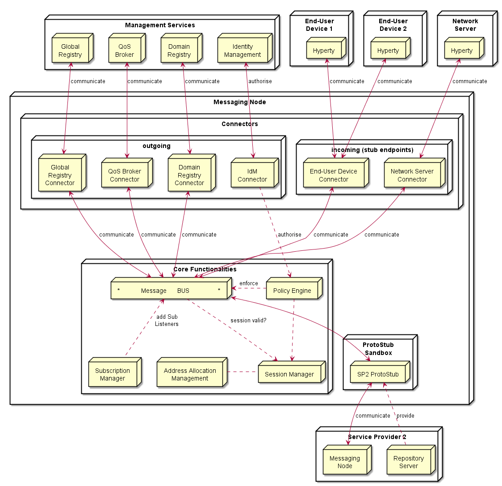

<h1></h1>
<h1></h1>

Messaging Nodes are responsible for routing messages between Hyperty Runtimes on intra- and inter-domain level, when peer-to-peer connections are not possible.
The main tasks of Messages Nodes are:

	* Assignment of unique addresses to entities (Hyperties and Data Objects),
	* Management of routing paths between entities,
	* Gateway to support Services in a Service Provider domain,
	* Enforcement of provider policies concerning the message routing.

Message Nodes can either be implemented from scratch, as a stand-alone solution, or they can make use of existing message routing systems and enrich them with support Services for the tasks listed above.

It is the Messaging Node ProtoStub that acts as the *glue* between the reTHINK runtime and the Message Node.
Therefore, each Message Node and its corresponding ProtoStub forms a unit that must be designed and implemented together.
All ProtoStubs must handle a common message format, but the transport protocol between the ProtoStub and the Message Node as well as internally in the Message Node are implementation specific.

Depending on the complexity and flexibility of the Message Node, different ProtoStub models are possible.
In one extreme, the ProtoStub might just be a pipe that transports messages completely un-touched. The other extreme is a ProtoStub that already analyses and translates reTHINK messages to another format suitable for the specific Message Node.

ReTHINK provides reference implementations of Message Nodes based on Vert.x, NodeJS, and Matrix.org.

## Architecture

The Messaging Node functional architecture is presented in the figure below and it comprises three main types of functionalities including the Core Functionalities, Connectors and Protocol Stubs.




## Core Functionalities

### Message BUS

The Message BUS routes messages to internal Messaging Node components and external elements by using Connectors or Protocol Stubs. It supports different communication patterns including publish/subscribe and request/response communication.

### Policy Engine

Message nodes are responsible for the interaction of runtimes that might belong to different administrative domains by offering protocol stubs to these external runtimes. The domain operators need a mechanism to control these domain interactions and to potentially block or limit certain combinations of message exchange.

In order to achieve this, a MN must provide a hook in the message flow that allows applying policy-based decisions to the routing. These policies must be manageable by the domain Policy Manager.

Therefore a Policy Engine provides Policy Decision and Policy Enforcement functionalities at Domain level for incoming and outgoing messages in cooperation with authentication and authorization provided by Identity Management functionalities. It also provides authorization / access control to the Message BUS.

## Session Management

Session Management functionalities are used to control messaging connections to service provider back-end services. For example, when user turns-on the device and connects to its domain, providing credentials as required by Identity Management functionalities. In general, each message should contain a valid token that is generated when the client connects to the Messaging Node. It also manages the registry of protocol stubs and connectors supported by the Messaging Nodes to support the routing of messages to these components.

## Address Allocation Management

As soon as an entity in a runtime wants to be accessible from another runtime, this entity must be addressable. Since a MN is the central message routing point for a domain it is the MNs task to create these addresses and to assign them to the requesting runtime. The resulting internal allocation table stores the relation of the allocated addresses to the stub connections and enables a proper routing of messages between the runtimes.

The Address Allocation Management functionality handles the allocation of messaging addresses to instances of Hyperties and Synchronization Data objects in cooperation with Session Management when users connect to the domain. These addresses are valid for at least the lifetime of a session. They are used by the Subscription Manager and Message BUS to take routing decisions.
The specification of the messages to manage address allocations can be found at [Address-allocation-messages](../messages/address-allocation-messages.md).

The Address Allocation Management is also responsible for the allocation of messaging addresses to foreign Hyperty Instances i.e. Hyperty Instances that are provided from external domains but that use the protofly concept to interact with Hyperty Instances served by this Messaging Node. For example, if the Messaging Node is implemented by core IMS or a simple SIP Proxy/SIP Registry, it might require the management of a pool of SIP addresses to be allocated to clients that have no account in the IMS HSS or in the SIP registry.

Address Allocation Management functionality must have listeners to receive messages for the following addresses:

```
domain://msg-node.<sp-domain>/address-allocation
```

### Subscription Manager

A core concept in the reTHINK architecture is that Hyperties interact with each other by exchanging and synchronizing their managed data objects based on the [Reporter - Observer pattern](../concepts/p2p-data-sync.md). The MN supports this concept by allowing observers (Hyperties, running in one or more runtimes) to subscribe for changes of certain allocated data object urls deployed in other runtimes. Whenever a Hyperty runtime reports a change in a monitored data object it sends a change message to the MN. The "to" address of this message will simply be the allocated address of the updated data object, not the address of the subscribers directly.

In order to route such object change messages to the subscribed listeners, the MN has to maintain a list of subscribers per allocated data object. Therefore the MN must intercept subscription messages which have the following format:

```
"id" : "1",
"type" : "SUBSCRIBE",
"from" : "hyperty-runtime://<observer-sp-domain>/<hyperty-observer-runtime-instance-identifier>/sm",
"to" : "domain://msg-node.<observer-sp-domain>/sm",
"body" : {
  "resource" : "<ObjectURL>" ,
  "childrenResources" : [{"<resource-children-name>"}],
  "schema" : "hyperty-catalogue://<sp-domain>/dataObjectSchema/<schema-identifier>"
}
```

This message of type "SUBSCRIBE" is addressed to "domain://msg-node.<observer-sp-domain>/sm", which is the identifier of the MNs "Synch Manager (sm)" component. In the body the most important field is the "resource", which contains the allocated address of the object that shall be subscribed by the runtimes sync manager (as identified by the "from" field).

The MN must extract the <ObjectURL> from the body and assign this URL internally to the given HypertyURL contained in the "from" URL. This means for the MN that every future "changes"-message to this ObjectURL must be forwarded to the Hyperty Runtime Instance. If the "childrenResources" arrays contains values, than additional assignments must be created for each <ObjectURL> + / + <resource-children-name>.

After extraction of the parameters and the creation of the assignments, the MN must respond with a message of code 200 back to the runtime.

```
"id" : "1"
"type" : "RESPONSE",
"from" : "domain://msg-node.<observer-sp-domain>/sm",
"to" : "hyperty-runtime://<observer-sp-domain>/<hyperty-observer-runtime-instance-identifier>/sm",
"body" : { "code" : "2XX"  }
```

*NOTE:* The procedure to un-subscribe from data object changes looks very similar to the above described subscribe procedure. The message to intercept is then of type "UNSUBSCRIBE". The MN has to remove the previously mapped assignments and respond back with a code 200 message.

If the MN later on receives a message from a reporting Hyperty that its data model has changed this message will look like this:

```
"id" : "3"
"type" : "UPDATE",
"from" : "<ObjectURL>",
"to" : "<ObjectURL>/changes",
"body" : { "value" : "changed value"  }
```

Note that the "from" and "to" fields just contain the <ObjectURL> and the "to"-field has the suffix "/changes". When the MN receives such a message, it must look up for all subscribed listeners to this <ObjectURL> and forward the message to them.

A more detailed specification can be found at [Data sync messages](../messages/data-sync-messages.md).
The Subscription Manager functionality must have listeners to receive messages for the following addresses:

```
domain://msg-node.<sp-domain>/sm
```

### Protocol Stub

The basic operation mode of a MN is that it is connected by runtimes directly via the provided protocol stubs. A message received from one runtime will be forwarded to another runtime which must also be connected through a stub. This is a classic "triangular" messaging architecture. The triangular message flow looks like this:

`
RuntimeA --> StubB --> MN-B --> RuntimeB
`

The stub architecture enables allows also extended messaging models, which can be implemented in future iterations, for instance a "trapezoid" architecture for inter-domain communication. In contrast to the triangle, each runtime will only have a connection with the MN from its own domain. If one runtime wants to send a message to another one from another domain, it will not be runtime itself that downloads and instantiates the stub of the foreign domain. It would be the domains MN instead that does it.

The trapezoid message flow will then look like this:

`
RuntimeA --> StubA --> MN-A --> StubB --> MN-B --> RuntimeB
`

and vice versa. This implies that the MN has to implement a module for the proper downloading, instantiation and operation of foreign stub in a sandboxed environment, just like the runtimes are already doing it.

From the viewpoint of the MN, each stub represents one runtime instance. It is the task of the MN to identify a stub connection, and to manage the life-cycle of the assigned server side resources. The actual "handshake mechanisms" between the stub and the MN are left implementation specific and must be agreed between the stub and MN implementations.

A valid method for the MN to identify a stub connection is to use the "runtimeURL", which each stub is constructed with in the runtime. If the stub provides this url during the connection handshake procedure, then the MN can identify the stub/runtime, even after a potential re-connect, e.g. due to temporary loss of network connectivity.

It is the responsibility of the MN to release resources if the "disconnect" method was invoked on the stub . This is the official indication that the runtime does not need this stub connection anymore and it has released the stub. In the alternative case, that a stub was not sending messages for a longer period, but was also not officially disconnected, it is up to the MN implementation to run a kind of garbage collection mechanism to release stale resources.

For more detailed specification of Protocol Stubs please refer to [Protocol stub specification](stub-specification.md).

## Connectors

Connectors implement protocol stacks used to interoperate with external elements from the domains. In general there are connectors for outgoing access to components inside or outside the own domain and on the other hand endpoints listening for incoming connections from external entities, like hyperty runtimes on end-user/network- devices.
All types of Connectors can be supported by using protocol on-the-fly concept, giving more flexibility for the integration of the Messaging Node in the Service Provider infra-structure.

### IdM Connector

The IdM connector provides access to the domains Identity Manager. The IdM functionalities support the Session Manager for a general Access Control and the Policy Manager for the validation of identity tokens in messages and the enforcement of routing policies.

It must have listeners to receive messages for the following addresses:

```
domain://idm.<sp-domain>
```

### Domain Registry Connector

The allocation of a unique address is only the first step on the way to make a hyperty or data object usable from another runtime. In order to make it discoverable the allocated addresses must be registered in the domain registry component. The interaction with the domain registry is also the task of the MN. The MN has to intercept messages from a runtime that address the <registry> subdomain of the MNs own url and to create a corresponding asynchronous request to the domain registry. As soon as it receives an answer, the MN has to respond this answer back to the runtime.

It handles messages for the registration, un-registration and lookup of Hyperties and Data Objects in the domain registry. The specification of these messages can be found at [Registration messages](../messages/registration-messages.md). The Domain Registry Connector mainly acts as a “relay” between the hyperty runtimes and the domain registry. It does not actively process the messages and responses. This connector is mandatory to keep Domain Registry interface protocol and API agnostic as well as to control the access to it.

It must have listeners to receive messages for the following addresses:

```
domain://registry.<sp-domain>
```

### Global Registry Connector

The role of the Global Registry Connector is comparable to the connector for the Domain Registry. It acts as a relay between the hyperty runtimes and the Global Registry. It is used by the Runtime Graph Connector to handle user’s GUID and it is also used by Hyperties to discover the domains where special remote Hyperties are registered. This Connector is optional. It might be required in cases where the runtime itself might not be able to establish an own connection to the Global registry. In such cases it can use the Connector running on the MN of its home-domain to access it.
The specification of the messages for the interaction with the global registry can be found at [Global Registry messages](../messages/global-registry-messages.md).

It must have listeners to receive messages for the following addresses:

```
global://registry/
```

### QoS Broker Connector

The QoS Broker Connector allows applications to communicate with the QoS Broker Component in a certain domain. The application can use this mechanism to inquire available network resources and to place resource reservations for application sessions.

### End-User Device Connector / Network Server Connector

These Connectors provide the “server-side” for connections that are initiated by protocol stubs running inside of Hyperty runtimes. These runtimes can either be running on end-user devices (e.g. in a browser or stand-alone environment) or on network-server devices, for example on an embedded system that implements an IoT use case.
A simple technical example for such a connector is a Websocket server that waits for connection requests from externally deployed stubs and handles them. The types of required server-side connectors correlates to the types of stubs that the MN needs to support. If a stub, for instance, needs to establish a REST like communication than the MN must operate a connector that implements the REST server endpoint.
