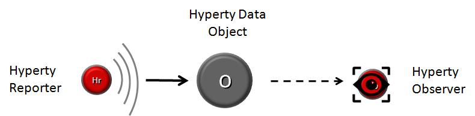
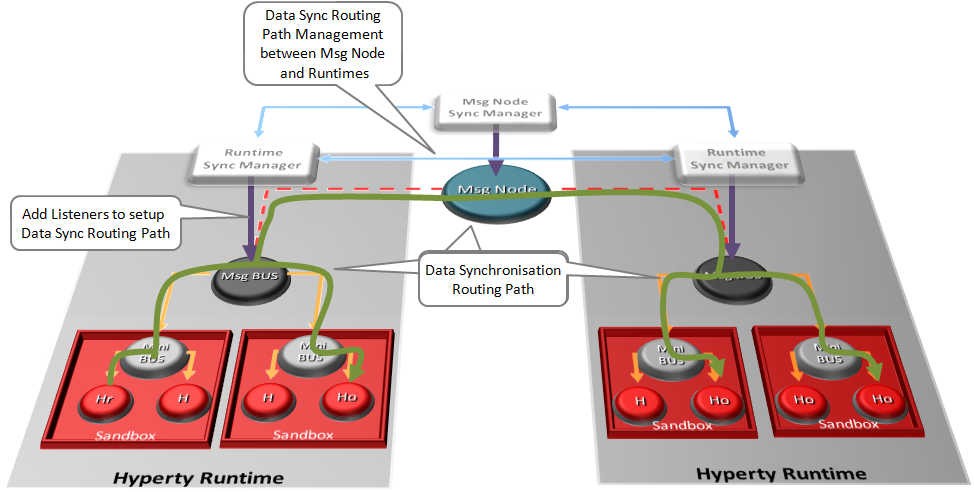

## P2P Data Synchronisation: Reporter - Observer Model

This document gives an overview on how Hyperties cooperate with each other through a Data Synchronisation model called Reporter - Observer.

While the [Protocol on-the-fly](protofly.md) provides transport interoperability without requiring the standardization of messaging protocols, the Reporter - Observer communication pattern enables semantic interoperability between Services without having to standardize Service APIs.

It extends existing Observable communication patterns by using a P2P data stream synchronization solution for programmatic Objects e.g. JSON Objects, hereafter simply called Data Objects.

To avoid concurrency inconsistencies among peers, only one peer is granted writing permissions to the Data Object - the Reporter service - and all the other service instances only have permissions to read the Data Object - the Observers.

As soon as the Reporter performs changes to Data Objects, they are immediately propagated to any authorized Observer by using the messaging framework. In this way, the Data Object monitored by the Observer is always synchronized with the Data Object owned by the Reporter.

Full interoperability is achieved between two service instances by only having to agree on the usage of common formats for the Data Objects.

To be noted that, conceptually, more complex semantic interoperability and data synchronization technologies, like Semantic Web and Operational Transformation, can be used.

### Data Object URL address

Data Objects addresses follow [Information-centric networking](https://irtf.org/icnrg) design principles to support Data Object portability (between Communication end-points) and group communication.
These characteristics are supported by the usage of virtual addresses separately allocated to Data Objects, which are agnostic of the network addresses and the execution environment.

### Data Object Schema

Each Data Object is formally described by a JSON-Schema that is identified by a Catalogue URL. This allows to check whether two different services are compliant by checking each supported Data Object schema. At this point the following Data Object schemas are defined:

-	**[Connection Data Schema](../datamodel/data-objects/connection)** : services supporting this schema are able to handle [WebRTC Peer Connections](https://developer.mozilla.org/en-US/docs/Web/Guide/API/WebRTC/Peer-to-peer_communications_with_WebRTC) between the Hyperty Runtime instances where they are running independently of the signalling protocol used. The URL Scheme for Connection Data Objects is "connection" (example: "connection://example.com/alice/bob201601290617").
-	**[Communication Data Schema](../datamodel/data-objects/communication)** : services supporting this schema are able to handle different communication types including Textual Chat, Audio, Video, Screen Sharing and File sharing. Such communication can be supported on top of WebRTC protocol streams by using the Connection Data Schema. The URL Scheme for Communication Data Objects is "comm" (example: "comm://example.com/group-chat/rethink201601290617").
-	**[Context Data Schema](../datamodel/context)** : services supporting this schema are able to produce or consume Context Data, usually collected from sensors. The URL Scheme for Communication Data Objects is "ctxt" (example: "ctxt://example.com/room/temperature201601290617").

### Parent - Children Resources

In order to allow use cases like Group Chat where all involved services are able to write in the Sync Data Object, the Parent - Child Data Sync Objects are introduced.

A Data Object Child belongs to a Data Object Parent children resource and can be created by any Observer of the Data Object Parent as well as by its Reporter. The Reporter - Observer rules still apply to Data Object Child i.e. there is only one Reporter that can update the Data Object Child, which can be an Observer of the Data Object Parent, as mentioned earlier.

The creation, update and delete of an Data Object Child is performed in the Data Object Parent itself:

`*Data Object Child creation, update and delete code snippet*`

All other services observing or reporting the Data Object Parent, will be notified every time a new Data Object Child is created, updated or deleted.

At this point, Data Object Child can't also be a Data Object Parent of another Sync Data Object, i.e. Data Object composition is limited to one level.

### Syncher and Sync Manager

This section, gives an overview on how the Data Object synchronisation transparently works on top of the [Messaging Framework](readme.md).

The Data Object synchronisation is provided by two components in the Runtime:

The [Syncher](https://github.com/reTHINK-project/dev-service-framework/blob/master/src/syncher/Syncher.js) is a singleton Component co-located with the Service Instance, which is in charge of handling all required procedures to manage data synchronisation at the Service instance side, as a Reporter or a Observer service.

The [Runtime Sync Manager](https://github.com/reTHINK-project/dev-runtime-core/blob/master/src/syncher/SyncherManager.js) is a Core Runtime Component, which is in charge of handling authorisation requests to create Sync Data Objects from Reporters and subscription requests to Sync Data Objects from Observers. As soon as authorisation is granted the Sync Manager handles all required MessageBUS listeners in order to setup the Data Sync Stream routing path among Reporters and Observers. I.e., the Runtime Sync Manager provides a Messaging Framework Routing Manager functionality.

The [Message Node Sync Manager](https://github.com/reTHINK-project/dev-service-framework/blob/master/src/syncher/Syncher.js) is a Message Node functionality, which is in charge of handling requests from Runtime Sync Managers in order to setup the Data Sync Stream routing path between the Reporter Runtime and Observers Runtimes. I.e., the Message Node Sync Manager also provides a [Messaging Framework](readme.md) Routing Manager functionality..

A detailed description of the Data Synchronisation procedures are provided [here](../dynamic-view/data-sync/readme.md)
