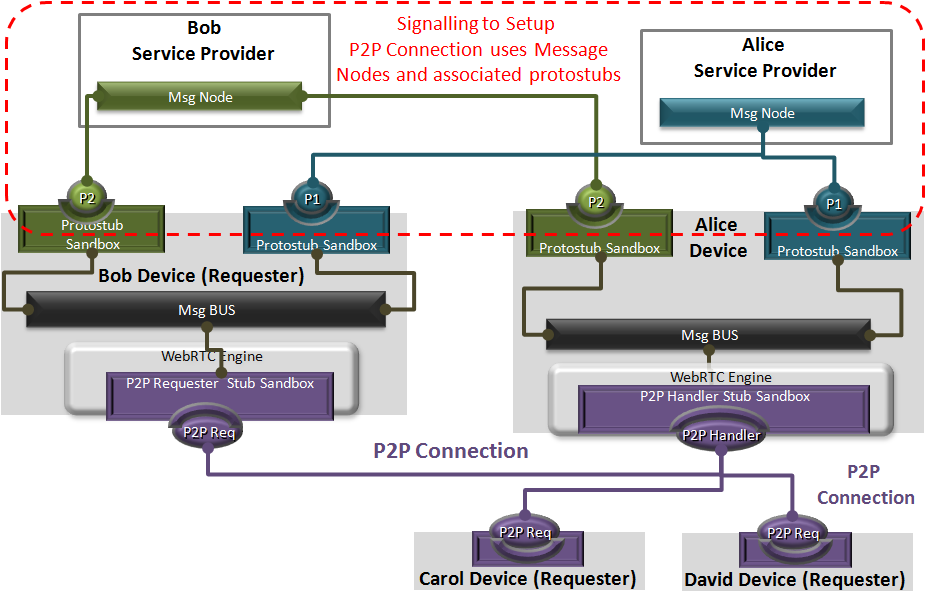

Hyperty Messaging Framework
---------------------------

This document gives an overview on the Messaging Framework technical solution used to support Hyperty's interaction through the higher level [Data Synchronisation Reporter - Observer communication mechanism](p2p-data-sync.md).

Hyperties cooperate each other with a Resource Oriented Messaging model implemented by a simple Messaging Framework. The Hyperty Messaging Framework, supports different messaging patterns including publish/subscribe and request/response messaging patterns. The higher level [Reporter - Observer communication pattern](p2p-data-sync.md) works on top of these basic messaging patterns.

The Message delivery is based on a simple message Router functionality that performs a lookup for listeners registered to receive the Message (the ["Message.to" Header field](https://github.com/reTHINK-project/dev-service-framework/blob/develop/docs/datamodel/message/readme.md#to) is the only information looked up for). The Message is posted to all found listeners, which can be other Routers or end-points (Hyperties). Thus, the Hyperty Messaging Framework is comprised by a network of Routers where each Router only knows adjacent registered Routers or end-points.

Listeners are programmatically registered and unregistered by Routing Management functionalities, which decide the listeners to be added according to a higher level view of the Routing Network.

The Messaging Framework works at three layers:

At the Runtime Sandbox level where Hyperties are executing, message delivery is provided by the [MiniBUS component](https://github.com/reTHINK-project/dev-runtime-core/blob/master/src/bus/MiniBus.js).

At the Runtime level where Sandboxes are hosted (e.g. in a Browser or in a NodeJS instance), message delivery is provided by the [Message BUS component](https://github.com/reTHINK-project/dev-runtime-core/blob/master/src/bus/MessageBus.js), which is an extension of the MiniBUS.

At Domain Level, message delivery is provided by the [Message Node](msg-node.md) functionality by using the [Protofly mechanism](#protocol-on-the-fly-protofly-and-protostubs), i.e. communication between Message BUS and Message Nodes and among Message Nodes are protocol agnostic. This also means that the Message Node can be provided by any Messaging solution as soon as there is a [Protostub available](#protocol-on-the-fly-protofly-and-protostubs). Currently, a [Vertx Message Node](https://github.com/reTHINK-project/dev-msg-node-vertx), a [Matrix Message Node](https://github.com/reTHINK-project/dev-msg-node-matrix) and a [NodeJS Message Node](https://github.com/reTHINK-project/dev-msg-node-nodejs) are provided. These are just reference implementations of Message Nodes and anyone is free to develop its own Message Node. Check the [Message Node and associated Protostub development tutorial](../tutorials/development-of-protostubs-and-msg-nodes.md) for more details.

At runtime level (MessageBUS and MiniBUS), it is used a standard CRUD based [JSON Message Model](../datamodel/message/readme.md), which is easily mapped into Restfull APIs.

### Protocol on-the-fly (protofly) and Protostubs

Protocol on-the-fly leverages the code on-demand support by Web runtimes (eg Javascript), to dynamically select, load and instantiate the most appropriate protocol stack during run-time. Such characteristic enables protocols to be selected at run-time and not at design time, enabling protocol interoperability among distributed services, promoting loosely coupled service architectures, optimising resources spent by avoiding the need to have Protocol Gateways in service's middleware as well as minimising standardisation efforts. The implementation of the protocol stack, e.g. in a javascript file, that is dynamically loaded and instantiated in run-time is called **Protostub:**. For security reasons, Protostubs are executed in isolated sandboxes and are only reachable through the Runtime MessageBUS and the Protostub Sandbox MiniBUS.

### Message Delivery between different Hyperty Runtimes

Communication between different Hyperty Runtimes can be supported with peer to peer connections or via a Message Node. In both options a Protostub implementing the most appropriate network protocol stack is used. For example,  JSON over Websockets and  Restfull API Client are good options for Protostubs used to interface with a Message Node, while WebRTC Datachannel is a good option for a Protostub used to directly interface with another Hyperty Runtime.

Protostubs are registered in the Runtime Registry with its own Hyperty Runtime URL e.g. `hyperty-runtime://example.com/runtime-123/protostub-3` and have listeners in the MessageBUS to receive messages targeting its URL.

When the MessageBUS is processing a new message and looking up routing paths for an address (The Message Routing generic procedure is described [here](../dynamic-view/basics/bus-msg-routing.md)), which is not local (eg `hyperty://example.com/alice-hyperty`), it won't find any registered listeners. In this case, the MessageBUS will ask the [Runtime Registry](https://github.com/reTHINK-project/dev-runtime-core/blob/master/src/registry/Registry.js) to resolve the "Message.to" header field. Then, the Runtime Registry will look for registered Protostubs that are able to deliver messages to such non-local address.

If there is already a deployed Protostub that is able to deliver the message to the remote Hyperty, the Registry will return the Hyperty Runtime protostub address and the MessageBUS will look up again for the protostub listener registered for its address. Otherwise, the [deployment of the required Protostub is performed](../dynamic-view/basics/deploy-protostub.md) and as soon as the Protostub is successfully instantiated, its hyperty runtime address is returned.

In this process, P2P Protostubs are favored since less resources are spent and Network latency should be better.

#### Peer to peer message delivery

There are two types of P2P Protostubs:

- P2P Handler Stub: would be deployed as soon as the Runtime is instantiated to be ready to receive requests setup P2P Connections. It would be the [observer](p2p-data-sync.md) of [Connection Data objects](../datamodel/data-objects/connection) that are created by remote P2P Requesters Stub. The P2P Handler Stub can observe more than one connection data objects ie it can handle several p2p connections to remote runtimes. Each p2p connection would be managed by a connection controller (see Connector hyperty design). As soon as the Runtime is instantiated, the P2P Handler Stub is deployed and the path to receive P2P Data Connection creation requests from P2P Requester Stubs is set.
- P2P Requester Stub : it would be deployed to setup a p2p connection with a remote runtime  P2P Handler Stub. It would be the [reporter]([observer](p2p-data-sync.md)) of a single [Connection Data object](../datamodel/data-objects/connection) object instance.

These P2P Protostubs are provisioned in the catalogue with p2p attribute enabled. *todo: propose new p2p attribute  in the protostub descriptor*.

Hyperties that are deployed in a P2P enabled runtime, are registered in the Domain Registration with its Hyperty Runtime URL and its P2P Handler Stub instance URL. P2P Requester Protostubs in other Runtimes can setup a P2P connection exchanging messages with the P2P Handler Protostub through the Message Node ie using Message Nodes Protosubs (see picture below).

