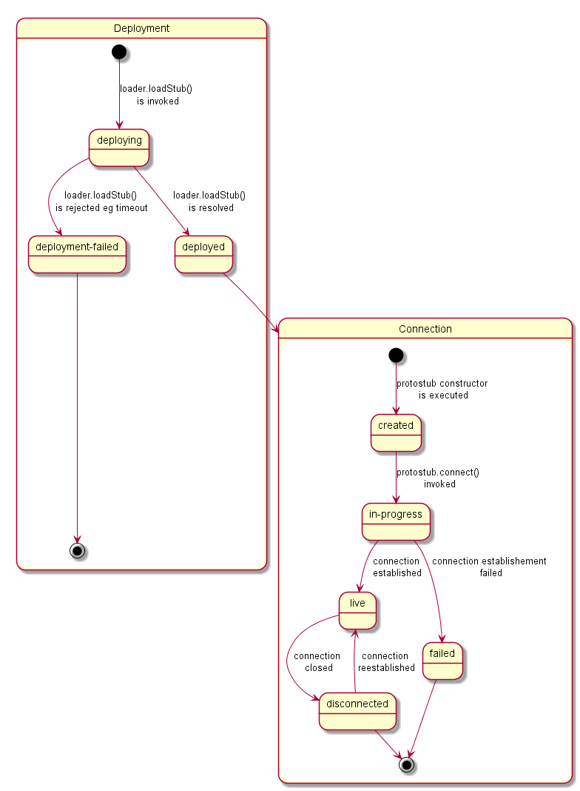

## Protostub specification

### Stub construction and activation

Stubs are provided by different vendors and developers and of course they have different naming conventions. In order to provide a common instantiation scheme a convention was defined additionally to the interface that ProtoStubs have to implement. The convention is that each stub modules must export a default activation function that is used by the runtimes to obtain a stub instance with a given set of parameters.

```
export default function activate(url, bus, config) {
  return {
    name: 'MatrixProtoStub',
    instance: new MatrixProtoStub(url, bus, config)
  };
}
```

This activation function hides the internal naming and just returns an object that provides an implementation of the methods defined in the ProtoStub interface. The parameters of this function correspond directly to the previously described parameters of the Stub constructor.

### Integration with the Messaging Bus of the Runtime

Protocol stubs are tightly integrated with the messaging bus of the runtime. This integration is bi-directional. A reference to the messaging bus is provided as second paramenter of the stub constructor.

In order to receive messages from the runtime's messaging bus, the stub has to add itself as a listener. This can be done directly in the stubs constructor by adding such a code snippet:

```
this._bus.addListener('*', (msg) => {
    this._assumeOpen = true;
    this._sendWSMsg(msg);
});
```

Whenever the stub receives a message through this listener callback it invokes its own implementation specific functionality to potentially anaylyze, process and finally send an outgoing message to its MN (either the un-modified or a transformed message, depending on the MN type). In the code example above it would just forward them via a websocket connection.

For every message that is received from the MN, the stub forwards this message to the bus like shown here:

```
// parse msg and forward it locally to the runtimes messaging bus
_onWSMessage(msg) {
  this._deliver(JSON.parse(msg.data));
}
```
Also messages received from a MN might be anaylyzed, processed and potentially transformed by the Stub before they are delivered to the runtimes message bus, depending on the MN type.

### Auto connect mechanism

The stubs are expected to support an auto connect mechanism. This is because the runtime will not explicitely trigger the stub connection process itself by invoking a "connect" method. Instead it just sends messages via the messaging bus to the stub and assumes that the stub takes care of its own connection state.

A simple approach to implement this behavior in the stub is to maintain a flag that indicates whether the connection to the MN shall be kept open or not. This flag could be set to TRUE, as soon as the first message is being sent and to FALSE if the stub receives a "disconnect" command from the runtime. If for instance a network problem causes an interruption of the connection between stub and MN, the stub would attempt to re-connect as soon as the next message shall be sent.

This is, how the method to send a message could look like:

```
_sendWSMsg(msg) {
  if ( this._assumeOpen )
    this.connect().then( () => {
      this._ws.send(JSON.stringify(msg));
    });
}
```

If there is an explicit invocation of the "disconnect" method of the stub the stub will close the connection to the MN and set the keep alive flag off.

```
disconnect() {
  this._assumeOpen = false;
  this._ws.close();
}
```

### State Machine

The Protostub status follows the state machine specified below.
The "Deployment" states are handled by the RuntimeUA Core component while the "Connection" states are handle by the Protostub itself.
The changes of Protostub Connection status are notified to `<runtimeProtoStubURL>/status`  address as described below which should be processed by the Runtime Registry to keep the Protostubs List updated.




### Connection events

In order to synchronize the state of the stubs with the runtime, each stub is expected to emit status messages to the bus whenever its connection state changes. The following method can be used to encapsulate this:

```
_sendStatus(value, reason) {
  let msg = {
    type: 'update',
    from: this._runtimeProtoStubURL,
    to: this._runtimeProtoStubURL + '/status',
    body: { value: value }
  };
  if (reason) {
    msg.body.desc = reason;
  }

this._bus.postMessage(msg); }
```

The Message is of type "update". Its "from" attribute must be the runtimeProtoStubURL that was provided as first parameter of the constructor. The "to" attribute is the runtimeProtoStubURL extended with "/status".

The expected "value" parameter should be set according to state machine above. Optionally a reason can be specified that will be placed in the body of the message.

If the connection to the MN is established via a Websocket, then the sending of the corresponding event messages can be triggered in the "open" and "close" handlers of the Websocket.

```
_onWSOpen() { this._sendStatus("live"); }

_onWSClose() { this._sendStatus("disconnected"); }
```


### The ProtoStub API

The interface that a protocol stub has to implement is kept very small and simple by intent.

A protocolStub is constructed with a set of parameters that ensures that the stub can be uniquely identified, connect to its backend Messaging Node and can communicate with the messaging bus in the runtime.

```
new ProtoStub(runtimeProtoStubURL, busPostMessage, configuration)
```

*Parameters:*

| name                | type                                      | description                                                                                                                                                                           |
|---------------------|-------------------------------------------|---------------------------------------------------------------------------------------------------------------------------------------------------------------------------------------|
| runtimeProtoStubURL | URL.RuntimeURL                            | A URL allocated by the runtime that uniquely identifies this protocolStub.                                                                                                            |
| busPostMessage      | Message.Message (???)                     | The runtime BUS postMessage function to be invoked on messages received by the protocol stub.                                                                                         |
| configuration       | ProtoStubDescriptor.ConfigurationDataList | Configuration data that is retrieved from the protocolStub descriptor. This data is implementation-specific and ensures that the Stub can address and connect its own Messaging Node. |

#### Methods


`connect(identity)`

The connect method establishes the connection between the protocol stub and the backend messaging node.

**Note:** The "connect" method will not be directly invoked by the runtime implementation. Rather it is expected that the stub maintains its connection state internally. Whenever the runtime intents to send a message via the postMessage method, the stub shall auto-connect to the Messaging Node and attempt to keep this connection open until it explicitly receives a "disconnect" invocation.

*Parameters:*

| name     | type    | description                                                                                                         |
|----------|---------|---------------------------------------------------------------------------------------------------------------------|
| identity | IDToken | An optional identity token that can be used to authenticate this stub connection against the backend messaging node |


`disconnect()`

The disconnect method is used to explicitly disconnect a stub from its messaging node. Such a disconnect can be used to release and clean up resources in the stub and also on the backend side in the messaging node.


The connect method establishes the connection between the protocol stub and the backend messaging node.

`_filter(msg)`

This message must be present in order to avoid message cycles in two situations:
* for messages beeing sent out to the MN.
* for messages beeing delivered to the Runtime MessageBus.

It is used to filter out messages that have been sent already via the protocol stub, by checking a "via" field in the message body. If this field exists and equals the stubs runtimeProtoStubURL then this message must return false, otherwise true.

*Parameters:*

| name     | type    | description                                                                                                         |
|----------|---------|---------------------------------------------------------------------------------------------------------------------|
| msg | Message | The original message from the MessageBus |

*Returns:*

**true**, if the message does not contain a body.via field matching the own runtimeProtoStubURL

**false** otherwise

`_deliver(msg)`

This message must be present in order to perform the actual delivery of a message towards the MN. It must insert the body.via field into the message, which existence is checked in the "_filter" method._

*Parameters:*

| name     | type    | description                                                                                                         |
|----------|---------|---------------------------------------------------------------------------------------------------------------------|
| msg | Message | The original message from the MessageBus |


#### Events

A protocol stub emits events to communicate its own connection state to the runtime. Whenever the stub gets connected or disconnected, it uses the "busPostMessage" to send a message to the runtimes message bus. These Event messages are defined as follows:

```
{
  "type": 'update',
  "from": runtimeProtoStubURL,
  "to": runtimeProtoStubURL + '/status',
  "body": {
    "value": "connected|disconnected"
}
```

The runtimeProtoStubURL is the URL that was provided as first parameter of the Stub constructor. The value in the message body is either "connected" or "disconnected".
