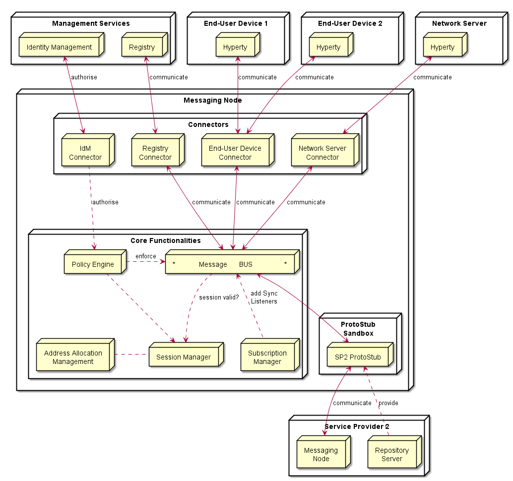

Messaging Node Architecture
---------------------------

The Messaging Node functional architecture is presented in the figure below and it comprises three main types of functionalities including the Core Functionalities, Connectors and Protocol Stubs.



### Core Functionalities

#### Message BUS

The Message BUS routes messages to internal Messaging Node components and external elements by using Connectors or Protocol Stubs. It supports different communication patterns including publish/subscribe and Request/response communication.

#### Policy Engine

The Policy Engine provides Policy decision and Policy Enforcement functionalities at Domain level for incoming and outgoing messages in cooperation with authentication and authorisation provided by Identity Management functionalities. It also provides authorisation / access control to the Message BUS.

#### Session Management

Session Management functionalities are used to control messaging connections to service provider back-end services. For example, when user turns-on the device and connects to its domain, providing credentials as required by Identity Management functionalities. In general, each message should contain a valid token that is generated when the client connects to the Messaging Node. It also manages the registry of protocol stubs and connectors supported by the Messaging Nodes to support the routing of messages to these components.

#### Address Allocation Management

The Address Allocation Management functionality handles the allocation of URL addresses to Hyperty Instances and Hyperty Data Objects in cooperation with Session Management when users connect to the domain.

It also manages the allocation of messaging addresses to foreign Hyperty Instances i.e. Hyperty Instances that are provided from external domains but that use the protofly concept to interact with Hyperty Instances served by this Messaging Node. For example, if the Messaging Node is implemented by core IMS or a simple SIP Proxy/SIP Registry, it is required the management of a pool of SIP addresses to be allocated to clients that have no account in the IMS HSS or in the SIP registry.

Address Allocation Management functionality must have listeners to receive messages for the following addresses:

```
domain://msg-node.<sp-domain>/hyperty-address-allocation
domain://msg-node.<sp-domain>/object-address-allocation
```

### Subscription Manager

The Message Node Subscription Manager is in charge of handling Subscription and Unsubscription requests from Runtime Sync Managers in order to manage the Data Sync Stream routing path in the Message Node.

The Subscription Manager functionality must have listeners to receive messages for the following addresses:

```
domain://msg-node.<sp-domain>/sm
```

### Protocol Stub

In special situations e.g. when the download of external software (protocol stubs) into end-user devices is not allowed, it should be possible to have interoperability between Messaging Nodes from different domains, by using the protofly concept.

Thus, a Protocol Stack to be used to communicate with another Messaging Node can be deployed.

It should be noted that protocol stubs can also be used to implement a Messaging Node connector, in case it does not exist.

### Connectors

Connectors implements protocol stacks used to interoperate with external elements from the domains. Connectors can be supported by using protocol on-the-fly concept, giving more flexibility for the integration of the Messaging Node in the Service Provider infra-structure.

#### Registry Connector

Registry Connector to interact with remote Registry functionalities. It must have listeners to receive messages for the following addresses:

```
domain://registry.<sp-domain>
```

#### IdM Connector

IdM Connector interacts with remote Identity Management functionalities. It must have listeners to receive messages for the following addresses:

```
domain://idm.<sp-domain>
```

#### End-User Device Connector

End-User Device Connector to interact with Hyperty Instances running in the end-user device

#### Network Server Connector

Network Server Connector to interact with Hyperty Instances running in a Network Server
