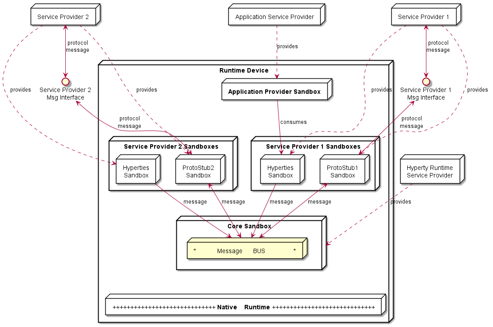
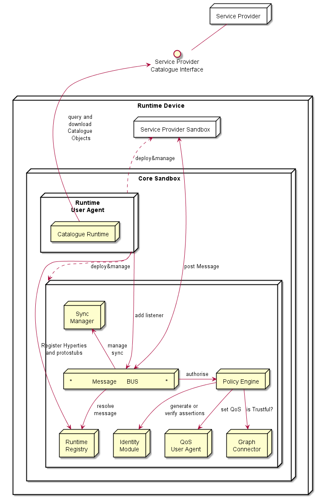

--------------------

The Hyperty Runtime provides all required functionalities to securely manage the life-cycle of Hyperties, only consuming back-end support services when strictly required.

The Hyperty Runtime was designed to support the execution of multiple untrusted software components, namely Applications, Hyperties, ProtoStubs, and Hyperty Core Runtime components. Therefore, to provide for the overall system security, it is necessary to ensure that different components execute in isolation from each other and to restrict their communication path to take place through secure channels.

To enforce isolation, the Hyperty Runtime implements a sandboxing mechanism which confines components downloaded from different service providers to independent sandboxes. Applications and Hyperties may or may not run within the same sandbox depending on their trust level. If they are downloaded from the same Service Provider, it is assumed that they trust each other and that they can share the same sandbox. Otherwise, Hyperties and Application run in different sandboxes. On the other hand, Protocol Stubs and Hyperties live in separate sandboxes even if they are distributed by the same Service Provider. To preserve compatibility with existing device native runtimes, Hyperty Core Runtime components are downloaded from the Hyperty Runtime Service Provider and executed in a sandbox named Core Sandbox. The Core Sandbox is responsible for the deployment, execution, and supervision of components downloaded from Service Providers.

Communication between components residing in different sandboxes is possible only through messages exchanged via the Message Bus component located in the Core Sandbox. To communicate with a Service Provider, a Hyperty must first send a message to the Protocol Stub associated with that Service Provider; the Protocol Stub plays the role of a bridge between the Hyperty Runtime and the Service Provider. If Hyperty and Application share the same sandbox, they can communicate directly through a local API, otherwise they have to exchange messages through the Message Bus.

For example, in Figure below, protostub1 is the only way that Hyperty instances have to communicate with Service Provider 1. In general, in the Core Sandbox, all required functionalities to support the deployment, execution and maintenance of components downloaded from service providers, are executed. Core components are, ideally, natively part of the device runtime. However, to support existing platforms including Browsers and Mobile Operating Systems, to minimise the need to install new applications, the existing device native runtime functionalities (e.g. JavaScript engine) are distinguished from the Hyperty Core Runtime functionalities. In such situations, the Hyperty Core Runtime components are downloaded from the Hyperty Runtime Service Provider and are executed in an isolated core sandbox.


The Application and the Hyperty can be delivered by the same Service Provider or by different Service Providers, i.e. Hyperty is delivered by an (Hyperty) Service Provider and the Application is delivered by an Application Service Provider. These two different situations impacts the level of trust between the Application and the Hyperty, that should be handled by the Hyperty Runtime accordingly.

In Figure above, the Application and the Hyperty Instances it consumes, are downloaded from the same Service Provider. Thus, it is assumed they trust each other and that they can be executed in the same sandbox with no impact on how the Application consumes the Hyperty Application API. In Figure below, it is depicted the Runtime Architecture where the Application and the Hyperty Instances it consumes, don't trust each other, for example, they are downloaded from different service providers. In such situation, Hyperties and the Application are isolated from each other and they are executed in different sandboxes. In this case, the Hyperty Application API is no longer local and the application is only able to reach the Hyperty Instance through the Message BUS. It is desirable to abstract the Application developer from these situations and to let the Application developer call the Hyperty Application API as if they are always local. This implies that the Core Runtime and the Sandbox implementation, is able to support a Remote Procedure Call (RPC) communication when the Application and the Hyperty Instance are in different sandboxes.



As described below, to prevent cross origin attacks / spy, access to Core Runtime Message BUS is subject to authorisation, by using standardised policies enforced by the Core Policy Engine.

Some more details are provided in the following sections.

### Service Provider Sandboxes

#### Hyperty

[Hyperties](../tutorials/hyperty.md) is a new service paradigm designed according to [Decentralised Communication principles](../messaging-framework/readme.md).
It follows Microservices architectural patterns, i.e. Hyperties are independently deployable components.
Each hyperty provides a small set of business capabilities, using the smart endpoints and dumb pipes philosophy.
On the other side, Hyperties follow emerging Edge and Fog computing paradigms as opposed to more popular Cloud Computing and they are executed as much as possible in end-users devices.

Hyperties are dynamically deployed from the Runtime Catalogue, when required by Applications. Each Hyperty instance is registered in the Runtime Registry.


#### Protocol Stub

The Protocol Stub implements a protocol stack to be used to communicate with the Service Provider's backend servers (including Messaging Server or other functionalities) according to [Protocol on the Fly](../messaging-framework/protofly.md) concept.

Protocol stubs are only reachable through the Message BUS. In this way it is ensured that all messages received and sent goes through the message bus where policies can be enforced and additional data can be added or changed including identity tokens.

### Core Runtime

The Core Runtime components are depicted in Figure below.



Runtime Core components should be as much as possible independent from the Runtime type. They should be deployed once and executed at the background. The next time the runtime is started there should be no need to download the core runtime again unless there is a new version. Runtime core components instances should be shared by different Apps and Hyperty instances.

The Core Runtime is provided by a specific Service Provider (the Core Runtime Service Provider) that handles a Catalogue service with Runtime Descriptors and a Registry service to handle the registration of Runtime instances.

#### Message BUS

The Message Bus Supports local message communication in a loosely coupled manner between Service Provider sandboxes including Hyperty Instances and Protocol Stubs. Messages are routed to listeners previously added by the Runtime User Agent, to valid Runtime URL addresses handled by the Runtime Registry functionality.

Access to Message Bus is subject to authorisation by the Policy Engine, to prevent cross origin attacks / spy from malicious downloaded code including Hyperties and Protocol Stubs.

#### Policy Engine

The Policy Engine provides Policy decision and Policy Enforcement functionalities for incoming and outgoing messages from / to Service Provider sandboxes, according to Policies downloaded and stored locally when associated Hyperties are deployed by the Runtime User Agent. It also provides authorisation / access control to the Message BUS.

The verification or generation of identity assertions, to get valid Access tokens, are two examples of actions ruled by policies.

The Policy Engine must have listeners to receive messages at:

```
hyperty-runtime://<runtime-instance-identifier>/pep
```


#### Runtime Registry

The Runtime Registry handles the registration of all available runtime components including Core components, Service Provider Sandboxes and each component executing in each sandbox like Hyperty Instances, Protocol Stubs, IdP Proxies and Applications.

In addition, the Runtime Registry ensures synchronisation with Back-end Service Provider's Domain Registry or other runtimes connected with P2P Connections.

The Runtime Registry must have listeners to receive messages at:

```
hyperty-runtime://<runtime-instance-identifier>/registry
```

#### Identity Module

The Runtime Identity Module manages ID and Access Tokens required to trustfully manage Hyperty Instances communication including trustful association between Hyperty Instances with Users. In addition, it also supports the generation and validation of Identity assertions. Identity module is an extension of [WebRTC Identity](http://w3c.github.io/WebRTC-pc/#identity) and interacts with Identity Providers via IDP Proxy protostubs.

Messages routed by Message Bus should be signed with a token according to the Identity associated to it and managed by the Identity Module.

The Runtime Identity Module must have listeners to receive messages at:

```
hyperty-runtime://<runtime-instance-identifier>/idm
```

#### Runtime User Agent

The Runtime User Agent, manages Core Sandbox components including its download, deployment and update from Core Runtime Provider. It also handles Device bootstrap and the deployment and update of Service Provider sandboxes including Hyperties, Protocol Stubs and IdP Proxies, via the Runtime Catalogue.

The Runtime User Agent must have listeners to receive messages at:

```
hyperty-runtime://<runtime-instance-identifier>/ua
```

#### Runtime Catalogue

The Runtime Catalogue manages the descriptors of deployable components and Hyperty Data Object schemas that are downloaded from the Service Provider Catalogue via the [Catalogue Service interface](https://github.com/reTHINK-project/architecture/blob/master/docs/interface-design/Interface-Design.md#73-catalogue-interface). The Runtime Catalogue ensures synchronisation with Back-end Catalogue servers.

The Runtime Catalogue must have listeners to receive messages at:

```
hyperty-runtime://<runtime-instance-identifier>/catalogue
```


#### Sync Manager

The Sync Manager is in charge of handling authorisation requests to create Sync Data Objects and subscription requests to Sync Data Objects. As soon as authorisation is granted the Sync Manager handles all required MessageBUS listeners in order to setup the Data Sync Stream routing path among Hyperties. The Sync Manager must have listeners to receive messages at:

```
hyperty-runtime://<runtime-instance-identifier>/sm
```

#### Address Allocation

The Address Allocation manages the allocation of addresses to Hyperties and Data Objects. It reuses possible addresses previously registered in the Runtime Registry when requested by the business logic. Otherwise it interacts with the Messange Node to allocate new addresses.

The Address Allocation must have listeners to receive messages at:

```
hyperty-runtime://<runtime-instance-identifier>/address-allocation
```

#### Graph Connector

The Graph Connector is a local address book maintaining a list of trustful communication users. It also provides functionalities to manage User GUIDs.

The Graph Connector must have listeners to receive messages at:

```
hyperty-runtime://<runtime-instance-identifier>/graph
```

#### Discovery

The Discovery provides different types of search for Hyperties and Data Objects which is used by the Discovery lib provided in the Service Framework.

The Discovery component must have listeners to receive messages at:

```
hyperty-runtime://<runtime-instance-identifier>/discovery
```

### Native Runtime

The Native Runtime provides Functionalities that are natively provided by the runtime, e.g. JavaScript engine or WebRTC Media Engine to support for Stream communication between Hyperties according to WebRTC Standards when available.
